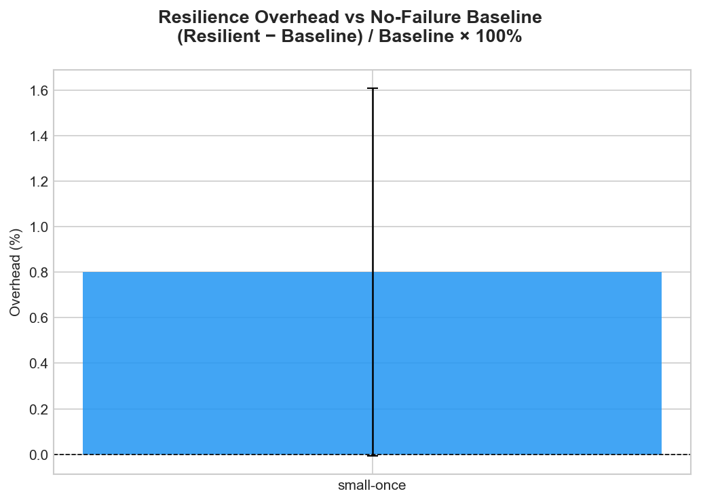
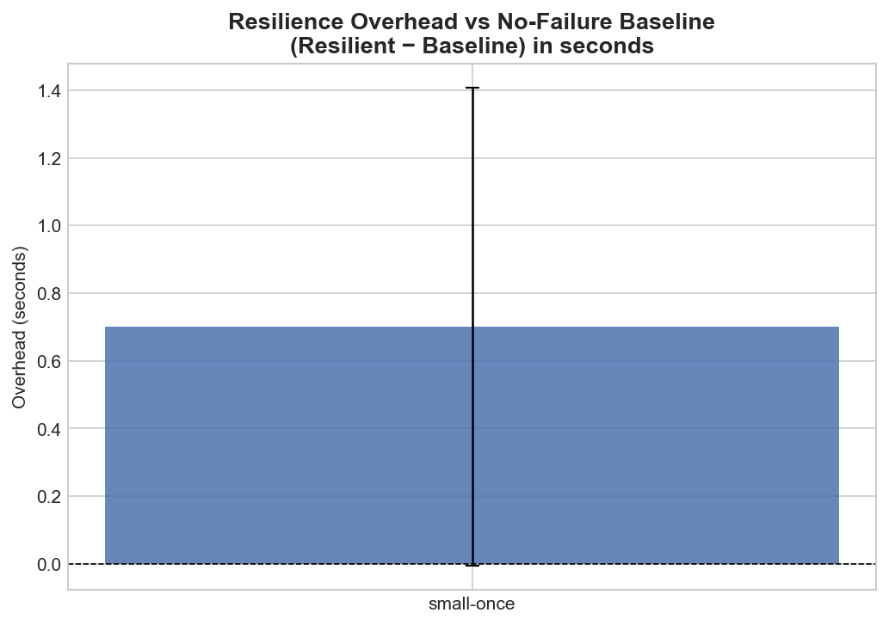
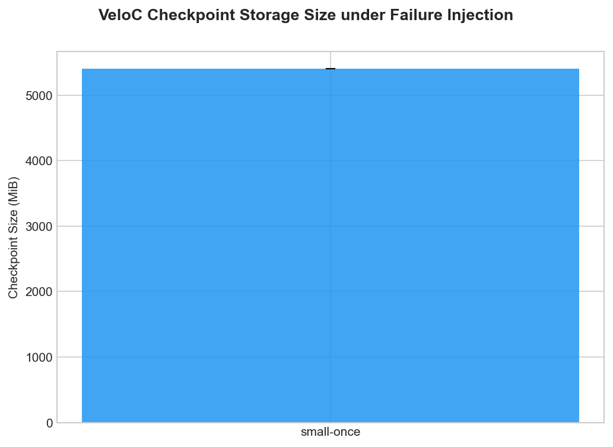
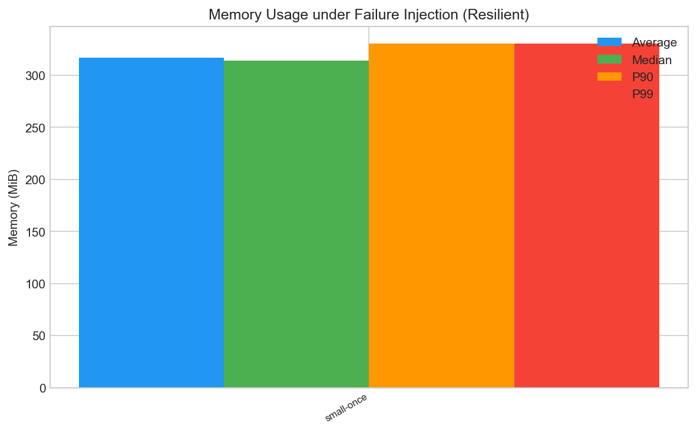

# Validation Summary Report

Generated: 2026-06-06 12:50 UTC

---

## 1. Correctness

**Overall status: ✅ PASS** (4/4 tests passed)

| # | Method | Score | Status | Message |
|---|--------|-------|--------|---------|
| 1 | numeric-tolerance [VeloC, failure-prone] | 0 | ✅ PASS | max_abs_diff=0.000e+00, max_rel_diff=0.000e+00 (atol=5.000e-02, rtol=5.000e-02) |
| 2 | exit_code [VeloC, failure-prone] | 0 | ✅ PASS | exit_code=0 |
| 3 | numeric-tolerance [VeloC, failure-free] | 0 | ✅ PASS | max_abs_diff=0.000e+00, max_rel_diff=0.000e+00 (atol=5.000e-02, rtol=5.000e-02) |
| 4 | exit_code [VeloC, failure-free] | 0 | ✅ PASS | exit_code=0 |

---

## 2. Performance Metrics (Failure-Injection Scenarios)

### Execution Time – VeloC (Resilient) (seconds)

| Scenario | Mean ± Std |
|----------|------------|
| small-once | 88.27 ± 0.71 |

### Resilience Overhead (seconds)

*Total runtime (all attempts) minus baseline (original, failure-free).*
*Includes checkpoint, recovery, and retry costs.*

| Scenario | VeloC (Resilient) |
|----------|---|
| small-once | N/A |

### Checkpoint Storage (MiB)

| Scenario | VeloC (Resilient) |
|----------|---|
| small-once | 5400.14 |

### Memory Usage – VeloC (Resilient) (MiB)

| Scenario | Average | Median | P90 | P99 |
|----------|---------|--------|-----|-----|
| small-once | 317.02 | 314.14 | 330.45 | 330.46 |

---

## 3. Plots

### Execution Time (Failure-Injection, Resilient)

### Resilience Overhead vs No-Failure Baseline (%)

### Resilience Overhead vs No-Failure Baseline (seconds)

### Checkpoint Storage Size

### Memory Usage (Avg / Median / P90 / P99)

---

*End of report.*
