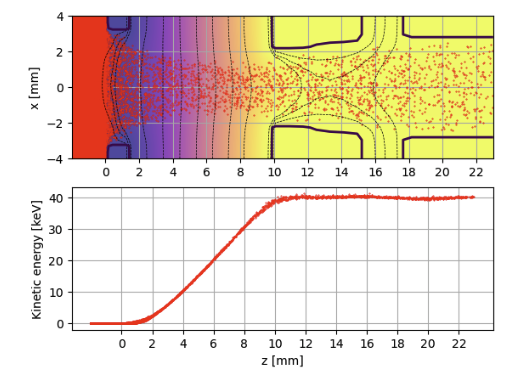

.. _examples-ion-beam-extraction:

Ion-Beam Extraction from a Plasma Source
========================================

This example simulates the extraction of a high-energy ion beam from a plasma source, using the same physical setup as in `this paper <https://pubs.aip.org/aip/rsi/article-abstract/81/2/02B108/1071759/Characterization-of-1-MW-40-keV-1-s-neutral-beam>`__.

The simulation box region at :math:`z<0` represents the plasma source, initially filled with a plasma of positive Deuterium ions (:math:`D^{+}`) and electrons.
Electrodes held at fixed electrostatic potentials extract and accelerate some of the plasma ions, forming a continuous ion beam with a final energy of approximately :math:`40\,\mathrm{keV}`.

The figure below shows a color map of the electrostatic potential (:math:`\phi`), with black lines indicating the electrode positions and red dots showing the :math:`D^{+}` macroparticles.
The bottom panel displays the kinetic energy distribution of the extracted ion beam.

.. _ion_beam:

Plasma Source Setup
-------------------

To maintain the plasma density during beam extraction, ions and electrons are continuously injected from the simulation boundaries in the region :math:`z<0`.
Without this boundary injection, the plasma would deplete as ions are accelerated out of the source region and particles with thermal motion are absorbed by the boundaries.
The injection flux corresponds to that of a thermal plasma.

The plasma source setup consists of two components:

1. **Initial plasma**: At :math:`t=0`, the volume :math:`z<0` is initialized with a thermal plasma.

2. **Boundary injection**: Throughout the simulation, ions and electrons are continuously injected from the :math:`\pm x`, :math:`\pm y`, and :math:`-z` boundaries in the region :math:`z<0`.

Electrode Setup
---------------

The electrodes are implemented as `embedded boundaries <https://amrex-codes.github.io/amrex/docs_html/EB_Chapter.html>`__.
In this input script, the electrode geometry is defined using an analytical expression via the parameter ``warpx.eb_implicit_function``.
Alternatively, the geometry can be defined using an STL file by setting ``eb2.geom_type = stl`` and ``eb2.stl_file = path/to/file.stl``.
For more details, see the :ref:`STL geometry preparation workflow <workflows-stl-geometry-preparation>` and the :ref:`embedded boundary input parameters <running-cpp-parameters-eb>`.

The electric potential on the electrodes is fixed via an analytical expression specified with the parameter ``warpx.eb_potential(x,y,z,t)``.
**Important**: WarpX only evaluates this expression on the electrodes themselves.
In the vacuum region between electrodes, WarpX's electrostatic solver computes the potential profile, taking into account both the fixed electrode potentials and the space charge from the ions.

Run
---

Run this example with: ``warpx.3d inputs_test_3d_ion_beam_extraction``.
For `MPI-parallel <https://www.mpi-forum.org>`__ runs, prefix with ``mpiexec -n 4 ...`` or ``srun -n 4 ...``, depending on your system.

.. note::
   The input file uses high values for ``self_fields_absolute_tolerance`` and ``self_fields_required_precision``, along with reduced spatial resolution and particle density, to speed up the CI test.
   For production runs, adjust these parameters as needed for your accuracy requirements.

.. literalinclude:: inputs_test_3d_ion_beam_extraction
   :language: none
   :caption: You can copy this file from ``Examples/Physics_applications/ion_beam_extraction/inputs_test_3d_ion_beam_extraction``.

Visualize
---------

The provided plotting script reads the output diagnostics in openPMD format and generates plots of:

- The electrostatic potential
- The ion beam macroparticles
- The ion beam energy distribution

The script also verifies that the particle energy tail is within a relative tolerance of the target energy of :math:`40\,\mathrm{keV}`.

.. literalinclude:: analysis_ion_beam_extraction.py
   :language: none
   :caption: You can copy this file from ``Examples/Physics_applications/ion_beam_extraction/analysis_ion_beam_extraction.py``.
