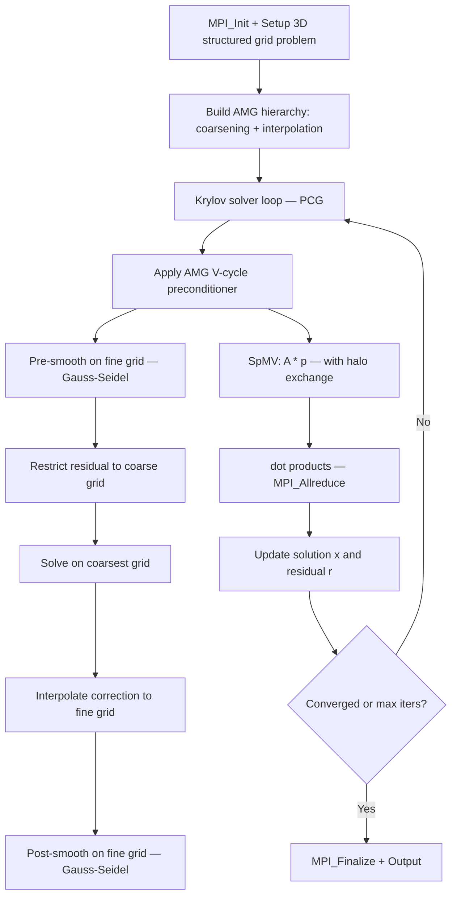

# AMG Computation Flow

## Overview
AMG (Algebraic Multigrid) is a parallel algebraic multigrid solver proxy application from LLNL. It solves large sparse linear systems arising from structured-grid discretizations using a multigrid V-cycle preconditioner with a Krylov solver (typically PCG or GMRES). The code sets up a Laplacian-type problem on a 3D structured grid, builds the multigrid hierarchy by coarsening, and iterates to convergence.

## Main Loop

## MPI Communication Pattern
- **Halo exchange**: `MPI_Isend`/`MPI_Irecv`/`MPI_Waitall` for exchanging ghost values at each grid level during smoothing and SpMV; 26-neighbor stencil communication on structured grids
- **Global reductions**: `MPI_Allreduce(MPI_SUM)` for dot products in PCG (two per iteration), and `MPI_Allreduce(MPI_MAX)` for convergence checks
- **Coarse grid**: coarsest level may be replicated or gathered to a subset of ranks for direct solve
- **Decomposition**: 3D block decomposition of the structured grid

## I/O Points
- Final output: prints iteration count, final residual norm, convergence factor, and timing breakdown to stdout
- No intermediate file output in the default configuration
- Problem setup parameters specified via command-line arguments
