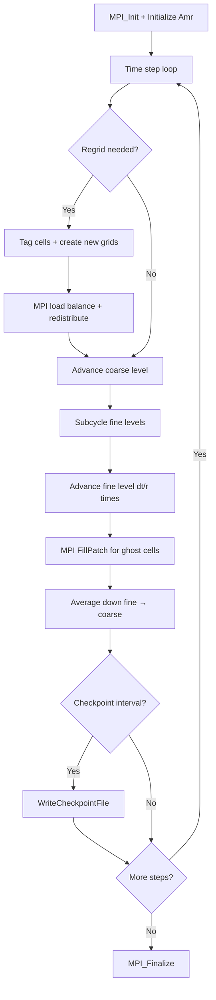

# AMReX Computation Flow

## Overview
AMReX is a block-structured AMR framework. A typical application runs a time-stepping loop with subcycling across AMR levels, regridding periodically to adapt the mesh.

## Main Loop

## MPI Communication
- **FillPatch**: ghost cell filling via MPI for each level
- **Regridding**: redistribute boxes across ranks for load balance
- **Average down**: fine → coarse data transfer (local or MPI)

## I/O Points
- Checkpoint directories: `chk00000/`, `chk00100/`, etc.
- Plot files for visualization

## Output Format
Checkpoint directories contain a `Header` text file + per-level `Level_N/` subdirectories with binary MultiFab data. Plotfiles have the same structure.
**How to compare**: use AMReX's `fcompare` tool or compare Header files for metadata and MultiFab data via binary diff or numeric tolerance.
