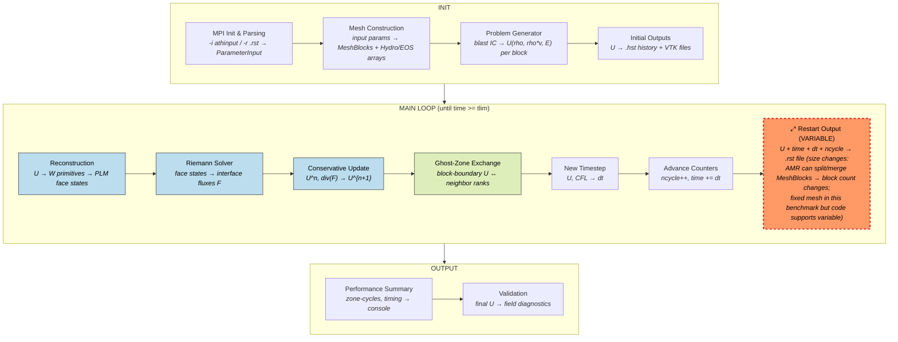
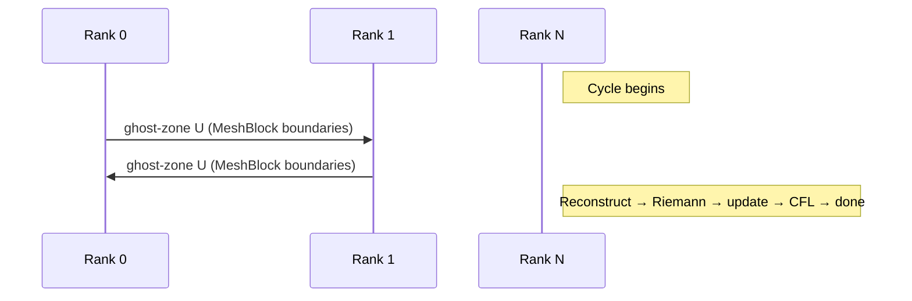
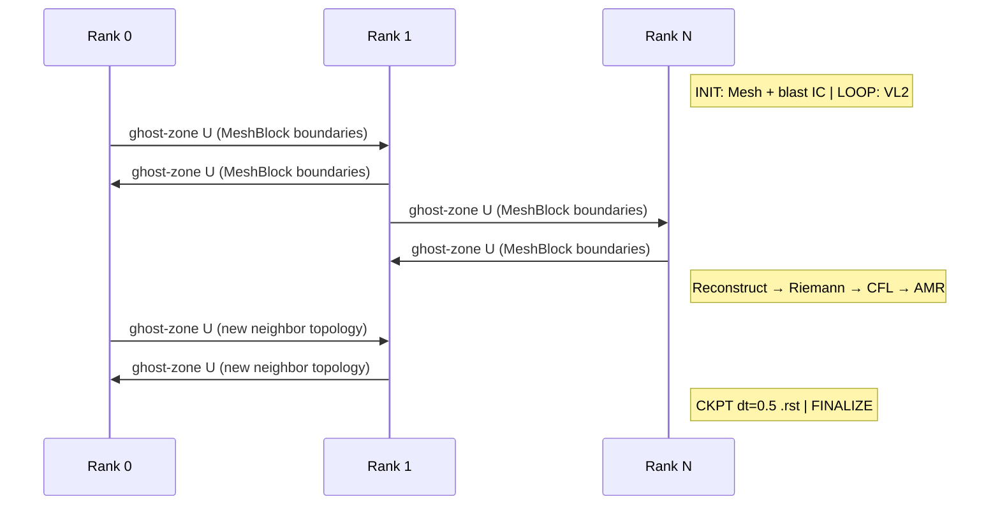

# Athena++ — Astrophysical MHD Code

**Class:** (3) iterative_adaptive  
**Language:** C++ (MPI)  
**Checkpoint library:** Native binary restart files (`RestartOutput`)

## Application Description

Athena++ is a high-performance astrophysics code solving the equations of compressible (magneto)hydrodynamics on structured AMR meshes. The benchmark uses the **spherical blast wave** problem (`--prob blast`) in 3D Cartesian geometry: a high-pressure sphere (pressure ratio `prat=100`) of radius 0.1 centered at the origin in a uniform ambient medium, evolved to time `tlim=1.0` using the van Leer integrator (`vl2`) at CFL 0.3. The domain is 50x100x50 cells with periodic boundaries. Pure hydrodynamics with ideal gas EOS (gamma=5/3).

## Computation Workflow


Data flow per step: conserved variables U are reconstructed to face states, Riemann-solved for fluxes, updated via flux divergence, and exchanged across MeshBlock boundaries.

### Start

1. **MPI initialization**, command-line parsing (`-i athinput.blast` for fresh, `-r blast.XXXXX.rst` for restart).
2. **Input parsing** — `ParameterInput` reads the athinput file.
3. **Mesh construction** — allocate all MeshBlocks and their data arrays; populate physics objects (Hydro, EOS, coordinates, boundary values) per block.
4. **Initial conditions** — `MeshBlock::ProblemGenerator()` on each block sets conserved variables U = (rho, rho*vx, rho*vy, rho*vz, E) based on the blast IC.
5. **Initial outputs** — history `.hst` and VTK files.

### Main Loop (van Leer VL2 integrator, until `time >= tlim`)

Each cycle:

1. **Task list execution** — `DoTaskListOneStage(pmesh, stage)` x `nstages`:
   - Spatial reconstruction (piecewise-linear) of primitives in each direction.
   - Riemann solver (HLLC/ROE) at cell faces -> interface fluxes.
   - Conservative update: `U^{n+1} = U^n - dt * div(F)`.
   - Primitive recovery via EOS.
   - Ghost-zone exchange between MeshBlocks (MPI).
2. **User work** (`UserWorkInLoop`).
3. **Advance counters** — `ncycle++`, `time += dt`.
4. **AMR** (`LoadBalancingAndAdaptiveMeshRefinement`) — optional (fixed mesh in this benchmark).
5. **New timestep** (`NewTimeStep`) — CFL-limited dt.
6. **Outputs** — check if history, VTK, or restart output is due.

### End

- When `time >= tlim = 1.0`.
- Print zone-cycle rates and timing.
- **Validation output:** numerical field diagnostics.

## Critical State

Per MeshBlock:

| Field | Type | Evolution |
|-------|------|-----------|
| `phydro->u` | Conserved variables (rho, rho*v, E), shape `(NHYDRO, nz+2*NGHOST, ny+2*NGHOST, nx+2*NGHOST)` | Updated each cycle by flux divergence |
| `phydro->w` | Primitive variables (rho, v, p) | Derived from `u` each step via EOS |
| Ghost zones | Halo data per MeshBlock | Exchanged via MPI each step |

Mesh-level scalars:
| Field | Type | Evolution |
|-------|------|-----------|
| `time` | Physical time (double) | Advanced by `dt` each cycle |
| `dt` | Timestep (double) | Recomputed each cycle via CFL |
| `ncycle` | Cycle counter (int) | Incremented each cycle |

**Blast wave physics:** The initial pressure discontinuity at radius 0.1 drives a strong outward shock wave. By `t=1.0` the shock has propagated ~0.5 domain lengths. The solution is highly time-dependent with large density, velocity, and pressure gradients.

## MPI Task Lifetime

**Per-rank state:** Each rank owns one or more MeshBlocks, each containing conserved variables `u` (rho, rho*v, E) with ghost zones. The per-rank data size depends on how many MeshBlocks are assigned by the load balancer. In this fixed-mesh benchmark, the assignment is static.

**How state changes:** Per-rank array sizes stay fixed in this benchmark (no AMR). The conserved variable values change every cycle via flux divergence. In general Athena++ runs, AMR can split/merge MeshBlocks and redistribute them across ranks.

**Communication pattern:** Each cycle exchanges ghost-zone data between neighboring MeshBlocks via MPI, then each rank performs local reconstruction, Riemann solves, and conservative updates independently.



### Application Lifetime View



**Key observations:**

- **State size can change during execution.** AMR can split, merge, or migrate MeshBlocks between ranks at any cycle, changing the per-rank data size. In this fixed-mesh benchmark the block assignment is static, but the code path supports dynamic redistribution.
- **Communication is nearest-neighbor ghost-zone exchange.** Each cycle exchanges conserved variable U at MeshBlock boundaries. After AMR, the neighbor topology may change, so the communication pattern itself is dynamic.
- **Checkpoint size tracks the current mesh state.** The `.rst` file includes the full block list and per-block conserved variable payload. If AMR has changed the block count since the last checkpoint, the new checkpoint will be a different size.

## Checkpoint Protection

### Write trigger

The checkpointed input `athinput.blast_ckpt` adds:
```
<output3>
file_type  = rst
dt         = 0.5
```
This writes a restart file every 0.5 time units.

### What is saved

Binary `.rst` file `Blast.XXXXX.rst` written collectively by all MPI ranks:
- **Full input parameters** — so restart can reconstruct configuration without the original input file.
- **Mesh header:** `nbtotal`, `root_level`, `mesh_size`, `time`, `dt`, `ncycle`, `datasize`.
- **Block list:** `LogicalLocation` (AMR position) and `cost_` (load-balancing weight) for all MeshBlocks.
- **Per-block payload:** `phydro->u` (conserved hydro variables), and if applicable: `phydro->w` (GR), magnetic fields `b.x1f/x2f/x3f` (MHD), passive scalars, user data — written via `Write_at_all()`.

### Restart protocol

When invoked with `-r blast.XXXXX.rst`:
1. `LoadFromFile(restartfile)` reads input parameters from the file header.
2. `Mesh(pinput, restartfile, mesh_flag)` constructs the mesh by reading header and block list, then reads each MeshBlock's conserved variable data directly — **bypassing `ProblemGenerator()`**.
3. `time`, `dt`, `ncycle` restored from the file.
4. Output scheduling corrected via `RollbackNextTime()`/`ForwardNextTime()`.
5. Integration resumes from exact conserved state.

### Restart script (`run_with_restart.sh`)

1. Check for existing `.rst` files (excluding any `final` files).
2. If found: `./bin/athena -r $RST_FILE`.
3. If not: `./bin/athena -i athinput.blast_ckpt`.

### Vanilla difference

The vanilla `athinput.blast` has no `<output3>` restart block — the restart infrastructure is always compiled in, but `.rst` files are never written.
