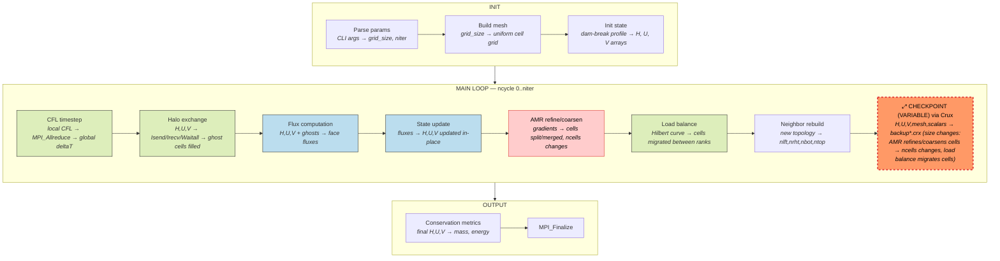
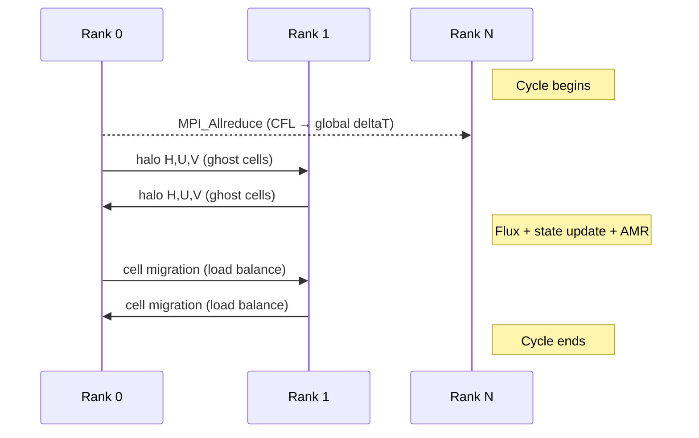
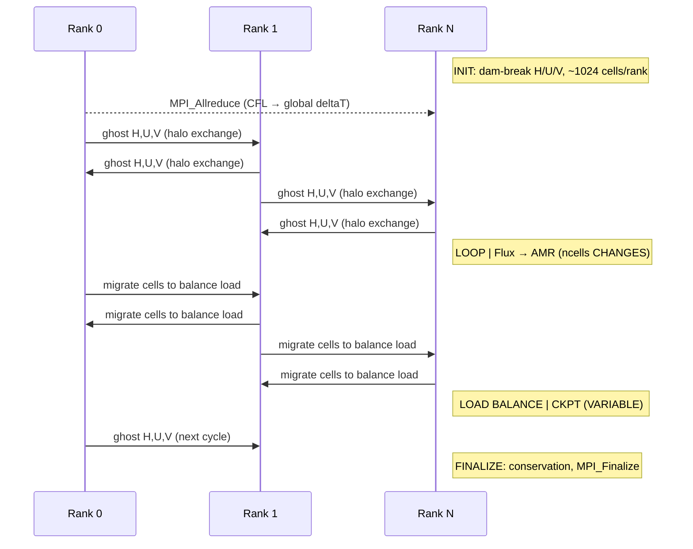

# CLAMR — Cell-based Adaptive Mesh Refinement

**Class:** (3) iterative_adaptive  
**Language:** C++ (MPI)  
**Checkpoint library:** Native Crux module (POSIX file I/O)

## Application Description

CLAMR is a LANL mini-application that solves the 2D shallow water equations on a dynamically adapting unstructured mesh using a finite volume method. The mesh continuously refines and coarsens based on solution gradient criteria. Each MPI rank owns a partition of adaptive mesh cells, and load balancing periodically redistributes cells via a Hilbert space-filling curve as the mesh topology changes.

## Computation Workflow

Data flow per step: `H,U,V` are updated via finite-volume fluxes after MPI halo exchange, then AMR reshapes the mesh and load balancing migrates cells, before Crux serializes the full dynamic state.

### Start

1. **MPI initialization** and problem parameter parsing (`-n <grid_size>`, `-i <iterations>`).
2. **Mesh construction** — initial coarse grid with cells at uniform resolution.
3. **State initialization** — cell state arrays (water height `H`, velocities `U`, `V`) set to initial conditions (e.g., dam-break profile).

### Main Loop (`ncycle` from 0 to `niter`)

1. **CFL timestep** — compute local CFL condition; global reduction via `MPI_Allreduce(MPI_MIN)` to get uniform `deltaT`.
2. **Halo exchange** — `MPI_Isend`/`MPI_Irecv`/`MPI_Waitall` to populate ghost cells with neighbor rank values of `H`, `U`, `V`.
3. **Flux computation** — finite volume stencil computes fluxes across all cell faces.
4. **State update** — `H`, `U`, `V` updated in-place for all owned cells.
5. **AMR** — evaluate gradient criteria; refine cells above threshold (split 1 cell into 4 children), coarsen cells below threshold (merge 4 siblings into 1 parent). `ncells` changes dynamically.
6. **Load balance** — repartition cells across ranks using Hilbert space-filling curve ordering; cells physically migrated between ranks via MPI.
7. **Neighbor rebuild** — reconstruct connectivity arrays (`nlft`, `nrht`, `nbot`, `ntop`) from the new mesh topology.
8. **Checkpoint** — if `ncycle % checkpoint_interval == 0`, write checkpoint via Crux.

### End

- Print conservation metrics (mass, energy) and timing to stdout.
- `MPI_Finalize`.
- **Validation output:** final mass/energy conservation values.

## Critical State

The state is distributed across MPI ranks. Cell count changes within each cycle due to AMR refinement/coarsening and load-balance migration.

| Field | Type | Evolution |
|-------|------|-----------|
| `H[ncells]` | Water height (double) | Updated every cycle by flux integration |
| `U[ncells]` | X-velocity (double) | Updated every cycle by flux integration |
| `V[ncells]` | Y-velocity (double) | Updated every cycle by flux integration |
| `i[ncells]`, `j[ncells]` | Cell coordinates (int) | Assigned at creation; inherited/split during AMR |
| `level[ncells]` | Refinement level (int) | Incremented on refinement, decremented on coarsening |
| `nlft`, `nrht`, `nbot`, `ntop` | Neighbor indices (int) | Rebuilt from scratch every cycle after load balance |
| `ncells` | Cell count (int) | Changes every step due to refinement and migration |
| `ncycle` | Cycle counter (int) | Incremented each timestep |
| `simTime`, `deltaT` | Simulation time (double) | Accumulated/computed each step |

**Key complexity:** The mesh topology is fully dynamic — neighbor arrays are index-based into the local rank's cell list and must be rebuilt after every repartitioning. The full mesh topology must be treated as live state.

## MPI Task Lifetime

**Per-rank state:** Each rank owns a partition of adaptive mesh cells with arrays `H`, `U`, `V` (water height, velocities), cell coordinates `i`, `j`, refinement `level`, and neighbor indices `nlft`, `nrht`, `nbot`, `ntop`. The local cell count `ncells` varies per rank.

**How state changes:** Per-rank data grows and shrinks every cycle. AMR refinement splits cells (increasing `ncells`), coarsening merges them (decreasing `ncells`), and Hilbert-curve load balancing migrates cells between ranks.

**Communication pattern:** Each cycle uses an allreduce for the global CFL timestep, point-to-point halo exchange for ghost cells, and bulk cell migration during load balancing.

### Application Lifetime View

**Key observations:**
- **Variable state size:** Per-rank cell count changes every cycle through two mechanisms -- AMR refinement/coarsening alters the total cell count, and Hilbert-curve load balancing migrates cells between ranks. Both the global total and per-rank distribution change dynamically.
- **Communication pattern:** Three distinct communication phases per cycle -- a global allreduce for the CFL timestep, point-to-point halo exchange for ghost cells, and bulk cell migration during load balancing. This is the most communication-intensive pattern among the benchmark apps.
- **Checkpoint coordination:** Crux serializes the full dynamic state (H, U, V, mesh topology, connectivity, scalars) after all mutations are complete. The checkpoint size varies per rank and per cycle because `ncells` is a moving target. Rotating copies provide rollback resilience.

## Checkpoint Protection

### Mechanism

CLAMR uses its native **Crux** module (`crux/crux.cpp`), a structured serialization framework supporting POSIX file I/O (with optional HDF5).

### What is saved

Checkpoint files in `checkpoint_output/backup*.crx` contain:

- Dynamic arrays via `store_MallocPlus`: `H`, `U`, `V`, `i`, `j`, `level`, `nlft`, `nrht`, `nbot`, `ntop`
- Scalars: `ncycle`, `simTime`, `deltaT`, `ncells`, `levmx`
- Each field has a named header followed by raw data

Crux maintains up to `num_of_rollback_states` rotating copies for rollback resilience.

### Checkpoint write sequence

1. `store_begin(nsize, ncycle)` — open checkpoint file.
2. `store_MallocPlus(memory)` — write all dynamic arrays.
3. `store_ints`/`store_doubles` — write scalar state.
4. `store_distributed_double_array` — write per-rank distributed arrays.
5. `store_end()` — finalize and close.

### Restart sequence

1. Detect checkpoint via `-R <filename>` flag or file presence.
2. `restore_begin` opens the checkpoint file.
3. `restore_MallocPlus` restores all dynamic arrays to saved sizes.
4. Restore scalars in the same order as write.
5. Rebuild ghost layers from restored mesh; neighbor connectivity is already stored.
6. Resume the time step loop from `ncycle`.

Checkpoint is placed at the end of each timestep after all state mutations (flux update, AMR, load balance, neighbor rebuild) are complete, ensuring consistency.
