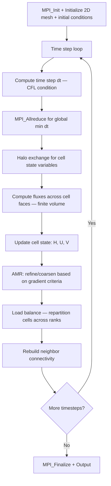

# CLAMR Computation Flow

## Overview
CLAMR (Cell-based Adaptive Mesh Refinement) is a mini-application from LANL that solves the shallow water equations on a 2D adaptive mesh using a finite volume method. It dynamically refines and coarsens the mesh based on solution gradients. Each MPI rank owns a partition of the adaptive mesh cells, and load balancing is performed periodically to redistribute cells as the mesh adapts.

## Main Loop

## MPI Communication Pattern
- **Halo exchange**: `MPI_Isend`/`MPI_Irecv`/`MPI_Waitall` for ghost cell values (water height, velocities) across rank boundaries
- **Global reduction**: `MPI_Allreduce(MPI_MIN)` for computing the global CFL time step
- **Load balancing**: periodic repartitioning using space-filling curves (Hilbert curve); cells are migrated between ranks via `MPI_Isend`/`MPI_Irecv`
- **Decomposition**: 2D spatial decomposition with dynamic load balancing; cell count per rank changes as the mesh adapts

## I/O Points
- Graphics output: optional periodic output of mesh and solution fields for visualization (via OpenGL or file)
- Checkpoint output: native checkpoint files written periodically
- Final output: prints conservation metrics, timing, and cell counts to stdout
