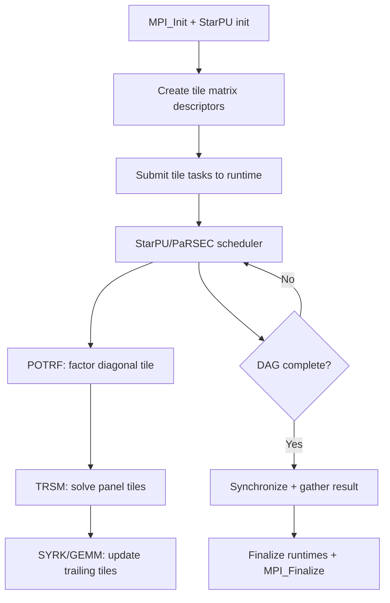

# Chameleon Computation Flow

## Overview
Chameleon provides dense linear algebra (Cholesky, LU, QR, LQ) using sequential tile-based task algorithms on distributed heterogeneous clusters. Uses StarPU or PaRSEC as interchangeable task runtime backends.

## Main Loop

## MPI Communication
- Handled by StarPU-MPI or PaRSEC (automatic, asynchronous)
- 2D block-cyclic tile distribution
- Data transfers triggered by task dependencies

## I/O Points
- Matrix generated in-memory, result verified via residual norm
