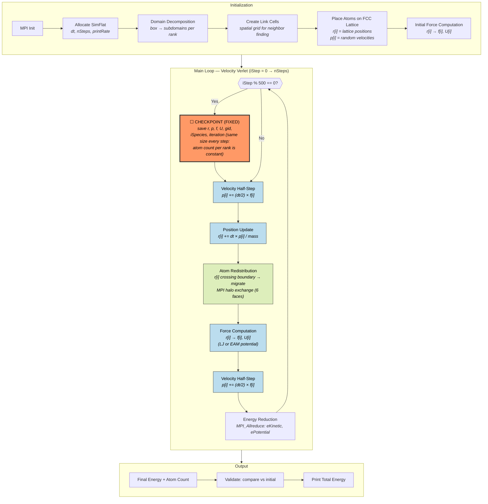
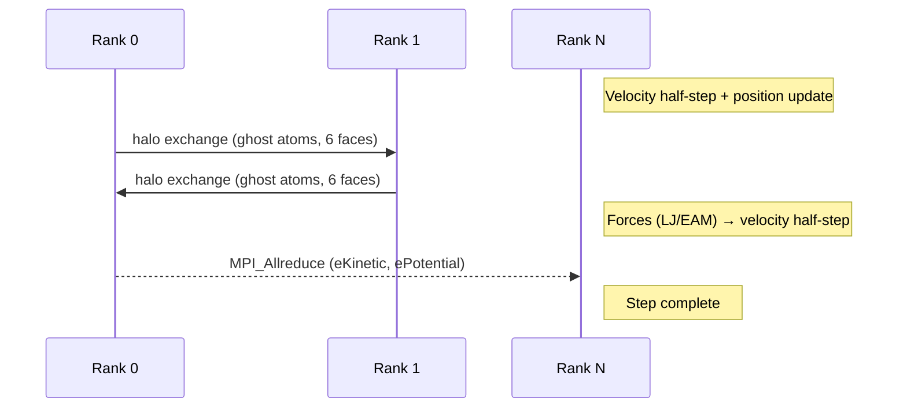
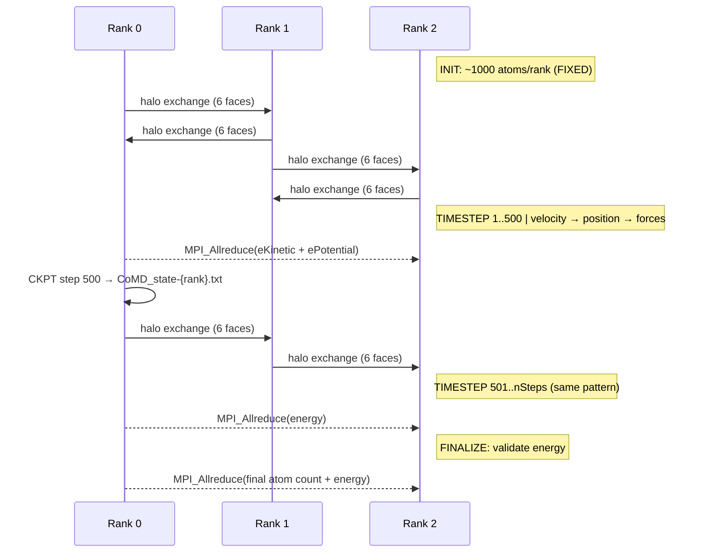

# CoMD — Classical Molecular Dynamics

**Class:** (1) iterative_fixed  
**Language:** C (MPI)  
**Checkpoint library:** POSIX file I/O (no external library)

## Application Description

CoMD (Co-design Molecular Dynamics) is a proxy application from the ExMatEx Exascale Co-Design Center at LANL. It simulates the time evolution of a system of atoms interacting via a Lennard-Jones (LJ) or Embedded Atom Method (EAM) pairwise force model. The primary observable is total energy (potential + kinetic) as atoms move under Newtonian dynamics. The checkpointed variant is **comd-ft**, which adds POSIX file-based fault tolerance.

## Computation Workflow

**Data flow per step:** `r,p` →(half-step)→ `p'` →(position)→ `r'` →(redistribute)→ `r'` migrated →(force)→ `f',U'` →(half-step)→ `p''` →(reduce)→ `E_total`

### Start

1. **MPI initialization** — establishes parallel environment across ranks.
2. **Simulation setup** (`initSimulation`) — allocates the top-level `SimFlat` struct containing timestep `dt`, total steps `nSteps`, and print frequency `printRate`.
3. **Force model selection** — initializes LJ or EAM potential.
4. **Domain decomposition** — divides the global simulation box into rectangular subdomains, one per MPI rank.
5. **Link cell creation** — subdivides each subdomain into a spatial grid of link cells for O(N) neighbor finding.
6. **Atom placement** — atoms placed on an FCC lattice and assigned to ranks based on position.
7. **Halo exchange setup** — MPI communication buffers for the 6 face-neighbor pairs.
8. **Initial force computation** — must precede first velocity half-step.

### Main Loop (Velocity Verlet, `iStep` from 0 to `nSteps`)

Each outer iteration runs `printRate` sub-steps:

1. **Velocity half-step** — `p += (dt/2) * f` for each local atom.
2. **Position update** — `r += dt * (p / mass)` for each local atom.
3. **Atom redistribution** — update link cell assignments, halo exchange via `MPI_Isend`/`MPI_Irecv` on 6 faces for atoms that crossed subdomain boundaries.
4. **Force computation** — evaluate LJ/EAM potential; produces updated forces `f[i]` and per-atom potential energy `U[i]`.
5. **Velocity half-step** — second `p += (dt/2) * f` completing the Verlet integrator.

After each batch of `printRate` steps: global reduction (`MPI_Allreduce`) to compute total kinetic and potential energy, then print status line with energy, temperature, and performance metrics.

### End

- Final energy reduction and status print.
- Internal validation: compare final atom count and energy against initial values.
- Performance timer summary, `MPI_Finalize`.
- **Validation output:** the `Total Energy` value in the final printed row.

## Critical State

The simulation state is distributed across MPI ranks. Each rank owns a disjoint subset of atoms determined by spatial position.

| Field | Type | Evolution |
|-------|------|-----------|
| `r[i][3]` | Position (3 doubles) | Updated every step by `advancePosition`; atoms migrate between ranks when crossing subdomain boundaries |
| `p[i][3]` | Momentum (3 doubles) | Updated twice per step by `advanceVelocity` using current forces |
| `gid[i]` | Global atom ID (int) | Static once initialized |
| `iSpecies[i]` | Species index (int) | Static once initialized |
| `nLocal` | Local atom count | Changes when atoms cross subdomain boundaries |
| `iteration` | Current step counter | Incremented by `printRate` each outer loop |

**Derived (not checkpointed independently):** Forces `f[i]` and potential energy `U[i]` are recomputable from positions alone. The checkpoint saves them anyway to avoid an extra force evaluation on restart.

## MPI Task Lifetime

**Per-rank state:** Each rank owns a spatially disjoint subset of atoms (positions `r`, momenta `p`, forces `f`, IDs `gid`) determined by 3D domain decomposition. The atom count per rank (`nLocal`) is nominally fixed but can change slightly as atoms drift across subdomain boundaries.

**How state changes:** Per-rank data stays approximately fixed in size. Atoms occasionally migrate to neighbor ranks when they cross boundaries, but the total atom count is conserved and the FCC lattice keeps the distribution balanced.

**Communication pattern:** Each timestep involves a 6-face halo exchange (ghost atoms for force computation) via `MPI_Isend`/`MPI_Irecv`, followed by a global `MPI_Allreduce` for energy summation.

### Application Lifetime View

The following diagram shows how each MPI rank's internal state evolves across the full application lifetime, from initialization through multiple timesteps to completion.

**Key observations:**
- Each rank's state arrays (`r`, `p`, `f`) maintain **constant size** throughout — atoms vibrate but rarely cross subdomain boundaries in this short LJ simulation
- Communication is **nearest-neighbor only** (6-face halo) plus periodic **global reductions** for energy
- Checkpoint is **per-rank independent** — no coordination between ranks during write

## Checkpoint Protection

### Write trigger

Every 500 steps at the top of the outer loop: `(iStep % 500 == 0) && iStep > 0 && !loaded`.

### What is saved

Each MPI rank writes its own file `$CHKPT_DIR/CoMD_state-<rank>.txt` containing:

- Simulation parameters (`nSteps`, `printRate`, `dt`)
- Domain geometry (process grid, global/local bounds)
- Link cell structure (grid sizes, atom counts per cell)
- Per-atom arrays in binary: `gid`, `iSpecies`, `r`, `p`, `f`, `U`
- Species metadata and energy scalars
- Current `iteration` counter

### Write protocol

1. Serialize all fields into a 4KB-aligned buffer (text for scalars, `memcpy` for arrays).
2. Single `write(fd, buf, size)` call.
3. `fsync(fd)` before `close` to guarantee durability.

### Restart protocol

1. Check if checkpoint file exists via `stat()`.
2. Read entire file into aligned buffer.
3. Deserialize fields in the same order as write.
4. Set `iStep = sim->iteration` so the loop resumes from the checkpointed step.
5. `loaded = 1` flag prevents immediately re-writing a checkpoint on the first iteration after restart.

### Consistency

Single-file write with `fsync` — no atomic rename or double-buffering. A crash mid-write would corrupt that rank's file. The benchmark relies on the kill happening between checkpoint writes (not during one) for correctness.
