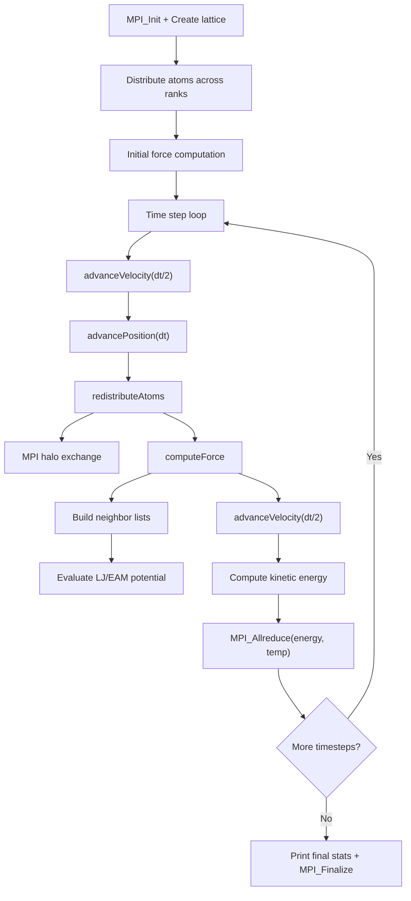

# CoMD Computation Flow

## Overview
CoMD (Co-design Molecular Dynamics) is a classical molecular dynamics proxy app implementing Lennard-Jones and EAM potentials with geometric spatial domain decomposition across MPI ranks. Fixed atom count per domain.

## Main Loop

## MPI Communication Pattern
- **Halo exchange**: `MPI_Isend`/`MPI_Irecv` for atom data at subdomain boundaries (6 faces in 3D)
- **Atom redistribution**: atoms that move outside a rank's subdomain are sent to the owning rank
- **Global reduction**: `MPI_Allreduce` for total energy and temperature
- **Decomposition**: 3D Cartesian domain decomposition (`-x`, `-y`, `-z` control grid)

## I/O Points
- Periodic status output to stdout (every `printRate` steps)
- Final summary: total energy, kinetic energy, temperature, atom count
