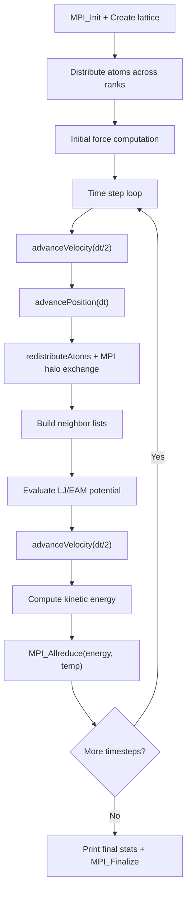

# CoMD Computation Flow

## Overview
CoMD (Co-design Molecular Dynamics) is a classical molecular dynamics proxy app implementing Lennard-Jones and EAM potentials with geometric spatial domain decomposition across MPI ranks. Fixed atom count per domain.

## Main Loop



## MPI Communication Pattern
- **Halo exchange**: `MPI_Isend`/`MPI_Irecv` for atom data at subdomain boundaries (6 faces)
- **Atom redistribution**: atoms crossing subdomain boundaries sent to owning rank
- **Global reduction**: `MPI_Allreduce` for total energy and temperature
- **Decomposition**: 3D Cartesian domain decomposition

## I/O Points
- Periodic status to stdout every `printRate` steps
- Final summary: total energy, kinetic energy, temperature, atom count

## Output Format
Stdout prints a table every N steps and a final summary:
```
#                                                                                         Performance
#  Loop   Time(fs)       Total Energy   Potential Energy     Kinetic Energy  Temperature   (us/atom)
     50     500.00    -3.538179e+00    -3.578498e+00     4.031944e-02       31.54       16.98
```
**How to compare**: extract `Total Energy` from the final row; numeric comparison with tolerance ~1e-6.
