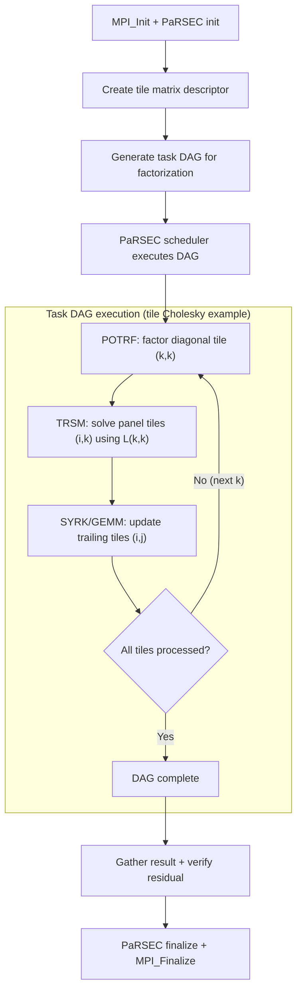

# DPLASMA Computation Flow

## Overview
DPLASMA provides dense linear algebra operations (Cholesky, LU, QR) on distributed tile matrices using the PaRSEC task-based runtime. Tasks are scheduled dynamically based on data dependencies in a DAG.

## Main Loop



## MPI Communication
- **Implicit**: PaRSEC runtime handles all data movement between ranks
- **2D block-cyclic**: tiles distributed across a process grid
- **Overlap**: communication overlapped with computation automatically

## I/O Points
- Matrix generated in-place (no file I/O for benchmarking)
- Verification: residual check printed to stdout

## Output Format
```
[****] TIME(s)     0.42 : dpotrf  N= 1000  NB= 200  P= 2  Q= 2  NTH= 1  : 4.762 gflops
       ||Ax-b|| / (||A||*||x||+||b||) = 2.34e-16
```
**How to compare**: verify residual norm is below machine epsilon (~1e-14 for double). The residual line is the correctness check.
