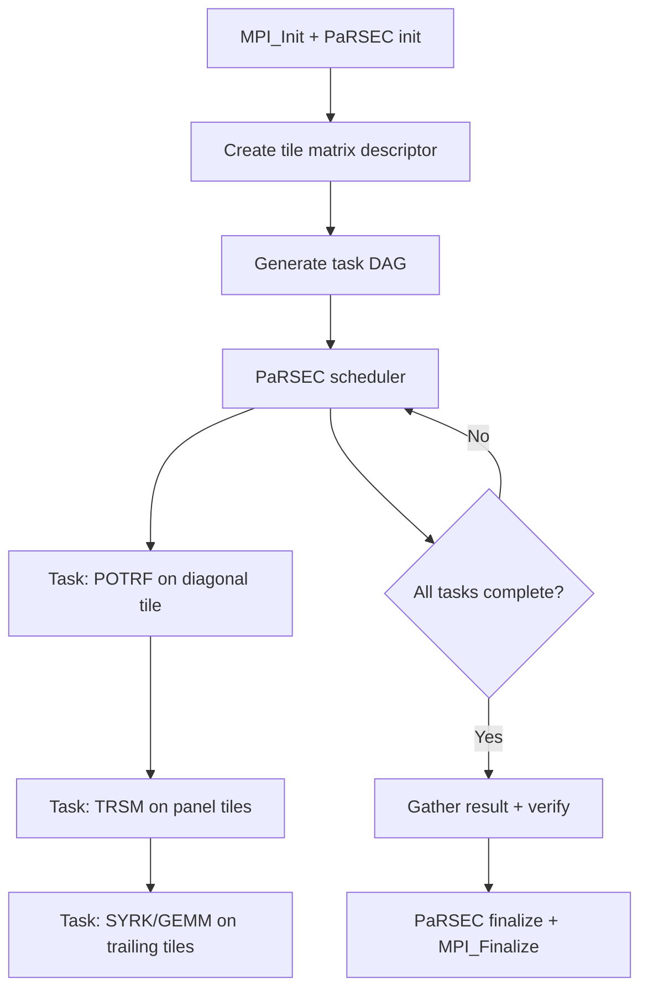

# DPLASMA Computation Flow

## Overview
DPLASMA provides dense linear algebra operations (Cholesky, LU, QR) on distributed tile matrices using the PaRSEC task-based runtime. Tasks are scheduled dynamically based on data dependencies in a DAG.

## Main Loop

## MPI Communication
- **Implicit**: PaRSEC runtime handles all data movement between MPI ranks
- **2D block-cyclic**: matrix tiles distributed across a process grid
- **Overlap**: communication overlapped with computation automatically

## I/O Points
- Matrix generated in-place (no file I/O for benchmarking)
- Verification: residual check printed to stdout
