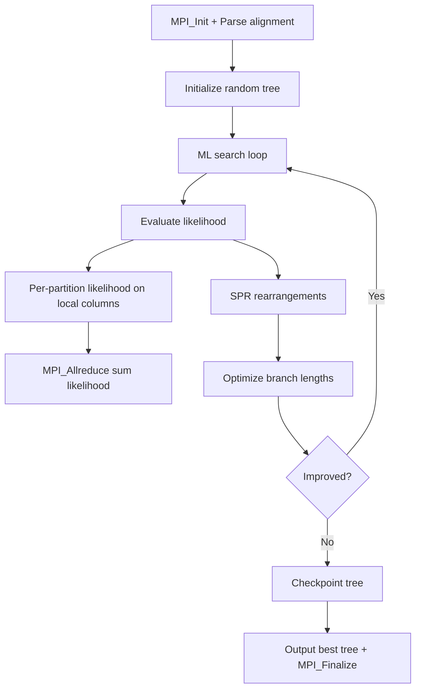

# ExaML Computation Flow

## Overview
ExaML (Exascale Maximum Likelihood) performs phylogenetic tree inference using maximum likelihood on partitioned multi-gene datasets. MPI parallelization distributes alignment columns across ranks.

## Main Loop

## MPI Communication
- **Data parallel**: alignment columns distributed across ranks via cyclic assignment
- **Collective**: `MPI_Allreduce` to sum per-site log-likelihoods across ranks
- **Broadcast**: `MPI_Bcast` for tree topology updates after SPR moves

## I/O Points
- Checkpoint files: tree topology + model parameters written periodically
- Final output: best tree in Newick format + log-likelihood score
