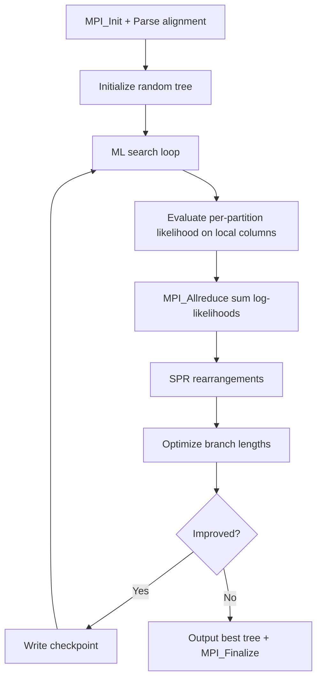

# ExaML Computation Flow

## Overview
ExaML (Exascale Maximum Likelihood) performs phylogenetic tree inference using maximum likelihood on partitioned multi-gene datasets. MPI parallelization distributes alignment columns across ranks.

## Main Loop



## MPI Communication
- **Data parallel**: alignment columns distributed cyclically across ranks
- **Collective**: `MPI_Allreduce` to sum per-site log-likelihoods
- **Broadcast**: `MPI_Bcast` for tree topology updates after SPR moves

## I/O Points
- Checkpoint: `ExaML_binaryCheckpoint.*` with tree + model params
- Final: best tree in Newick format + log-likelihood score

## Output Format
```
Final GAMMA-based Score of best tree: -12345.678901
Tree written to ExaML_result.T1
```
**How to compare**: extract the `Final GAMMA-based Score`; numeric comparison with tolerance ~1e-2 (ML scores can vary slightly across restarts due to rounding).
