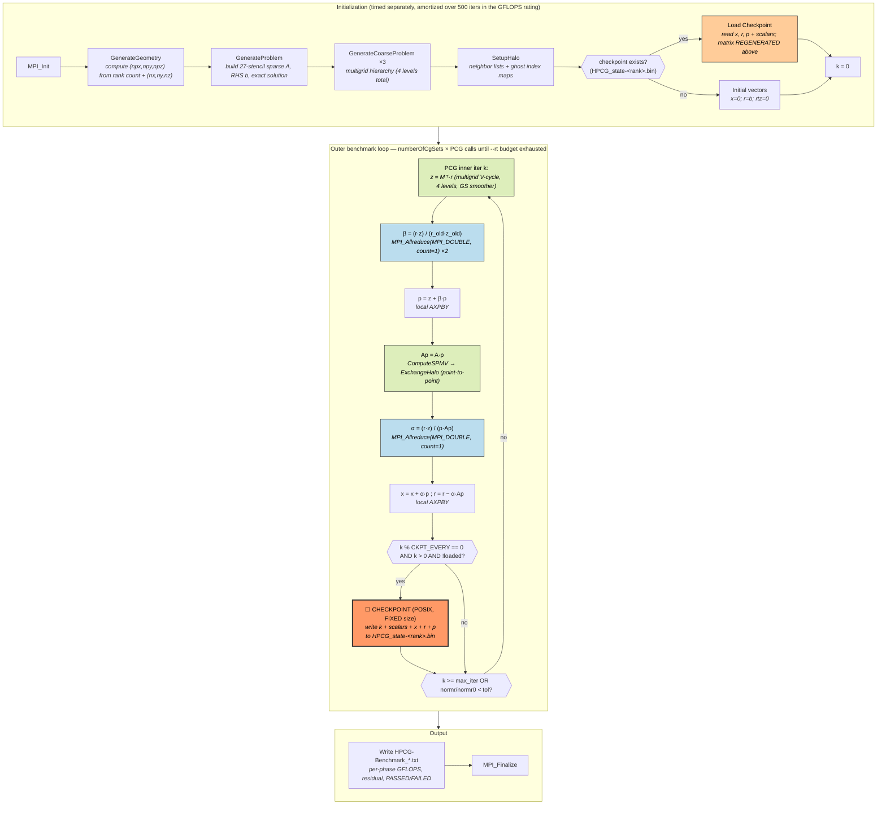
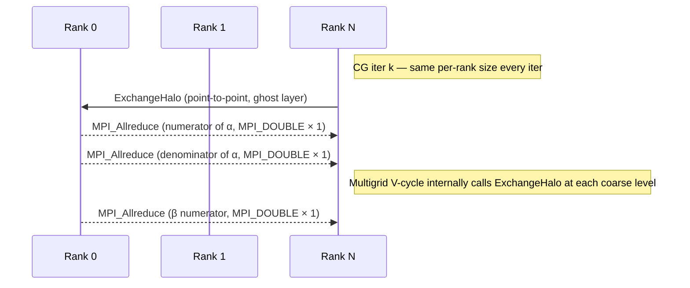
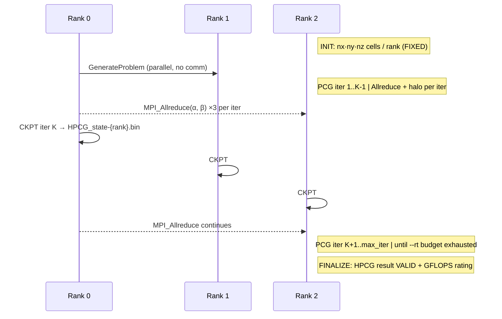

# HPCG — High Performance Conjugate Gradient

**Class:** (1) iterative_fixed
**Language:** C++ (MPI required, optional OpenMP)
**Checkpoint library:** **None upstream** — would be added in `tests/apps/checkpointed/HPCG/` as a small POSIX-file writer covering the per-rank vectors `x`, `r`, `p` plus a handful of scalars

## Application Description

HPCG (High Performance Conjugate Gradient) is the companion ranking benchmark to HPL on the TOP500. It builds a synthetic SPD sparse linear system from a 27-point stencil on a regular 3D grid and solves it with **multigrid-preconditioned conjugate gradient** (PCG). Performance is reported as a weighted GFLOPS rating spanning sparse mat-vec, symmetric Gauss-Seidel triangular solve, and AXPBY/dot-product vector kernels.

The reference upstream ([github.com/hpcg-benchmark/hpcg](https://github.com/hpcg-benchmark/hpcg)) **does not ship checkpoint/restart support**. Adding HPCG to this suite means writing a small POSIX-file checkpoint in our `tests/apps/checkpointed/HPCG/` variant — analogous to how `comd-ft` adds POSIX I/O to vanilla CoMD. This is a deliberate departure from the "every benchmark must have native upstream checkpoint" rule (see Suite-fit caveats below).

HPCG is the only proposed addition that broadens class (1) beyond stencil/lattice patterns into **Krylov / sparse-linear-algebra** territory, where the dominant cost is `MPI_Allreduce` on tiny (1-double) payloads rather than nearest-neighbor halo exchange.

## Computation Workflow



**Data flow per CG iter:** `r, z` →(Allreduce)→ `β` →(local)→ `p` →(SPMV + halo)→ `Ap` →(Allreduce)→ `α` →(local AXPBY)→ `x', r'`.

### Start

1. **MPI initialization**.
2. **Geometry** — `GenerateGeometry` factors the rank count into `(npx, npy, npz)` based on `(nx, ny, nz)` per-rank from `hpcg.dat`.
3. **Sparse problem** — `GenerateProblem` builds the 27-stencil sparse matrix `A`, RHS `b`, and the exact solution `xexact` (used only for validation).
4. **Multigrid hierarchy** — `GenerateCoarseProblem` runs three times to build coarse grids at half resolution each.
5. **Halo maps** — `SetupHalo` computes neighbor rank IDs and ghost-cell index maps for `ExchangeHalo`.
6. **Restart vs fresh** — if `HPCG_state-<rank>.bin` is found, deserialize the per-rank vectors and scalars; otherwise initialize `x=0`, `r=b`, scalars zero.

### Main Loop (PCG with multigrid preconditioner)

The outer benchmark structure runs `numberOfCgSets` PCG calls, each up to **50 inner CG iterations**, until the wall-clock budget set by `--rt=N` is exhausted (default 1800 s for an "official" run; we set lower for benchmarking).

Per inner iteration in `src/CG.cpp`:

1. **Preconditioner** — `z = M⁻¹·r` via 4-level multigrid V-cycle with symmetric Gauss-Seidel smoother (`ComputeMG_ref`).
2. **β coefficient** — `β = (r·z) / (r_old·z_old)`. Each dot product is one `MPI_Allreduce(MPI_DOUBLE, count=1, MPI_SUM)`. **Two Allreduces here.**
3. **Search-direction update** — `p = z + β·p` (local AXPBY).
4. **Sparse matrix-vector** — `Ap = A·p`. `ComputeSPMV` calls `ExchangeHalo` first to refresh ghost cells via non-blocking point-to-point.
5. **α coefficient** — `α = (r·z) / (p·Ap)`. **One more Allreduce.**
6. **Vector updates** — `x += α·p`; `r -= α·Ap`. Local.
7. **(checkpoint hook)** — if `k % CKPT_EVERY == 0 && k > 0 && !loaded`, write the per-rank state file. Same pattern as CoMD.

Termination: time budget exhausted *or* `normr / normr0 < tol·(1 + 1e-6)` (rare at the chosen tol — usually time wins).

### End

- Outputs `HPCG-Benchmark_<version>_<timestamp>.txt` and `hpcg_log_<timestamp>.txt`.
- Both contain per-phase GFLOPS, the final residual, spectral radius estimates, and a `PASSED`/`FAILED` validation flag.
- **Validation output:** the harness greps the `HPCG result is VALID with a GFLOP/s rating of: <value>` line.

## Critical State

For a deterministic restart, every rank must restore exactly its CG iteration state:

| Field | Type | Size | Save? | Notes |
|-------|------|------|-------|-------|
| `x[i]` | `double` | local-N | ✓ | The solution vector — **must save** |
| `r[i]` | `double` | local-N | ✓ | Residual — **must save** |
| `p[i]` | `double` | local-N + halo | ✓ | Search direction — **must save** |
| `Ap[i]` | `double` | local-N | ✗ | Derivable from `p` via SPMV — skip |
| `z[i]` | `double` | local-N | ✗ | Derivable from `r` via multigrid V-cycle — skip |
| `b[i]` | `double` | local-N | ✗ | Regenerable from `GenerateProblem(geometry)` — skip |
| `normr`, `normr0`, `rtz`, `oldrtz`, `α`, `β` | `double` | scalars | ✓ | Iteration state |
| `k` (CG iter), outer set index | `int` | scalars | ✓ | Loop counters |
| Sparse matrix `A` (and 3 coarse levels), halo maps | `Matrix` | large | ✗ | **Regenerable** from `(nx, ny, nz, npx, npy, npz)` — skip |
| RNG | — | — | ✗ | HPCG is deterministic; no RNG state |

**Key observation:** because `A` and the multigrid hierarchy are pure functions of the synthetic geometry, the checkpoint payload is just **3 doubles × local-N + a handful of scalars per rank**. This is the smallest critical-state footprint of any class-(1) app.

## MPI Task Lifetime

**Per-rank state shape: stable.** Each rank owns a fixed local box `nx × ny × nz` for the entire run. No migration, no AMR, no resizing.

**Communication pattern:**
- **One-cell ghost halo** via `ExchangeHalo` (non-blocking `MPI_Isend`/`MPI_Irecv`), called inside `ComputeSPMV_ref` and at every multigrid level.
- **Two `MPI_Allreduce(MPI_DOUBLE, count=1, MPI_SUM)` per CG inner iteration** in `ComputeDotProduct` (numerator + denominator of α; one for β).
- This ratio (Allreduce-bound on tiny payloads + halo-exchange) is structurally different from every other class-(1) app in the suite, all of which are halo-dominated.



### Application Lifetime View



**Key observations:**
- Per-rank state is **structurally fixed** for the entire run. Class (1) by the `tests/apps/README.md` definition.
- Checkpoint is **per-rank independent** — no coordination, no MPI-IO.
- The dominant communication pattern (Allreduce-on-tiny-payloads) is unique in the suite — neither CoMD nor any of the other class-(1) apps stress checkpoint scheduling against latency-bound collectives this way.

## Checkpoint Protection

### Write trigger (proposed — would live in our `checkpointed/HPCG/src/CG.cpp`)

At the top of the inner CG loop, mirroring CoMD's idiom (`docs/CoMD/README.md` line 161):

```c++
const int CKPT_EVERY = 10;
if (k > 0 && k % CKPT_EVERY == 0 && !loaded) {
    write_checkpoint(rank, k, vectors, scalars);
}
loaded = 0;
```

### What is saved (per-rank file `HPCG_state-<rank>.bin`)

```
struct HPCGCheckpoint {
    int    k;                  // current CG iteration
    int    outer_set;          // outer benchmark set index
    int    nx, ny, nz;         // local grid (sanity check)
    double normr, normr0;
    double rtz, oldrtz, alpha, beta;
    // Then raw vectors:
    double x[local_N];         // 8 × local_N bytes
    double r[local_N];         // 8 × local_N bytes
    double p[local_N + halo];  // 8 × (local_N + halo) bytes
};
```

For `(nx, ny, nz) = (104, 104, 104)`, local_N ≈ 1.1 M → checkpoint ≈ 27 MB / rank. Cheap.

### Write protocol

1. **`MPI_Barrier`** — all ranks must reach the same `k` before any write begins (so a partial write doesn't pair rank-N's iter K with rank-(N-1)'s iter K-1).
2. Each rank: `fopen("HPCG_state-<rank>.bin", "wb")` → sequential `fwrite` of the struct → `fsync` → `fclose`.
3. Per-rank independent — no collective MPI-IO.

### Restart protocol

1. After `GenerateProblem` and `GenerateCoarseProblem` regenerate the matrix and multigrid hierarchy (free, deterministic from the synthetic geometry), check for `HPCG_state-<rank>.bin`.
2. If present, deserialize all fields. Set `loaded = 1` so the immediate-next iteration doesn't re-write.
3. Resume the inner CG loop at `k`.

### Consistency

- **Per-rank-independent** files. No atomic publish needed across ranks.
- **`MPI_Barrier`** ensures all ranks reach the same iteration before any write begins.
- **`fsync` per file** for write durability. No `.tmp` + rename pattern (acceptable since per-rank independence makes a single corrupted file recoverable from the previous checkpoint via re-run).

## Suite-fit notes (why class 1)

- **MPI_Barrier-based**: PCG iterations form bulk-synchronous step boundaries (the Allreduces themselves are implicit barriers).
- **Per-rank state fixed**: no migration, no resizing.
- **Distinct communication profile**: Allreduce-on-tiny-payloads + halo, vs the halo-dominated CoMD/SW4lite/OpenLB. Adds genuine signal to (1).

## Suite-fit caveats — the upstream-immutability tension

The repository's reference-app rule states:

> Every benchmark application **must** have native checkpoint/restart support in its original upstream source. ([tests/apps/README.md](README.md))

**HPCG fails this criterion strictly.** The upstream has no save/restore. Adding HPCG to the suite means our `tests/apps/checkpointed/HPCG/` would carry an in-house POSIX writer that is not present in the official benchmark.

**Mitigation precedent**: the suite already accepts `comd-ft` (CoMD with POSIX I/O added by ExMatEx, not by upstream LANL CoMD) and the recent miniVite POSIX rewrite (commit `4f24272ec`, "miniVite — replace FTI with simple POSIX file checkpoint"). HPCG-with-POSIX-checkpoint would be the same shape: a well-defined extension to a published benchmark.

**Decision needed**: keep HPCG out of the suite under a strict reading of the immutability rule, or admit it as a third-party-style extension consistent with the CoMD-ft / miniVite precedents. The previous recommendation in `tests/apps/README.md:101` flagged HPCG as "lower priority than fixing class 4" specifically because of this tension.

## Suite-fit cost summary

| Aspect | Cost |
|--------|------|
| Source size | ~30k LOC C++ |
| Build | CMake or autotools, OpenMPI + g++ sufficient |
| Runtime control | Precise via `--rt=N` (seconds) — easy to size to 120 s |
| Critical-state size | Smallest in the suite (~27 MB / rank for `nx=ny=nz=104`) |
| Validation signal | `HPCG result is VALID` line + GFLOPS rating |
| Build tier | `fast` (compiles in <60 s; runtime configurable) |
