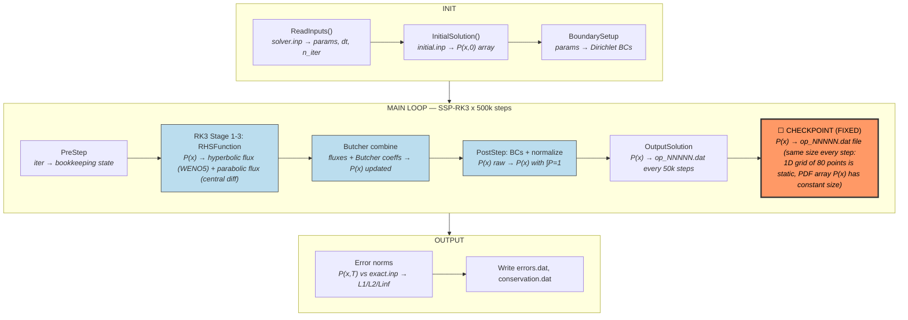
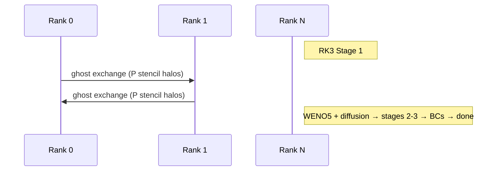
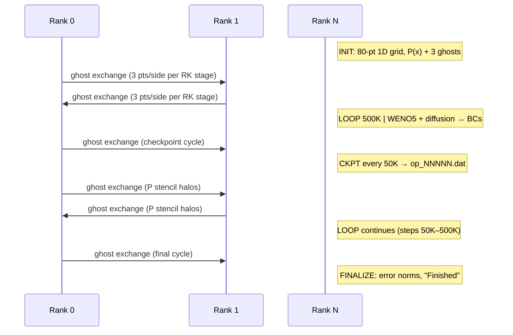

# HyPar — Hyperbolic-Parabolic PDE Solver

**Class:** (1) iterative_fixed  
**Language:** C (MPI)  
**Checkpoint library:** Native solution output files (text format, repurposed as checkpoints)

## Application Description

HyPar is a finite-difference PDE solver for hyperbolic-parabolic PDEs on structured multi-block meshes with MPI parallelism. The benchmark uses the **Fokker-Planck Double Well** model on a 1D domain. It solves for the time evolution of a probability density function `P(x,t)` under a double-well drift potential:

```
dP/dt = d[f(x)P]/dx + (q/2) * d²P/dx²
```

where `f(x) = 4x(1 - x²)` (gradient of the double-well potential) and `q = 0.24` (diffusion coefficient). The hyperbolic term uses 5th-order WENO, the parabolic term uses 2nd-order central differences, and time integration uses SSP-RK3. The domain has 80 grid points, Dirichlet boundary conditions `P=0` at both ends, 500,000 timesteps at `dt=0.001` (total time = 500).

## Computation Workflow



Data flow per step: `P(x)` is evolved by 3-stage RK3 (WENO advection + central diffusion), re-normalized, and periodically written to `op_*.dat` files that double as checkpoints.

### Start

1. **MPI initialization**, read `solver.inp` via `ReadInputs()`.
2. **Array allocation**, initialize the Fokker-Planck model (`FPDoubleWellInitialize()`).
3. **Initial condition** — read PDF from `initial.inp` via `InitialSolution()`.
4. **Boundary conditions** setup.
5. Check `restart_iter` in `solver.inp` (0 for fresh run, nonzero when injected by restart script).

### Main Loop (SSP-RK3, 500,000 timesteps)

Driven by `Solve()` -> `TimeInitialize()` + loop from `restart_iter` to `n_iter`:

Each iteration:

1. **Pre-step** (`TimePreStep`) — bookkeeping.
2. **RK step** (`TimeStep` -> `TimeRK`) — 3-stage SSP-RK3:
   - For each stage: evaluate `RHSFunction` (calls `FPDoubleWellAdvection` for hyperbolic flux via WENO and `FPDoubleWellDiffusion` for parabolic flux), combine with Butcher tableau coefficients.
3. **Post-step** (`TimePostStep`) — apply boundary conditions, normalize PDF integral.
4. **Diagnostics** (`TimePrintStep`) — print screen output every `screen_op_iter` steps.
5. **File output** — every `file_op_iter=50000` steps: write `op_00001.dat`, `op_00002.dat`, etc.

### End

- Compute L1/L2/Linf error norms against exact solution from `exact.inp`.
- Write `errors.dat` and `conservation.dat`.
- Print `"Finished"` to stdout.
- **Validation output:** error norms and `"Finished"` line.

## Critical State

| Field | Type | Evolution |
|-------|------|-----------|
| `solver.u` | PDF array `P(x)` (double, size `npoints_local_wghosts * nvars`) | Updated every step by RK3; must remain non-negative and integrate to 1 |
| `waqt` | Physical time (double) | `= iter * dt` |
| `iter` | Iteration counter (int) | Incremented each step |

**Transient arrays:** RK stage arrays `U[stage]` and `Udot[stage]` are scratch spaces fully recomputed each iteration — not part of persistent state.

**Conservation property:** The PDF integral (total probability) is conserved by the Fokker-Planck equation and tracked at each step.

## MPI Task Lifetime

**Per-rank state:** Each rank owns a contiguous segment of the 1D grid (80 points total) and holds local values of the PDF array `P(x)` plus ghost points from neighbors for stencil operations (WENO5 requires wide stencils).

**How state changes:** Per-rank data is strictly fixed in size. The 1D structured grid never changes, and the PDF values are updated in-place by the RK3 integrator with no data migration between ranks.

**Communication pattern:** Each RK3 stage requires a ghost-point exchange with neighboring ranks to fill the wide stencil (5th-order WENO needs 3 ghost points per side). No global reductions occur during the timestep itself; diagnostics are computed separately.



### Application Lifetime View



**Key observations:**
- **State size behavior:** Per-rank state is strictly fixed throughout execution. The 1D grid has exactly 80 points partitioned across ranks, and each rank's local `P(x)` segment (plus 3 ghost points per side for WENO5) never changes size. Checkpoint file size is identical for every write.
- **Communication pattern:** Nearest-neighbor ghost-point exchange before each of the 3 RK3 stages (6 exchanges per timestep total). The 5th-order WENO stencil requires 3 ghost points per side. No global reductions occur during the timestep — diagnostics and normalization are computed separately.
- **Checkpoint coordination:** All ranks write their local `P(x)` segments to a shared text file (`op_NNNNN.dat`) via `WriteArray`. The output files double as checkpoints — on restart, the most recent `op_*.dat` is copied to `initial.inp` and the restart iteration is injected into `solver.inp`.

## Checkpoint Protection

### Mechanism

HyPar repurposes its **solution output files** as checkpoints. The same `WriteArray` function that generates visualization output is used for restart data. No separate checkpoint format exists.

### What is saved

Text files `op_00001.dat` (iteration 50000), `op_00002.dat` (iteration 100000), ..., each containing the serialized PDF array `solver.u`.

### Write trigger

Every `file_op_iter=50000` iterations via `OutputSolution()` -> `WriteArray()`.

### Restart protocol (`run_with_restart.sh`)

1. Find the most recent output file: `ls -t op_*.dat | head -1`.
2. Extract file index (e.g., `5` from `op_00005.dat`).
3. Compute restart iteration: `RESTART_ITER = index * file_op_iter` (e.g., 5 * 50000 = 250000).
4. Copy that output file to `initial.inp` (overwriting the original initial condition).
5. Inject `restart_iter <RESTART_ITER>` before `end` in `solver.inp` via `sed -i`.
6. Run HyPar — reads `initial.inp` as the PDF at iteration 250000, sets `waqt = 250000 * 0.001 = 250.0`.
7. Revert `solver.inp` by removing the injected line.
8. Loop resumes from iteration 250000 to 500000.

**Filename index reset:** `ResetFilenameIndex()` adjusts the output file numbering so continued output files have correct sequential naming.
