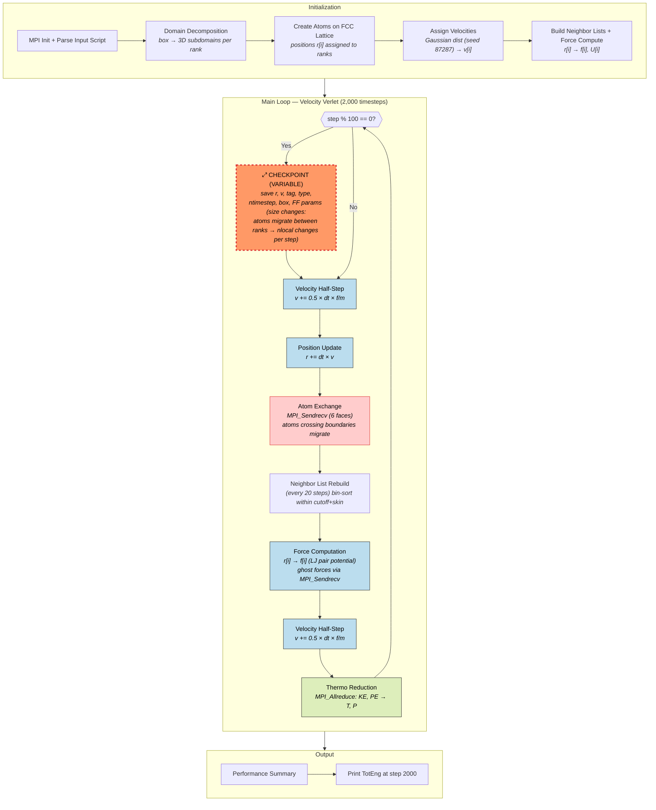
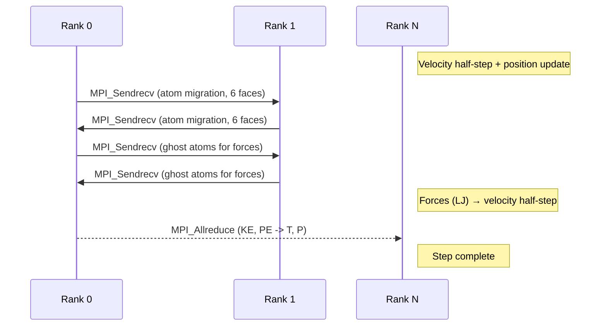
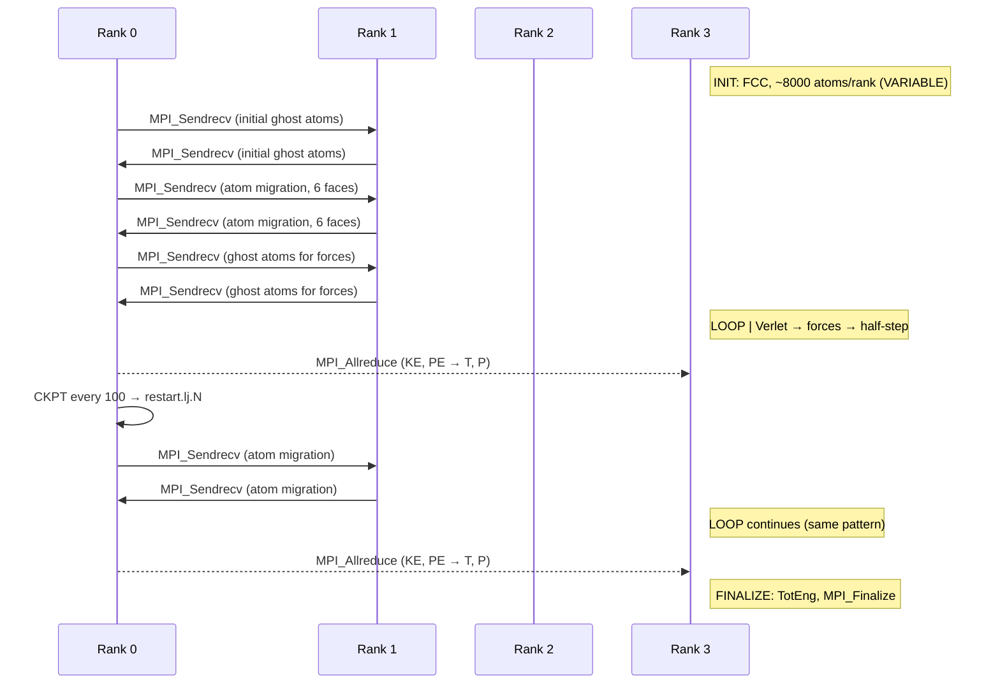

# LAMMPS — Large-scale Atomic/Molecular Massively Parallel Simulator

**Class:** (2) iterative_variable  
**Language:** C++ (MPI)  
**Checkpoint library:** Native restart files

## Application Description

LAMMPS is a classical molecular dynamics engine that integrates Newton's equations of motion for atoms interacting through empirical potentials. The benchmark configuration runs a **3D Lennard-Jones melt**: ~32,000 atoms on an FCC lattice at reduced density 0.8442, simulated in LJ units under the NVE microcanonical ensemble using the velocity Verlet integrator with a cutoff-based LJ pair potential (rc = 2.5sigma). The run is distributed across 4 MPI ranks using 3D spatial domain decomposition.

## Computation Workflow



**Data flow per step:** `r,v` →(half-step)→ `v'` →(position)→ `r'` →(exchange)→ `r'` migrated →(neighbors)→ pairs →(force)→ `f'` →(half-step)→ `v''` →(reduce)→ `TotEng`

### Start

1. **MPI initialization** and input script parsing.
2. **Domain partitioning** — 3D grid of subdomains, one per rank.
3. **Atom creation** — atoms placed on FCC lattice and assigned to owning rank by position.
4. **Velocity assignment** — Gaussian distribution with fixed seed (87287) for reproducibility.
5. **Initial neighbor list build** and force computation.

### Main Loop (2,000 timesteps, velocity Verlet)

Each timestep:

1. **Velocity half-step** — `v += 0.5 * dt * f/m` for all local atoms.
2. **Position update** — `r += dt * v` for all local atoms.
3. **Atom exchange** — atoms that crossed subdomain boundaries sent to new owning rank via `MPI_Sendrecv` in all 6 face directions. `nlocal` changes dynamically.
4. **Neighbor list rebuild** — every 20 steps, bin-sorted neighbor list rebuilt from local + ghost atoms within cutoff + skin (2.5 + 0.3 = 2.8sigma).
5. **Force computation** — LJ pair forces for all neighbor pairs. Ghost atom forces accumulated via `MPI_Sendrecv`.
6. **Velocity half-step** — second `v += 0.5 * dt * f/m` completing the Verlet step.
7. **Thermodynamics** — kinetic/potential energy reduced via `MPI_Allreduce`. Temperature, pressure logged.

### End

- Performance summary and loop timing printed.
- `MPI_Finalize`.
- **Validation output:** the `TotEng` value at step 2000.

## Critical State

The state is rank-local and asymmetric — each MPI rank owns a disjoint subset of atoms by spatial position. Ghost atoms are reconstructed each step and are not persistent state.

| Field | Type | Evolution |
|-------|------|-----------|
| `x[i][3]` | Atom position (3 doubles) | Updated every step; atoms migrate between ranks as they cross boundaries |
| `v[i][3]` | Atom velocity (3 doubles) | Updated twice per step via half-step Verlet |
| `tag[i]` | Global atom ID | Static — tracks atoms across rank migration |
| `type[i]` | Atom species | Static (single species for LJ melt) |
| `nlocal` | Local atom count | Variable — changes every step as atoms move |
| `ntimestep` | Current step counter | Monotonically incremented |
| Box bounds | `boxlo/hi` | Fixed for NVE at constant volume |

**Derived:** Forces `f[i]` are recomputed from scratch each step and are not independent state.

**Variable state:** The atom count per rank (`nlocal`) changes every timestep as atoms cross subdomain boundaries, making this a variable-size checkpoint problem.

## MPI Task Lifetime

**Per-rank state:** Each rank owns a spatial subdomain of the 3D simulation box and holds the atoms within it (positions `x`, velocities `v`, global IDs `tag`, types). Ghost atoms from neighboring subdomains are reconstructed each step and are transient.

**How state changes:** The local atom count (`nlocal`) changes every timestep as atoms cross subdomain boundaries. This makes per-rank state variable-sized, though the global atom count is conserved.

**Communication pattern:** Each step performs a 6-face `MPI_Sendrecv` exchange to migrate atoms that crossed boundaries, a neighbor-ghost exchange for force computation, and a global `MPI_Allreduce` for thermodynamic quantities.



### Application Lifetime View



**Key observations:**
- **State size behavior:** Each rank's atom count (`nlocal`) fluctuates every timestep as atoms cross subdomain boundaries. Global atom count (~32,000) is conserved, but per-rank state is variable-sized, making checkpoint size unpredictable per rank.
- **Communication pattern:** Nearest-neighbor `MPI_Sendrecv` in 6 face directions for atom migration and ghost exchange (point-to-point), plus a global `MPI_Allreduce` for thermodynamic reductions each step.
- **Checkpoint coordination:** All ranks contribute local atom data to a single merged binary restart file. No explicit barrier — LAMMPS serializes rank contributions internally. On restart, atoms are re-partitioned to match the current MPI decomposition.

## Checkpoint Protection

### Write trigger

The input script `in.lj_ckpt` adds:
```
restart 100 restart.lj
```
This writes a binary restart file every 100 steps. LAMMPS uses two-file rotation — alternating between `restart.lj.100`, `restart.lj.200`, etc. — so at least one complete checkpoint is always available.

### What is saved

A complete snapshot in LAMMPS binary format:
- All atom positions, velocities, global IDs, types
- Force field parameters (epsilon, sigma, cutoff)
- Simulation box geometry
- Current timestep counter
- All simulation settings (fix styles, neighbor list parameters)

Each rank contributes its local atom data; the file is a globally consistent merged dump.

### Restart protocol (`run_with_restart.sh`)

1. Find the most recent `restart.lj.*` file via `ls -t`.
2. If found, generate an on-the-fly input script calling `read_restart` on that file.
3. Re-specify force field coefficients (not stored in restart file).
4. Issue `run 2000 upto` — the `upto` keyword runs until step 2000 total, not 2000 additional steps.
5. If no checkpoint exists, fall back to fresh run from `in.lj_ckpt`.

### Restart mechanics

On `read_restart`, LAMMPS reconstructs the full atom state, re-partitions atoms to match the current MPI decomposition (may differ from checkpoint time), rebuilds neighbor lists, and resumes from the saved `ntimestep`.

### Output comparison

Both vanilla and checkpointed runs must reach step 2000 with matching `TotEng`. The `keep_patterns: ["      2000"]` filter isolates the step-2000 thermodynamic row, making comparison insensitive to timing and layout differences.
