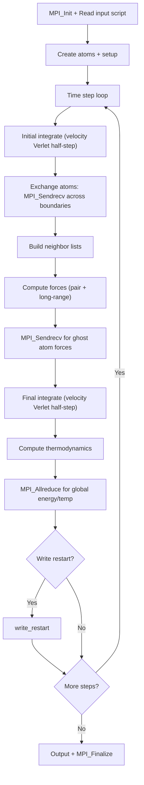

# LAMMPS Computation Flow

## Overview
LAMMPS performs molecular dynamics with spatial domain decomposition. Each timestep computes forces, integrates equations of motion, and exchanges atoms that migrate across subdomain boundaries.

## Main Loop



## MPI Communication
- **Atom exchange**: `MPI_Sendrecv` for atoms crossing subdomain boundaries (6 directions)
- **Ghost communication**: `MPI_Sendrecv` for ghost atom positions/forces
- **Collective**: `MPI_Allreduce` for global thermodynamic quantities
- **Decomposition**: 3D regular spatial decomposition

## I/O Points
- Restart files: binary dump of full simulation state
- Dump files: atom positions for visualization
- Log: thermodynamic output every N steps

## Output Format
Log output prints a thermodynamic table:
```
Step Temp E_pair E_mol TotEng Press
     0   1.44  -6.7733681   0  -4.6133681  -5.0196693
   100   0.76  -5.7585055   0  -4.6185055   0.20726105
```
Restart files are binary (architecture-dependent or MPI-IO portable).
**How to compare**: extract `TotEng` column from log; numeric comparison with tolerance ~1e-4. For restart files, re-run from restart and compare final thermodynamics.
