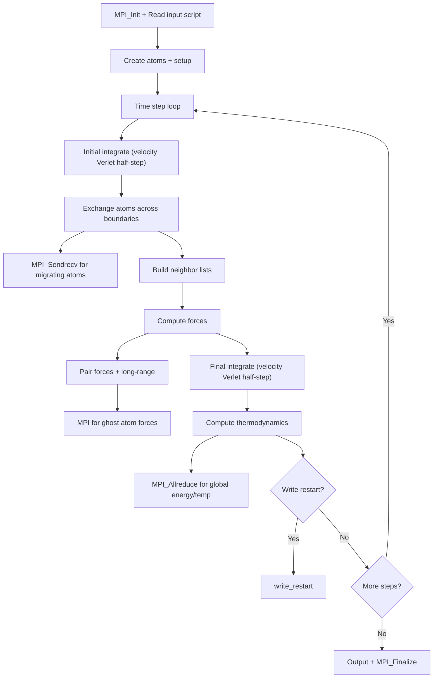

# LAMMPS Computation Flow

## Overview
LAMMPS performs molecular dynamics with spatial domain decomposition. Each timestep computes forces, integrates equations of motion, and exchanges atoms that migrate across subdomain boundaries.

## Main Loop

## MPI Communication
- **Atom exchange**: `MPI_Sendrecv` for atoms crossing subdomain boundaries (6 directions)
- **Ghost communication**: `MPI_Sendrecv` for ghost atom positions/forces
- **Collective**: `MPI_Allreduce` for global thermodynamic quantities
- **Decomposition**: 3D regular spatial decomposition

## I/O Points
- Restart files: binary dump of full simulation state
- Dump files: atom positions for visualization
- Log: thermodynamic output every N steps
