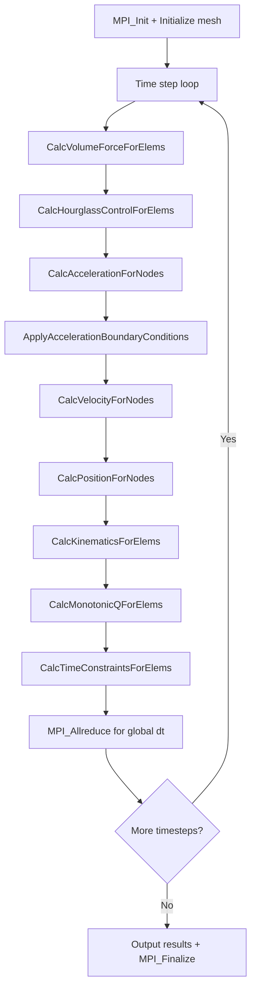

# LULESH Computation Flow

## Overview
LULESH (Livermore Unstructured Lagrangian Explicit Shock Hydrodynamics) simulates a Sedov blast wave problem using Lagrangian hydrodynamics on a hexahedral mesh. Each MPI rank owns a fixed subdomain; the mesh deforms but the topology (element/node count) stays constant.

## Main Loop



## MPI Communication Pattern
- **Halo exchange**: `MPI_Isend`/`MPI_Irecv`/`MPI_Wait` on 26 neighbors for nodal fields
- **Global reduction**: `MPI_Allreduce(MPI_MIN)` for the global time step constraint
- **Decomposition**: 3D block decomposition, ranks must be a perfect cube

## I/O Points
- Final output: energy, relative volume, iteration count to stdout

## Output Format
Stdout prints per-iteration and final summary lines:
```
Run completed:
   Problem size        =  30
   MPI tasks           =  8
   Iteration count     =  50
   Final Origin Energy = 2.025075e+04
```
**How to compare**: extract the `Final Origin Energy` value; numeric comparison with tolerance ~1e-6.
