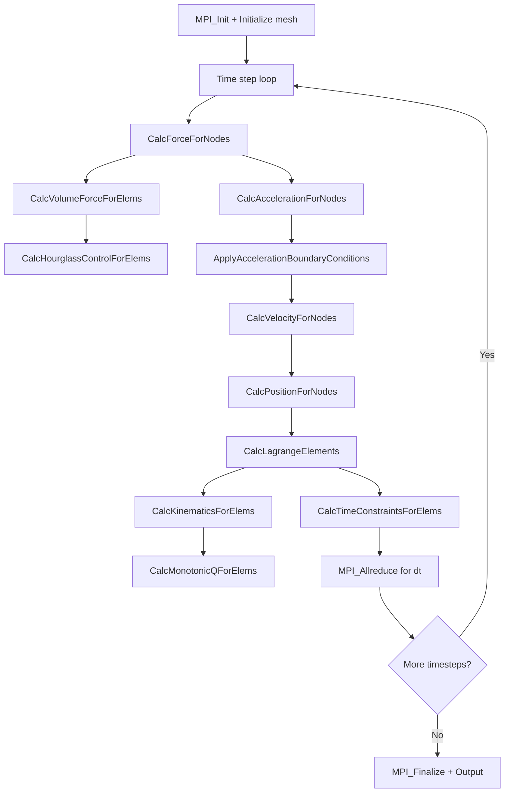

# LULESH Computation Flow

## Overview
LULESH (Livermore Unstructured Lagrangian Explicit Shock Hydrodynamics) simulates a Sedov blast wave problem using Lagrangian hydrodynamics on a hexahedral mesh. Each MPI rank owns a fixed subdomain; the mesh deforms but the topology (element/node count) stays constant.

## Main Loop

## MPI Communication Pattern
- **Halo exchange**: `MPI_Isend`/`MPI_Irecv`/`MPI_Wait` on 26 neighbors (face + edge + corner) for nodal fields (positions, velocities, forces)
- **Global reduction**: `MPI_Allreduce(MPI_MIN)` for computing the global time step constraint
- **Decomposition**: 3D block decomposition, number of ranks must be a perfect cube (1, 8, 27, 64, ...)

## I/O Points
- Final output: prints energy, relative volume, and iteration count to stdout
- No intermediate file output in the default configuration
