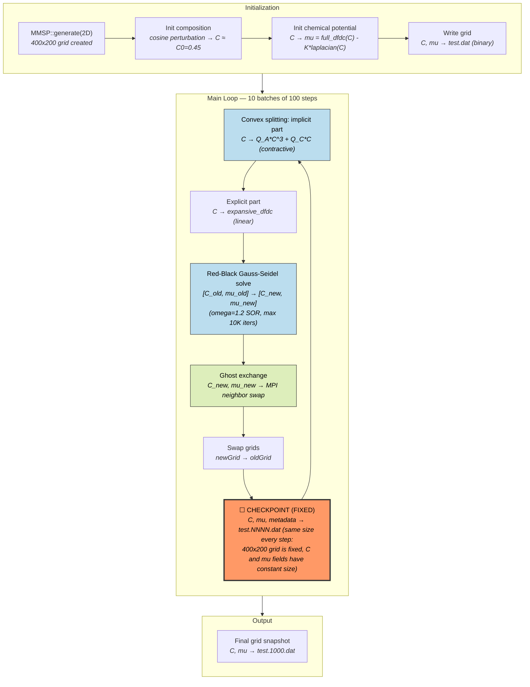
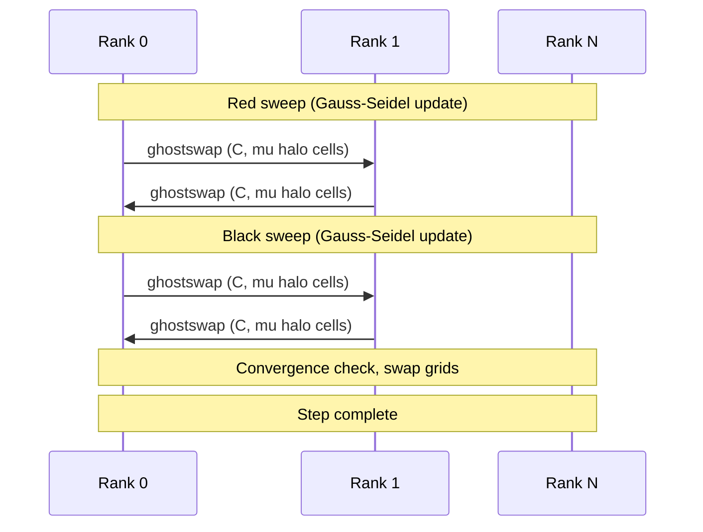
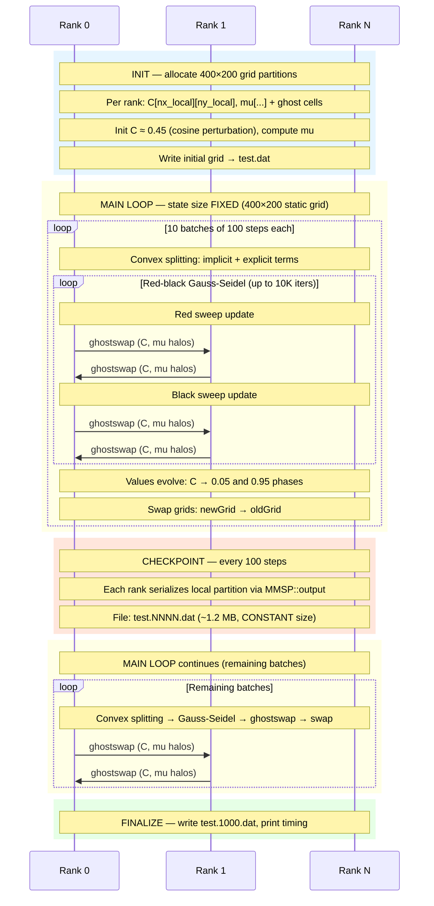

# MMSP — Mesoscale Microstructure Simulation Program (Cahn-Hilliard)

**Category:** Iterative / Variable state  
**Language:** C++ (MPI)  
**Checkpoint library:** Native MMSP grid serialization (`MMSP::output`/`MMSP::input`)

## Application Description

MMSP is a C++ framework for phase-field simulations. The benchmark uses the **Cahn-Hilliard convex-splitting** example, which simulates **spinodal decomposition** — the spontaneous phase separation of a binary mixture. A 2D composition field `C(x,y)` and chemical potential field `mu(x,y)` evolve over 1000 timesteps on a 400x200 grid, with intermediate snapshots every 100 steps. The free energy drives phase separation toward compositions near `Ca=0.05` and `Cb=0.95`.

## Computation Workflow



**Data flow per step:** `C,mu` →(convex split)→ implicit+explicit terms →(Gauss-Seidel)→ `C',mu'` →(ghost swap)→ synced `C',mu'` →(every 100 steps)→ `.dat` checkpoint file

### Start

1. **Initialization** — `MMSP::generate(dim=2, "test.dat")` creates a 2D grid of size 400x200.
2. **Initial conditions** — composition `C` set as a small cosine perturbation around `C0=0.45`; chemical potential `mu` computed from `full_dfdc(C) - K*laplacian(C)`.
3. **Grid output** — initial state written to `test.dat` using MMSP binary serialization.

### Main Loop (10 batches of 100 steps each)

Each batch calls `MMSP::update(grid, 100)`, which runs 100 steps of a **semi-implicit convex-splitting** scheme:

1. **Convex part** — treated implicitly: `Q_A*C^3 + Q_C*C` (contractive derivative of free energy).
2. **Concave part** — treated explicitly: `expansive_dfdc` (linear in `C`).
3. **Solve** — 2x2 per-node system `[C_new, mu_new]` solved iteratively using **red-black Gauss-Seidel** with successive over-relaxation (omega=1.2).
4. **Convergence check** — every 5 iterations, normalized residual tested; solver aborts after `max_iter=10000`.
5. **Ghost exchange** — `ghostswap()` communicates halo cells with MPI neighbors after each color sweep.
6. **Array swap** — after convergence: `swap(oldGrid, newGrid)`.

After each batch of 100 steps, `MMSP::output(grid, filename)` writes a snapshot: `test.0100.dat`, `test.0200.dat`, ..., `test.1000.dat`.

### End

- Loop completes after 1000 total steps.
- **Validation output:** progress timing lines.

## Critical State

| Field | Type | Evolution |
|-------|------|-----------|
| `grid(n)[0]` = `C` | Composition (double, 0 to 1) | Updated each step by convex-splitting solver; separates into C~0.05 and C~0.95 phases |
| `grid(n)[1]` = `mu` | Chemical potential (double) | Updated each step; drives diffusive fluxes |
| Grid metadata | Spatial dimensions, ghost layout, MPI decomposition | Static |
| Iteration counter | Implicit in output filename | Tracks batch number |

**Conservation property:** Mass (total composition integral) is conserved — the Cahn-Hilliard equation has the form `dC/dt = div(M * grad(mu))` with no source term.

**Energy stability:** The convex-splitting scheme guarantees `dE/dt <= 0` (monotonic free energy decrease), ensuring numerical stability regardless of timestep size.

## MPI Task Lifetime

**Per-rank state:** Each rank owns a contiguous rectangular partition of the 2D grid (400x200) and holds local values of the composition field `C` and chemical potential `mu`, plus ghost cells from neighboring ranks.

**How state changes:** Per-rank data is strictly fixed in size. The structured grid never changes, and field values are updated in-place by the iterative solver without any data migration.

**Communication pattern:** Within each Gauss-Seidel iteration, a `ghostswap()` exchanges boundary halo cells with neighboring ranks. The red-black coloring requires a ghost exchange after each color sweep. No global reductions are performed during the solve.



### Application Lifetime View



**Key observations:**
- **State size behavior:** Per-rank state is strictly fixed throughout execution. The 400x200 structured grid is allocated once at initialization and never changes dimensions. Each rank holds a constant-sized rectangular partition of the `C` and `mu` fields, so checkpoint file size is identical for every write.
- **Communication pattern:** Nearest-neighbor `ghostswap` halo exchange with adjacent ranks after each color sweep of the Gauss-Seidel solver. No global reductions are performed — the solver is purely local with neighbor communication. This pattern repeats thousands of times per batch (up to 10K Gauss-Seidel iterations per timestep).
- **Checkpoint coordination:** Each rank serializes its local grid partition independently via `MMSP::output`, which writes spatial metadata, MPI decomposition info, and all field values to a single shared binary `.dat` file. The step count is encoded in the filename, eliminating the need for separate metadata files.

## Checkpoint Protection

### Mechanism

MMSP's checkpointing is **native to the framework's data model**: `MMSP::output(grid, filename)` serializes the full grid (spatial metadata, MPI decomposition, all field values) to a binary `.dat` file. The same mechanism used for visualization output serves as checkpoint data.

### What is saved

Each `.dat` file is a complete, self-contained snapshot:
- Grid spatial metadata and MPI decomposition info
- All node values: `C` and `mu` per grid point
- Ghost cell layout

### Write trigger

Every 100 steps: `MMSP::output(grid, filename)` writes `test.NNNN.dat`.

### Restart protocol

The restart command:
```bash
CKPT=$(ls -t test.*.dat 2>/dev/null | head -1)
mpirun ... ./parallel $CKPT 1000 100
```

1. Find the most recent `.dat` file (e.g., `test.0500.dat`).
2. The MMSP main function detects the two-dot filename pattern.
3. Extracts `iterations_start = 500` from the numeric segment.
4. Deserializes the binary grid data back into memory via the `GRID2D` constructor, restoring both `C` and `mu` fields with ghost cell layout intact.
5. Loop starts from `iterations_start` and runs to `steps` (1000).

**Key design:** The step count is implicit in the filename — no separate metadata or index file is needed. The framework knows which batch to resume from by parsing the filename.
