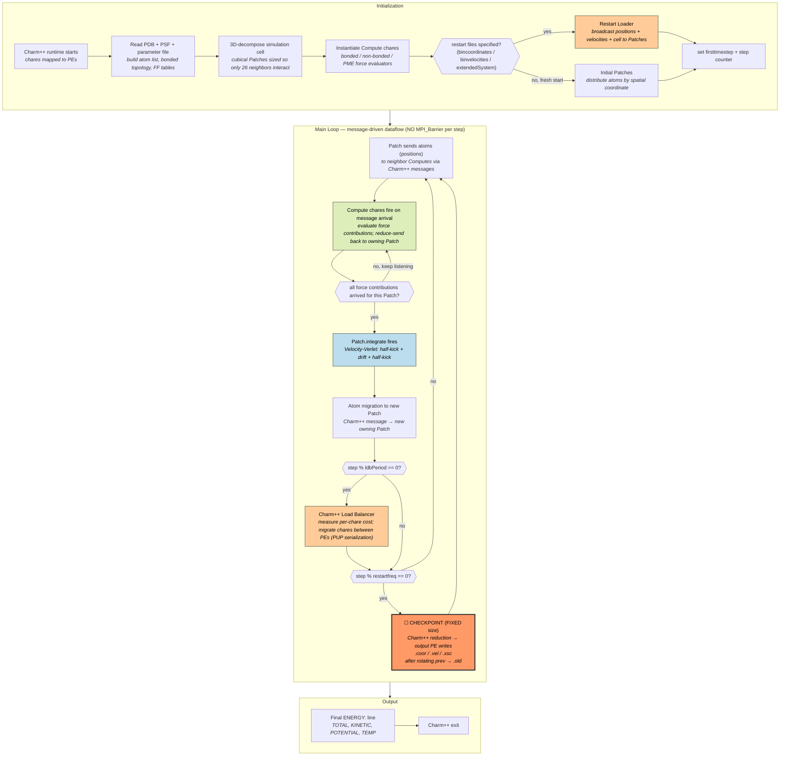
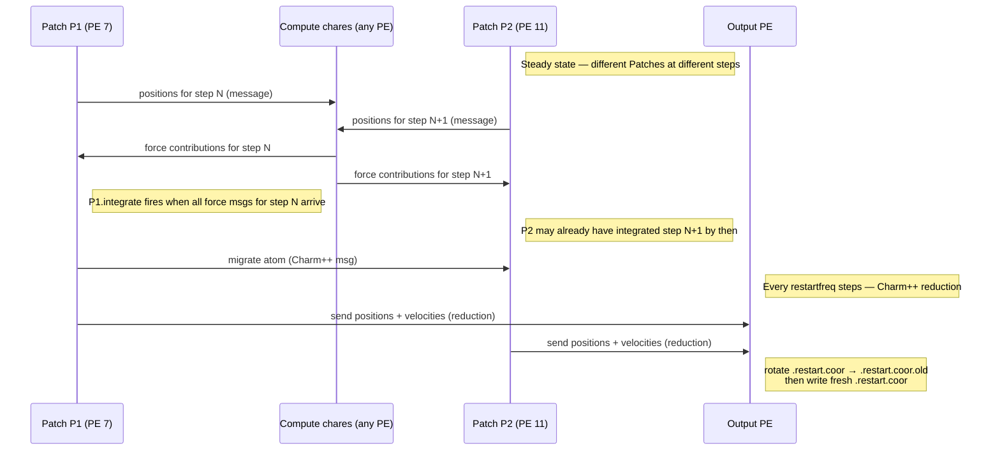
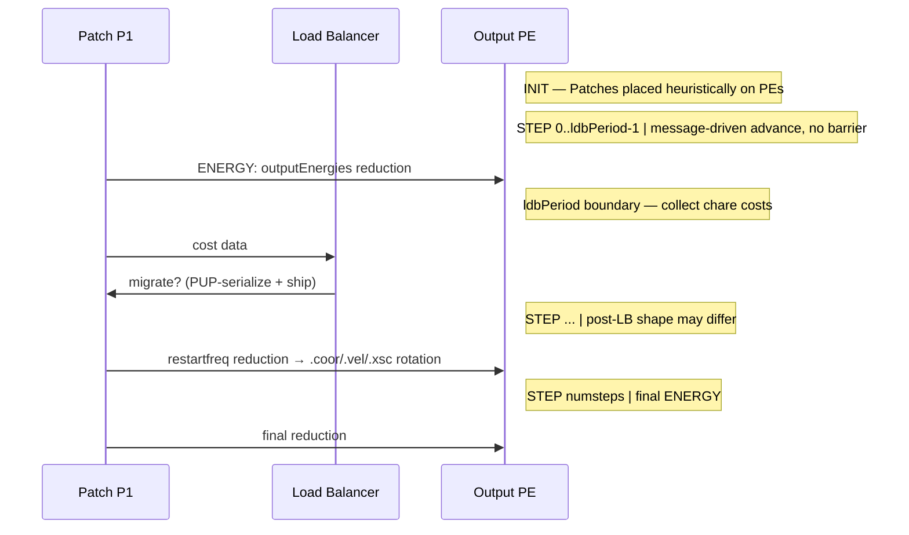

# NAMD — Charm++ Message-Driven Molecular Dynamics

**Class:** (4) asynchronous
**Language:** C++ on the **Charm++ runtime** (built over MPI when using the `mpi-linux-x86_64` machine layer)
**Checkpoint library:** Native — single-writer aggregated `.coor` / `.vel` / `.xsc` files, with `.old` rotation as the atomicity mechanism

## Application Description

NAMD (Nanoscale Molecular Dynamics, UIUC) is a production biomolecular MD code. It integrates Newton's equations for systems of 10⁴–10⁹ atoms (proteins, lipid bilayers, viruses) under CHARMM/AMBER force fields. Unlike most MPI-SPMD MD codes (CoMD, LAMMPS), NAMD is a **Charm++ program**: the simulation is decomposed into chare objects (Patches, Computes, PMEs) that fire entry methods when messages arrive. There is no global timestep barrier; per-rank progress is decided at runtime by message arrival order.

NAMD's reference checkpoint is its built-in `restartfreq` mechanism, controlled in the `.conf` file. It writes aggregated binary restart files (positions, velocities, cell vectors) collected from all PEs to a single I/O PE.

## Computation Workflow



**Data flow per step (per Patch, NOT per global step):** `atoms(x,v)` →(send-to-Compute)→ `force contributions` →(reduce to Patch)→ `f` →(integrate)→ `x', v'` →(migrate)→ destination Patch.

### Start

1. **Charm++ runtime starts** — `charmrun ++local +pN` launches N PEs; the runtime maps initial chares to PEs heuristically.
2. **Topology + parameters** — read PDB (atom positions), PSF (bonds, angles, exclusions), force-field parameters (CHARMM/AMBER tables).
3. **3D Patch decomposition** — divide the simulation cell into cubical Patches sized so each Patch's neighbor list reaches at most 26 spatial neighbors.
4. **Compute chares** — instantiate bonded, non-bonded, and (if PME enabled) particle-mesh-Ewald force evaluators.
5. **Restart vs fresh** — if `bincoordinates`, `binvelocities`, `extendedSystem` are set in the `.conf`, the loader broadcasts those values into freshly-instantiated Patches (and `firsttimestep <N>` advances the step counter); otherwise atoms are placed at PDB positions with thermalized velocities.

### Main Loop (message-driven, no global barrier)

There is **no per-step `MPI_Barrier`**. Each Patch independently advances when its preconditions (all incoming force messages) are met:

1. **Force exchange** — Patch sends positions to its neighbor Computes via Charm++ messages.
2. **Force evaluation** — Compute chares fire entry methods on message arrival, evaluate the relevant force law, and send contributions back to the owning Patch.
3. **Integration** — once the Patch has received all expected force contributions (a Charm++ count-based dependency), `integrate` runs the Velocity-Verlet half-kick + drift + half-kick.
4. **Atom migration** — atoms whose new positions cross a Patch boundary are sent to the new owning Patch as Charm++ messages.
5. **Periodic load balancing** (every `ldbPeriod`, default 200 steps) — Charm++'s measurement-based LB migrates chares between PEs via the PUP (Pack/UnPack) serialization framework.
6. **Periodic checkpoint** (every `restartfreq` steps) — see Checkpoint Protection below.

Crucially, while Patch P1 on PE 7 is at step N, Patch P2 on PE 11 may be at step N+2 or N-1. The simulation is causally consistent (Patch P1 cannot integrate step N+1 until all force contributions for step N have arrived), but there is no instant in wall time when "all PEs are at step N."

### End

- Loop exits when the integrator step counter reaches `numsteps`.
- `ENERGY:` lines (TOTAL, KINETIC, POTENTIAL, TEMP) printed every `outputEnergies` steps; the final TOTAL energy is the natural correctness probe.
- Charm++ runtime exits.

## Critical State

| Field | Type | Evolution |
|-------|------|-----------|
| Atom positions `x[3]` | `double` × N_atoms | Updated every step by Verlet integrator |
| Atom velocities `v[3]` | `double` × N_atoms | Updated every step (two half-kicks) |
| Step counter | `int` (`firsttimestep` on restart) | Monotonically increasing |
| Extended system (cell vectors a, b, c, origin) | 12 doubles | Updated every step under NPT/Langevin piston |
| Langevin piston state (cell velocity, strain rate) | 6 doubles | Updated under constant-pressure dynamics |
| RNG state (per-PE Mersenne Twister) | uint64 array | Advanced by Langevin thermostat / piston |
| Patch ownership map (chare → PE) | runtime table | Mutated by load balancer every `ldbPeriod` |

**Saved by the standard restart files:** atom positions (`.coor`), velocities (`.vel`), extended-system cell (`.xsc`). **Not preserved across restart:** RNG state, load-balancer chare placement, message-queue contents. Restart yields *thermodynamically faithful* trajectories on average, **not bit-identical** ones — expected behavior for stochastic MD.

## Charm++ Task Lifetime (in lieu of MPI ranks)

**Per-PE state shape: dynamic.** A PE owns:
- some number of Patch chares (set changes when the LB migrates them)
- some number of Compute chares (also migratable)
- the Charm++ message queue and pending entry-method invocations

Chare migration uses Charm++'s **PUP (Pack/UnPack)** framework. The chare implements `void pup(PUP::er &p)` which serializes its state; the runtime ships the byte stream to the destination PE and reconstructs it there. This is the same machinery Charm++'s built-in in-memory checkpointing uses, but NAMD's *physics-level* restart (`.coor` / `.vel` / `.xsc`) operates ABOVE the runtime — it does not use the chare-PUP path.

**Communication pattern:** Charm++ messages over the configured machine layer. When Charm++ is built on `mpi-linux-x86_64` (the typical HPC build), every Charm++ message becomes an MPI message underneath. There is no top-level `MPI_Barrier` anywhere in NAMD's main loop. The only quasi-collectives are Charm++ reductions, which the runtime implements as its own asynchronous tree-reduction — not `MPI_Allreduce`.



### Application Lifetime View



**Key observations:**
- **No global step barrier**, ever. Patches at different steps coexist.
- Per-PE state shape **changes at LB boundaries** (different chares own different Patches).
- The reference restart is **single-writer aggregated**, not per-rank. This is structurally different from every other app in the suite.

## Checkpoint Protection

### Write trigger

Two `.conf` keywords:

```
restartfreq <N>          # write every N timesteps
restartname  <prefix>    # output filename prefix
restartsave  no          # default; if 'yes', append step number → keep history
binaryrestart yes        # default
```

If `restartname` is set, `restartfreq` is **mandatory** (no default). Tutorials commonly use 500–5000.

### What is saved

Three files per restart event, written by the **output PE** (single writer collected via Charm++ reduction):

| File | Format | Content |
|------|--------|---------|
| `<prefix>.restart.coor` | binary, Fortran-unformatted style: `int32 numatoms` then `3*numatoms doubles` | Atom positions |
| `<prefix>.restart.vel` | same format | Atom velocities |
| `<prefix>.restart.xsc` | ASCII | Cell vectors, origin, Langevin piston state |

Plus a paired **previous-generation** copy:

| File | Purpose |
|------|---------|
| `<prefix>.restart.coor.old` | Previous restart, kept as one-step-back recovery |
| `<prefix>.restart.vel.old` | Same |
| `<prefix>.restart.xsc.old` | Same |

### Write protocol

1. NAMD reaches a step boundary that is a multiple of `restartfreq`.
2. Each Patch sends its atoms to the output PE via a Charm++ reduction tree.
3. The output PE serializes and writes:
   - `remove(<prefix>.restart.coor.old)` — drop the older generation
   - `rename(<prefix>.restart.coor, <prefix>.restart.coor.old)` — promote current to old
   - `write()` fresh `<prefix>.restart.coor`
4. Same sequence for `.vel` and `.xsc`.

This is **not MPI-IO**. It is a single-writer pattern over Charm++'s message-driven aggregation.

### Restart protocol

User edits `.conf`:
```
bincoordinates  <prefix>.restart.coor
binvelocities   <prefix>.restart.vel
extendedSystem  <prefix>.restart.xsc
firsttimestep   <N>
```
NAMD's loader reads the binary files into the freshly-instantiated Patch decomposition, broadcasts atoms to the appropriate Patches (by spatial coordinate), and sets the integrator's step counter to `<N>`.

### Consistency

NAMD uses a **two-generation `.old` rotation**, not a true atomic two-phase commit. A crash mid-write leaves the previous-generation `.old` files intact, so the user can manually point the next run at `<prefix>.restart.coor.old` and resume from one snapshot back. This is the closest NAMD comes to atomicity — there is no `.tmp` + rename pattern like AMReX uses.

The aggregation tree itself is implicitly synchronizing: the output PE cannot write until it has received reductions from every Patch, which means every Patch reached the same logical step boundary at the moment of the reduction call. So even though the main loop has no `MPI_Barrier`, the *checkpoint event* does establish a consistent global snapshot at the configured step.

## Suite-fit notes (why class 4)

- **No global step barrier** — message-driven dataflow, structurally different from CoMD's `for step:` loop.
- **Different async sub-flavor than ROSS** — ROSS uses optimistic execution + rollback + GVT. NAMD uses message-driven scheduling + measurement-based load balance. Both qualify as class (4); they exemplify different async paradigms.
- **Single-writer aggregated checkpoint with `.old` rotation** — a checkpoint pattern NOT exercised anywhere else in the suite (every other app does per-rank file write or MPI-IO collective).

## Suite-fit caveats

- Build is a two-stage CMake-style process: build Charm++ first (`./build charm++ mpi-linux-x86_64 mpicxx ...`), then build NAMD against it. Source size ≈ 600k LOC C++; Charm++ ≈ 400k LOC.
- Restart is *thermodynamically faithful* but not *bit-identical* (RNG state lost). Output comparison must use energy tolerance, not byte-diff — same approach used for ROSS / SPPARKS / QMCPACK.
- NAMD has a non-redistributable academic license. Source must be downloaded from the [UIUC TCBG site](https://www.ks.uiuc.edu/Research/namd/) by the user; cannot be auto-fetched by `install_app_sources.sh`.
- Smallest validated example is `src/alanin` (alanine dipeptide, ~66 atoms): runs at 4 ranks in seconds. Recommended for the `medium` build tier.
