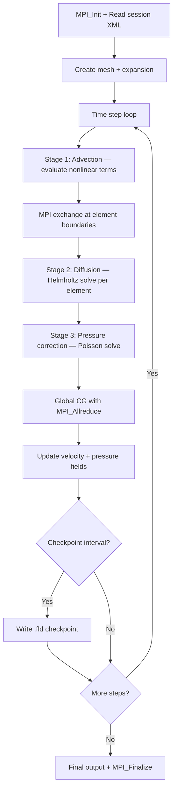

# Nektar++ Computation Flow

## Overview
Nektar++ solves PDEs using spectral/hp element methods with high-order polynomial bases. Time-stepping uses multi-stage schemes (e.g., IMEX for incompressible Navier-Stokes with operator splitting).

## Main Loop



## MPI Communication
- **Element-wise**: DG exchanges at element interfaces
- **Global solves**: CG/GMRES with `MPI_Allreduce` for inner products
- **Decomposition**: mesh elements distributed via METIS/SCOTCH

## I/O Points
- `.fld` field files (checkpoint/restart)
- `.chk` checkpoint files (HDF5 or XML format)

## Output Format
Field files (`.fld`) are binary/HDF5 containing spectral coefficients per element. Stdout prints:
```
Steps: 1000/1000  Time: 1.00  CPU: 45.2s  L2(u): 0.00123
```
**How to compare**: extract `L2(u)` norm; numeric comparison with tolerance ~1e-4. Or compare `.fld` files with Nektar++ `FieldConvert` utility.
