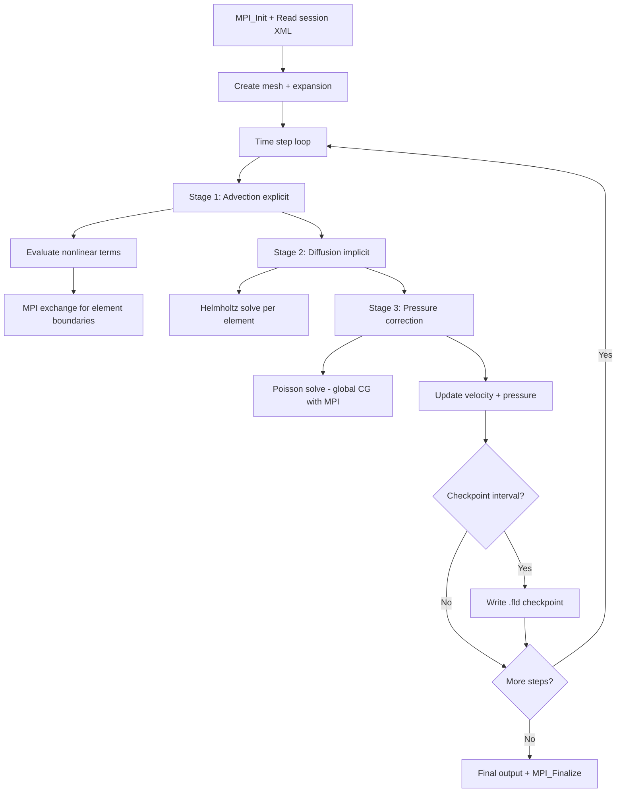

# Nektar++ Computation Flow

## Overview
Nektar++ solves PDEs using spectral/hp element methods with high-order polynomial bases. Time-stepping uses multi-stage schemes (e.g., IMEX for incompressible Navier-Stokes with operator splitting).

## Main Loop

## MPI Communication
- **Element-wise**: discontinuous Galerkin exchanges at element interfaces
- **Global solves**: CG/GMRES with MPI_Allreduce for inner products
- **Decomposition**: mesh elements distributed via METIS/SCOTCH partitioning

## I/O Points
- `.fld` field files (checkpoint/restart)
- `.chk` checkpoint files (HDF5 or XML format)
