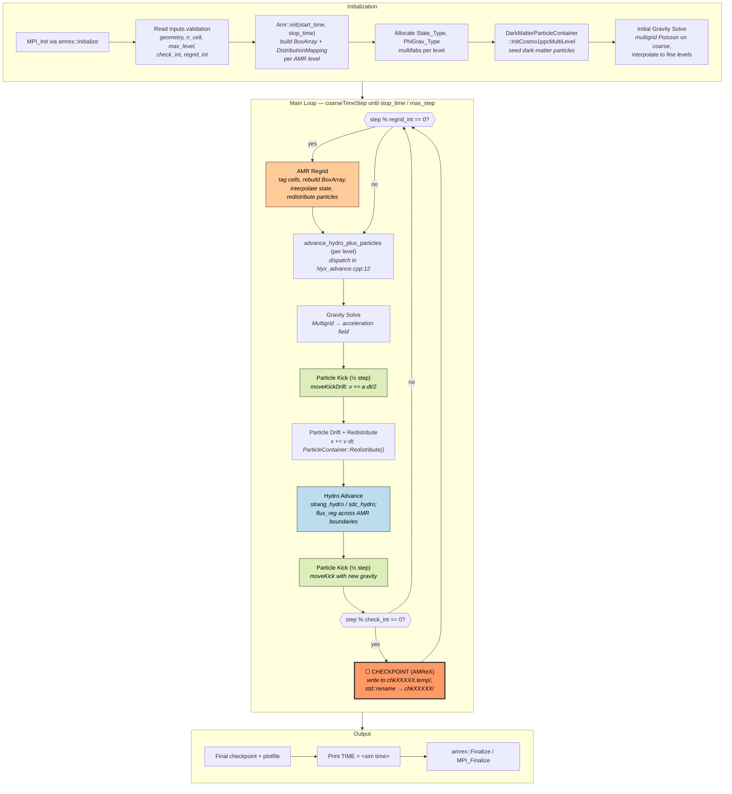
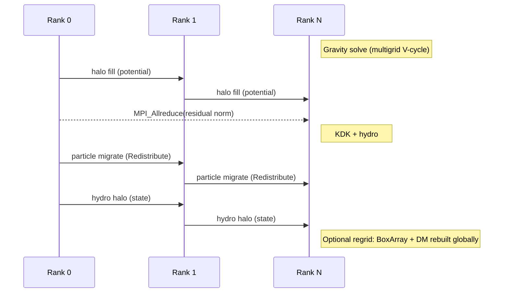
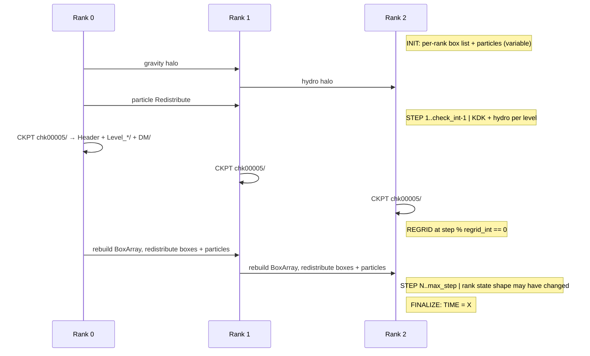

# Nyx — AMReX Cosmological Hydrodynamics + N-Body

**Class:** (3) iterative_adaptive
**Language:** C++ (with Fortran kernels), built on AMReX
**Checkpoint library:** AMReX native checkpoint format (`Header` + `Level_*/` MultiFab + `DM/` particle directories, atomic via `std::rename`)

## Application Description

Nyx is a cosmological simulation code from LBNL's CCSE that couples a finite-volume hydrodynamics solver (Euler equations with PPM/PLM reconstruction and a Godunov flux scheme) to an N-body particle solver for dark matter, with a multigrid Poisson solver supplying self-gravity. It runs on the AMReX adaptive mesh refinement framework, so the grid hierarchy and per-rank work both change at every regrid boundary. Optional physics (heating/cooling, neutrinos, AGN feedback) plug into the same evolve loop. The reference checkpoint reuses AMReX's native plotfile machinery rather than carrying its own format.

## Computation Workflow



**Data flow per coarse step:** `multifabs(state) + particles(x,v)` →(gravity solve)→ `phi, accel` →(KDK)→ `particles' (v half, x, v half)` →(hydro)→ `state'` →(possibly regrid)→ `new BoxArray + redistributed particles` →(checkpoint optional)→ `chkXXXXX/`.

### Start

1. **AMReX initialization** wraps `MPI_Init` and reads ParmParse keys from `inputs.validation`.
2. **AMR setup** — `Amr::init(start_time, stop_time)` builds the `BoxArray` and `DistributionMapping` for each level from `geometry`, `amr.n_cell`, and `amr.max_level`.
3. **Field allocation** — `State_Type` (density, momentum, energy), `PhiGrav_Type` (potential), and per-physics diagnostic fields are allocated as `MultiFab` per level.
4. **Particle initialization** — `DarkMatterParticleContainer::InitCosmo1ppcMultiLevel` places dark-matter particles on selected AMR levels.
5. **Initial gravity** — multigrid Poisson solve on the coarse level, interpolated to finer levels so the first kick has a valid acceleration field.

### Main Loop (`coarseTimeStep` → per-level advance)

The driver in `nyx_main.cpp` loops:

```c++
while (!finished) {
    if (okToContinue() && levelSteps(0) < max_step && cumTime < stop_time)
        amrptr->coarseTimeStep(stop_time);
    else
        finished = true;
}
```

`coarseTimeStep` advances the coarse level by one step, recursing into finer levels with subcycling. The Nyx advance function (`Nyx_advance.cpp:12`) dispatches to one of:

- `advance_hydro_plus_particles()` — full coupled physics (default for cosmology runs).
- `advance_hydro()` — hydro only.
- `advance_particles_only()` — particles + gravity only.

For the full path, each per-level step is a kick-drift-kick sequence:

1. **Gravity solve** on the level (multigrid; `Source/Gravity/Gravity.cpp`).
2. **Particle half-kick** — `moveKickDrift` adjusts velocities by `½·dt·a`, then drifts positions.
3. **Particle redistribution** — `ParticleContainer::Redistribute()` migrates particles whose positions crossed a rank boundary; AMReX also creates ghost + virtual particles for multilevel subcycling.
4. **Hydro advance** — `strang_hydro.cpp` or `sdc_hydro.cpp` updates the state multifabs and accumulates flux corrections in `flux_reg` for AMR sync.
5. **Particle second half-kick** — `moveKick` with the post-hydro acceleration.
6. **AMR regrid** — every `amr.regrid_int` coarse steps the level structure is rebuilt: cells are tagged, a new `BoxArray` and `DistributionMapping` are produced, hydro state is interpolated to the new grids, and particles are redistributed to match.
7. **Checkpoint** — when `step % amr.check_int == 0` the AMReX `Amr::checkPoint` path is invoked (see Checkpoint Protection below).

### End

- Loop exits when `levelSteps(0) >= max_step` *or* `cumTime >= stop_time`.
- A final checkpoint and plotfile are written unconditionally so the last state is always recoverable.
- **Validation output:** Nyx prints `TIME = <sim time>` near end-of-run; the validator's `keep_patterns` matches that line.
- `amrex::Finalize` calls `MPI_Finalize`.

## Critical State

Per AMR level and per rank, Nyx checkpoints these categories. The list is broader than CoMD because the AMR hierarchy itself is mutable.

| Category | Components | Where it lives |
|----------|-----------|----------------|
| Hydro state | `State_Type` MultiFab — density, 3-vector momentum, energy | `Level_*/` — written by `AmrLevel::checkPoint()` via `VisMF::Write` |
| Gravity potential | `PhiGrav_Type` MultiFab — solved each step | Written alongside `State_Type` |
| Diagnostic EOS | `DiagEOS_Type` MultiFab when hydro is enabled | Written alongside `State_Type` |
| Dark-matter particles | `DarkMatterParticleContainer`: positions, velocities, masses, IDs | `chkXXXXX/DM/` via `NyxCheckpoint(dir, "DM")` |
| Optional particle species | AGN, neutrino containers when enabled | Each writes its own subdirectory |
| AMR hierarchy | `BoxArray` and `DistributionMapping` per level, refinement structure | Encoded into the top-level `Header` |
| Time metadata | `time`, `dt`, `levelSteps[]`, finest level | `Header` |
| Cosmological scale factor | `comoving_a` value | Written as a side file `comoving_a` |
| Wall-clock accounting | `CPUtime` accumulator | Written as `CPUtime` side file |

Forces, fluxes, and intermediate hydro slopes are **not** checkpointed — they are recomputed on restart.

## MPI Task Lifetime

**Per-rank state shape:** initially each rank owns a disjoint set of grid patches and the particles that fall inside them. Both the grid ownership and the particle count per rank change over time:

- Hydro multifabs are sized by the rank's box list. Between regrids that list is fixed; at each regrid it can change completely (load balancing redistributes whole boxes).
- Particle counts drift continuously as particles cross rank boundaries during drift; AMReX `Redistribute()` calls move them.

**Why "pipeline + variable":**

- **Pipeline**: subcycled AMR levels form a coarse-to-fine sequence: coarse advances once, fine levels advance multiple sub-steps each, then sync. Each phase (gravity, KD, hydro, K) is a stage in that pipeline.
- **Variable**: rank ownership of boxes and particles is **not stable** — every regrid (`amr.regrid_int`) reshuffles the distribution map, so per-rank memory footprint and particle count can change abruptly.

**Communication pattern:**

- AMReX MultiFab operations use neighbor-of-neighbor halo fills via non-blocking point-to-point.
- Multigrid gravity solves are bandwidth-bound collectives.
- Particle redistribution uses an `MPI_Alltoallv`-like exchange under `ParticleContainer::Redistribute()`.



### Application Lifetime View



**Key observations:**
- Each rank's **memory footprint can change at regrid**; benchmarks must measure across these boundaries.
- Particles are the dominant variable-size payload — checkpoint size grows with the live particle count.
- Multilevel subcycling means a single coarse "step" comprises many fine-level updates and several halo fills.

## Checkpoint Protection

### Write trigger

Driven from `inputs.validation`:

```
amr.check_int = 5      # checkpoint every 5 coarse steps
# (alt) amr.check_per = <wall-time interval, not used here)
```

`Amr::coarseTimeStep` invokes `Amr::checkPoint(...)` whenever `levelSteps(0) % check_int == 0`.

### What is saved

The on-disk layout for one snapshot:

```
chk00005/
├─ Header                  # text: time, dt, step, finest_level,
│                          #   per-level BoxArray + DistributionMapping
├─ Level_0/                # MultiFabs for level 0 (state, potential, ...)
├─ Level_1/                # MultiFabs for level 1
├─ Level_max/              # ...
├─ DM/                     # dark-matter particle binary files
├─ AGN/                    # if AGN species enabled
├─ comoving_a              # cosmological scale factor
└─ CPUtime                 # wall-time accumulator
```

Per-level MultiFabs are written by `AmrLevel::checkPoint`, which calls `StateData::checkPoint` → `VisMF::Write` (collective MPI binary). Particles are written by `DarkMatterParticleContainer::NyxCheckpoint` using AMReX's binary particle I/O.

### Write protocol (`AMReX_Amr.cpp`)

1. Build the snapshot under a temporary name `chk00005.temp/` so a partial write can never be observed.
2. For each AMR level: `AmrLevel::checkPoint(dir, os, how, dump_old)` writes the per-level `Header` line then calls `StateData::checkPoint` for each registered state type.
3. Particle containers write their own `chk00005.temp/<species>/` subdirectories.
4. Side files (`comoving_a`, `CPUtime`) are written.
5. `std::rename(chk00005.temp, chk00005)` performs the atomic swap that publishes the snapshot.

### Restart protocol

1. User passes `amr.restart=chk00005` on the command line.
2. `Amr::init` detects the restart key and calls `AmrLevel::restart` for each level: read `Header`, reconstruct `BoxArray` + `DistributionMap`, then `VisMF::Read` each MultiFab from `Level_*/`.
3. `particle_post_restart` reads the `DM/` directory back into `DarkMatterParticleContainer`.
4. `comoving_a_post_restart` reads the cosmological scale factor side file.
5. The gravity object is rebuilt; flux registers and any forcing spectrum are reconstructed.
6. Simulation resumes from the step counter and time recorded in `Header`.

### Consistency

- **Atomic publish** via `std::rename` on the snapshot directory — readers either see the previous snapshot or the new one, never an in-progress mix.
- **Per-rank, in parallel** — `VisMF` writes use collective MPI inside one snapshot; ranks do not synchronize across snapshots.
- **No double-buffering inside a snapshot** — a crash that interrupts the write leaves the `.temp` directory; nothing is published to `chkXXXXX/` until the rename succeeds, so the previous snapshot remains the latest valid one.
