# Nyx Computation Flow

## Overview

Nyx is an adaptive mesh cosmological simulation code built on the AMReX framework. It couples compressible gas dynamics with N-body gravitational interactions to simulate the evolution of baryonic matter and dark matter in an expanding universe. The hydrodynamics is solved using a second-order Godunov method on the Eulerian grid, while dark matter is represented as Lagrangian particles evolving under gravity. Nyx supports block-structured AMR, allowing dynamic refinement in regions with high density or interesting physical activity. The gravitational potential is computed by solving the Poisson equation using a multigrid solver, coupling the gas density and particle mass to produce a self-consistent gravitational field.

## Main Loop Flowchart

```mermaid
flowchart TD
    A[Initialize: read inputs, build grid hierarchy, initialize gas + dark matter particles] --> B[Start Time Step n]
    B --> C[Compute dt: CFL condition on gas + particle velocities + cosmological expansion]
    C --> D[Advance Cosmology: update scale factor a, Hubble parameter H]
    D --> E[Gravity Solve: deposit particle + gas mass, solve Poisson equation for phi]
    E --> F[Particle Push - Half Step: kick dark matter particles by dt/2 using gravitational acceleration]
    F --> G[Hydro Advance: Godunov unsplit method for gas on each level]
    G --> G1[Compute primitive variables from conserved state]
    G1 --> G2[Reconstruct interface states with PPM or PLM]
    G2 --> G3[Solve Riemann problem at cell interfaces]
    G3 --> G4[Compute fluxes and update conserved variables]
    G4 --> H[Source Terms: add heating/cooling, cosmological expansion terms]
    H --> I[Gravity Solve: recompute potential with updated density]
    I --> J[Particle Push - Full Step: drift particles by dt, kick by dt/2 with new acceleration]
    J --> K[Particle Redistribution: migrate particles across ranks and AMR levels]
    K --> L[Regrid: tag cells for refinement, rebuild AMR hierarchy if needed]
    L --> M{Checkpoint interval?}
    M -- Yes --> N[Write AMReX checkpoint]
    M -- No --> O{Plotfile interval?}
    N --> O
    O -- Yes --> P[Write plotfile for visualization]
    O -- No --> Q{t < t_end?}
    P --> Q
    Q -- Yes --> B
    Q -- No --> R[Finalize and exit]
```

## MPI Communication Pattern

- **Domain decomposition**: The grid at each AMR level is decomposed into non-overlapping boxes assigned to MPI ranks via AMReX's distribution mapping (space-filling curve or knapsack).
- **Ghost cell exchange**: Hydro stencils require ghost cells (typically 4 for PPM). `FillBoundary` and `FillPatch` operations exchange ghost cell data between neighboring ranks for state variables (density, momentum, energy) and the gravitational potential.
- **Gravity solver communication**: The Poisson solve uses geometric multigrid with level-by-level solves. Multigrid V-cycles require ghost cell exchanges at each relaxation step and restriction/prolongation operations between multigrid levels. Cross-level communication occurs during the composite solve.
- **Particle communication**: Dark matter particles that move across box boundaries are migrated to the owning rank via AMReX `Redistribute`. Mass deposition from particles to the grid uses `SumBoundary` to accumulate contributions in ghost cells.
- **AMR regridding**: Collective operations to determine new box layout, followed by data redistribution.
- **Reductions**: Global quantities (total mass, total energy, maximum density) computed via `MPI_Allreduce`.

## I/O Points

- **Checkpoint writes**: Full simulation state at user-specified step intervals. Includes all gas state MultiFabs, dark matter particle data, gravitational potential, AMR hierarchy, cosmological parameters, and time-stepping state.
- **Plotfile writes**: Derived quantities (density, temperature, velocity, dark matter density) written for visualization at step or time intervals.
- **Lyman-alpha statistics**: Optional output of flux power spectrum and other Lyman-alpha forest statistics at specified redshifts.
- **Particle output**: Dark matter particle positions and velocities for halo finding or analysis.
- **Initial conditions**: Read from external files (e.g., transfer function, initial particle displacements from Zel'dovich approximation or N-GenIC).
