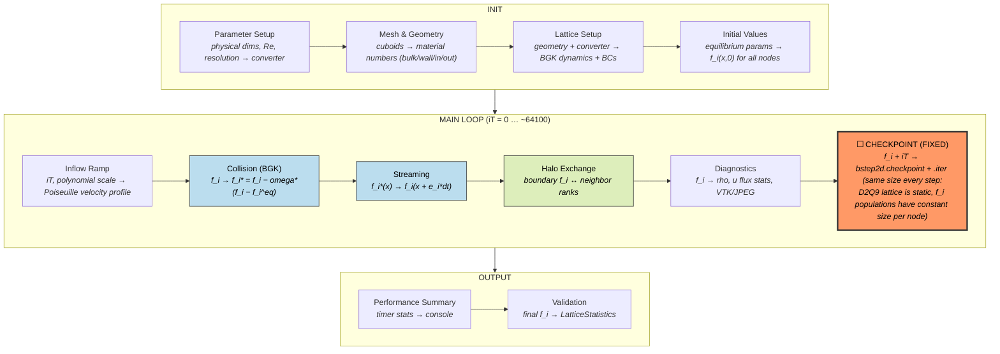
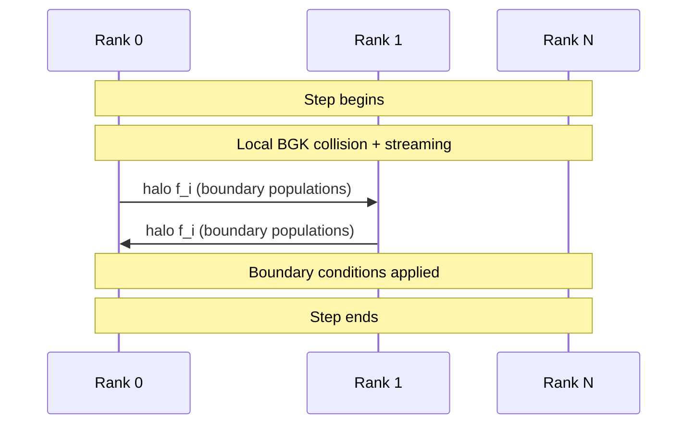
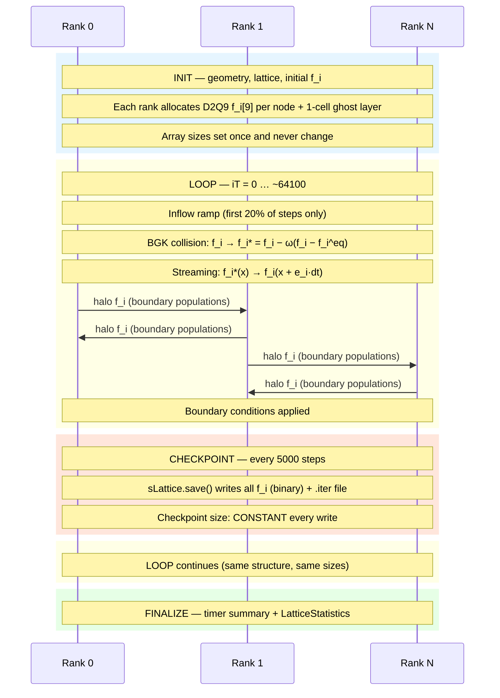

# OpenLB — Open Source Lattice Boltzmann

**Category:** Iterative / Fixed state  
**Language:** C++ (MPI)  
**Checkpoint library:** Native `SuperLattice::save`/`load` (binary serialization)

## Application Description

OpenLB is an open-source Lattice Boltzmann Method (LBM) framework for fluid dynamics simulations. The benchmark uses the `bstep2d` example: 2D incompressible viscous flow over a **backward-facing step** (Armaly et al. 1983). A rectangular channel (0.7 m x 0.0101 m) has a step (0.2 m x 0.0049 m) removed from the bottom-left corner, forcing the flow to expand abruptly and produce a recirculation zone downstream. The simulation uses D2Q9 BGK with relaxation time tau=0.518 at resolution 20, Poiseuille inflow, and pressure outflow.

## Computation Workflow


Data flow per step: f_i populations are relaxed (collision), propagated (streaming), exchanged (MPI halo), then periodically saved to disk.

### Start

1. **Parameter setup** — physical dimensions, viscosity, velocity, resolution, `MAX_PHYS_T = 2.0` simulated seconds.
2. **Mesh creation** (`createMesh`) — subtract step cuboid from channel cuboid, discretize at `physDeltaX`.
3. **Geometry preparation** (`prepareGeometry`) — assign material numbers: bulk=1, walls=2, inflow=3, outflow=4.
4. **Lattice setup** (`prepareLattice`) — create unit converter, assign BGK dynamics to bulk nodes, set boundary condition operators.
5. **Initial values** (`setInitialValues`) — initialize all distribution functions `f_i` to equilibrium, set relaxation parameter omega.
6. **Checkpoint detection** — if checkpoint file exists, load state and resume from saved iteration.

### Main Loop (`iT` from `startIter` to `maxIter`, ~64100 steps)

Each iteration:

1. **Inflow ramp** (`setTemporalValues`) — during the first 20% of steps, ramp Poiseuille inflow profile from zero to full velocity (polynomial start scale, updated every 100 steps).
2. **Collision and streaming** (`sLattice.collideAndStream()`) — the core LBM kernel:
   - **Collision:** each cell relaxes its D2Q9 distribution functions toward equilibrium: `f_i* = f_i - omega * (f_i - f_i^eq)`.
   - **Streaming:** propagate post-collision populations to neighboring cells along lattice velocity directions.
   - **Halo exchange:** MPI communication of boundary-layer populations between ranks.
3. **Diagnostics** (`getResults`) — every 0.1 simulated seconds: print velocity/pressure flux statistics and lattice statistics; every 0.2 s: write VTK files and JPEG heatmaps.

### End

- After all timesteps, print performance summary (`timer.printSummary()`).
- **Validation output:** `LatticeStatistics` output at the final step.

## Critical State

| Field | Type | Evolution |
|-------|------|-----------|
| `f_i(x, t)` | 9-component vector (D2Q9 populations) per lattice node, in `SuperLattice` | Updated every step by BGK collision + streaming |
| Inflow boundary momenta | Velocity arrays at material-3 nodes | Updated during ramp-up phase; fixed after ramp completes |
| Iteration counter `iT` | Integer | Incremented each step |

**Derived quantities:** Macroscopic density `rho` and velocity `u` are computed from `f_i` on demand — not stored separately. The halo layer contains copies of neighboring-rank populations and is transient (regenerated each step).

**Fixed lattice:** The mesh is static — no AMR, no cell migration. The only evolving state is the D2Q9 population array.

## MPI Task Lifetime

**Per-rank state:** Each rank owns a fixed rectangular sub-domain of the 2D lattice. The local data is 9 distribution functions `f_i` per node (D2Q9 populations) plus a one-cell ghost layer holding copies from neighboring ranks. Array sizes are constant.

**How state changes:** Per-rank data stays fixed in size throughout execution. The `f_i` values change every step via collision and streaming, but the lattice geometry and domain decomposition never change.

**Communication pattern:** After each collision+streaming step, ranks exchange boundary-layer populations with their neighbors via MPI halo exchange. No global reductions are used in the main loop.



### Application Lifetime View



**Key observations:**

- **State size is constant throughout execution.** The D2Q9 lattice is allocated once during INIT and never changes — no AMR, no cell migration, no rebalancing. Every rank holds the same number of nodes from start to finish.
- **Communication is strictly nearest-neighbor.** Each step performs a single halo exchange of boundary-layer f_i populations between adjacent ranks. There are no global reductions in the main loop.
- **Checkpoint size is deterministic.** Because the lattice is static and each node stores exactly 9 doubles, every checkpoint writes the same number of bytes regardless of simulation time or flow state.

## Checkpoint Protection

### Write trigger

Every 5000 lattice steps when `iT > 0`.

### What is saved

Two files:
- **`bstep2d.checkpoint`** — binary file containing all D2Q9 population values across all cuboids and MPI ranks, written by `sLattice.save()` (OpenLB's native serialization).
- **`bstep2d.checkpoint.iter`** — ASCII text file containing the current iteration number.

### Write sequence

```cpp
sLattice.save("bstep2d.checkpoint");
std::ofstream iterFile("bstep2d.checkpoint.iter");
iterFile << iT;
```

### Restart detection and recovery

```cpp
std::size_t startIter = 0;
if (sLattice.load("bstep2d.checkpoint")) {
    std::ifstream iterFile("bstep2d.checkpoint.iter");
    if (iterFile.good()) { iterFile >> startIter; startIter++; }
}
for (std::size_t iT = startIter; iT < maxIter; ++iT) { ... }
```

If the checkpoint file exists, `sLattice.load()` restores all `f_i` values. The loop starts from `startIter` instead of 0, skipping geometry setup, lattice initialization, and the ramp phase (which would produce incorrect results if re-run mid-simulation).

### Consistency

The checkpoint captures the entire simulation state because `f_i` encodes all macroscopic quantities (density, momentum) deterministically. The `.iter` file serves as a commit record — if the binary write crashes, the `.iter` file retains the previous iteration number.

### Vanilla difference

The vanilla version removes `sLattice.save()`/`sLattice.load()` calls and the `.iter` file I/O, always starting the loop from `iT = 0`.
