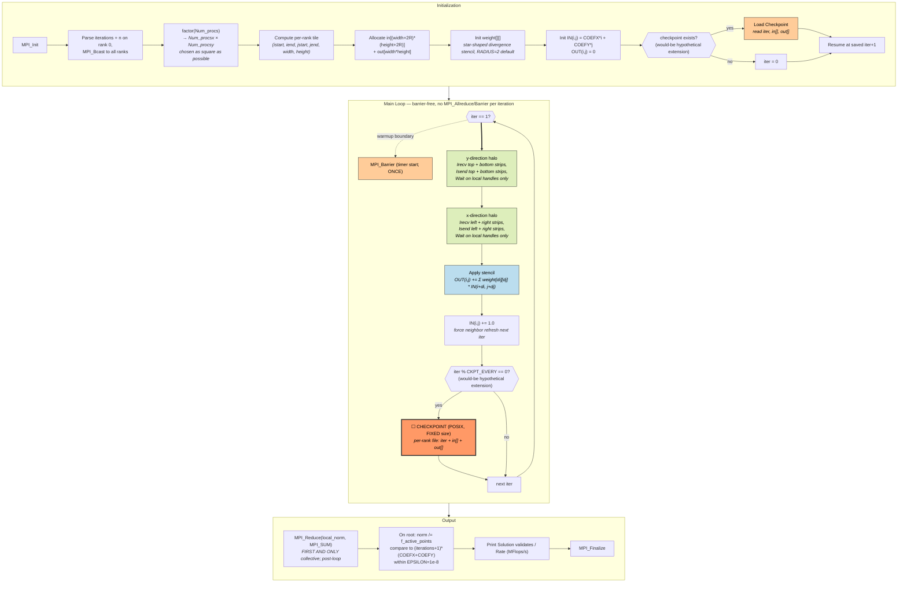
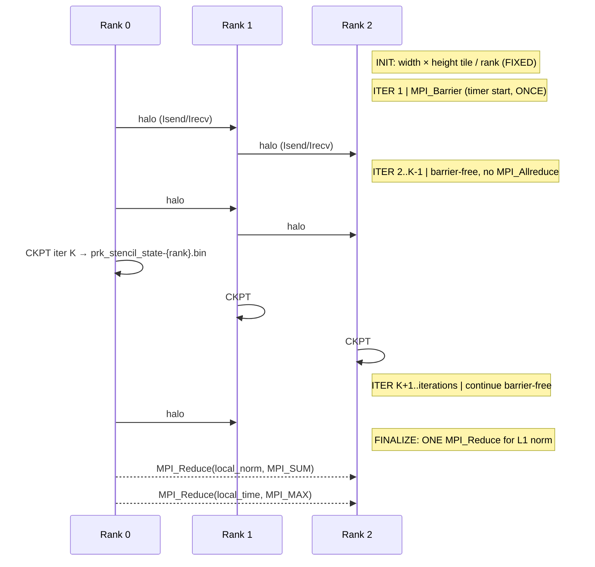

# PRK Stencil — Parallel Research Kernels Star Stencil (MPI1)

**Class:** (4) asynchronous — *with caveats; see honest assessment below*
**Language:** C (MPI1, two-sided non-blocking)
**Checkpoint library:** **None upstream** — would be added as a small POSIX-file writer covering the per-rank `in[]` and `out[]` arrays plus iteration counter. Same upstream-immutability tension as HPCG.

## Application Description

PRK Stencil is the canonical 2D star-shaped stencil sweep from the [Parallel Research Kernels](https://github.com/ParRes/Kernels) suite (Van der Wijngaart & Mattson, HPEC 2014). The MPI1 variant lives at `MPI1/Stencil/stencil.c` and is the most portable, "two-sided non-blocking MPI" reference. Each rank owns a fixed tile of an `n × n` global grid; per iteration, every rank exchanges 4 halo strips with its nearest neighbors (north/south/east/west) and applies a local stencil kernel.

The interesting property — and why it's a candidate for class (4) — is that the author **deliberately removed the per-iteration `MPI_Barrier`** in 2014 (see `stencil.c:65` comment: *"RvdW, October 2014: removed barrier at start of each iteration"*). The main loop has **no in-loop `MPI_Allreduce` either**: the validation norm is reduced exactly once after the loop completes. So a rank that finishes its local stencil work first proceeds straight to the next iteration's `MPI_Isend` without waiting for any global synchronization point.

Calling this "asynchronous" is a stretch — it is more honestly **barrier-free BSP with non-blocking halo**, since each rank still implicitly synchronizes with its 4 nearest neighbors via `MPI_Wait` on halo recv requests. It is not chaotic relaxation in the Bertsekas sense. But among canonical, well-maintained MPI kernels it is **the least-synchronized stencil benchmark in existence** and the one closest to the asynchronous-iterative paradigm without crossing into the message-driven (Charm++) or rollback-based (PDES) territory already covered by NAMD and ROSS.

## Computation Workflow



**Data flow per iteration:** `in[]` →(Irecv/Isend halo strips, Wait)→ `in[] with refreshed halo` →(stencil)→ `out[]` →(in += 1.0)→ next iter.

### Start

1. **MPI initialization** and rank-0 reads `iterations` and `n` from CLI, then `MPI_Bcast` to all ranks.
2. **Rank-grid factorization** — `factor(Num_procs, &Num_procsx, &Num_procsy)` picks the most-square decomposition (e.g., 4 ranks → 2×2; 8 ranks → 4×2).
3. **Per-rank tile** — each rank computes `(istart, iend, jstart, jend, width, height)` for its slice.
4. **Allocate arrays** — `in[(width+2R)*(height+2R)]` (with `RADIUS=2` halo on each side) and `out[width*height]` (no halo).
5. **Initialize** stencil weights for the star-shaped divergence operator, set `IN(i,j) = COEFX*i + COEFY*j` and `OUT(i,j) = 0`.
6. **(restart path)** — if a `prk_stencil_state-<rank>.bin` is found, deserialize `iter`, `in[]`, `out[]`. Topology must match (same `Num_procs`).

### Main Loop (`for iter = 0..iterations`)

There is **no `MPI_Barrier`** and **no `MPI_Allreduce`** in the loop body. The single `MPI_Barrier` at `iter==1` exists only to align all ranks at the timer-start moment; it never fires again.

Per iteration:

1. **y-direction halo** — `MPI_Irecv` north and south strips → `MPI_Isend` north and south strips → `MPI_Wait` on this rank's own request handles. Edge ranks skip off-grid neighbors via `if (my_IDy < Num_procsy-1)`.
2. **x-direction halo** — same pattern for east and west strips.
3. **Apply stencil** — `OUT(i,j) += Σ weight[di][dj] * IN(i+di, j+dj)` over the star-shaped neighborhood (`stencil.c:407–417`).
4. **`IN(i,j) += 1.0`** — line 420. This is the key tell that the kernel is designed to **detect and tolerate stale neighbor data**: the increment forces every iteration's halo to differ from the previous one's, so a stale read would propagate visible error into the post-loop validation norm. Bertsekas-style fully-async iteration would tolerate that error; PRK Stencil's MPI version uses `MPI_Wait` to enforce neighbor freshness, but the design intent and the data-flow shape are async-friendly.
5. **(checkpoint hook)** — every K iterations, write the per-rank state file. Same idiom as CoMD.

### End

- After `iter > iterations`, ONE `MPI_Reduce(MPI_SUM)` collapses local L1 norms onto rank 0.
- Rank 0 normalizes by `f_active_points` and compares against the analytic expected norm `(iterations+1) * (COEFX + COEFY)` within `EPSILON=1e-8`.
- Output: `Solution validates` and `Rate (MFlops/s) = <value>`. The harness can grep either line.
- `MPI_Finalize`.

## Critical State

For a deterministic restart, every rank must restore its full local arrays + iteration counter:

| Field | Type | Size | Save? | Notes |
|-------|------|------|-------|-------|
| `iter` | `int` | 4 B | ✓ | loop counter |
| `in[]` | `double*` | `(width+2R) × (height+2R) × 8` B | ✓ | overwritten with halo + `+= 1.0` each iter |
| `out[]` | `double*` | `width × height × 8` B | ✓ | accumulated stencil output |
| `weight[][]` | `double` | `(2R+1)² × 8` B (tiny) | ✗ | regenerable from `RADIUS` |
| `(istart, iend, jstart, jend, width, height)` | `int` | scalars | ✗ | derivable from rank topology |
| `Num_procsx`, `Num_procsy` | `int` | scalars | ✗ | from `factor(Num_procs)` |
| `local_norm`, `norm` | `double` | scalars | ✗ | computed only post-loop |

**Key observation:** since `in[]` already includes its own halo region, the saved file already contains everything needed to resume **without an immediate post-restart halo exchange**. Per-rank file size at `n=4000`, 4 ranks: `(2002)² × 8 ≈ 32 MB` for `in[]` alone, similar for `out[]`. ~64 MB / rank — small.

## MPI Task Lifetime

**Per-rank state shape: stable.** Each rank owns a fixed `(width × height)` tile for the entire run. No load balancing, no migration, no rank add/drop, no resizing.

**Communication pattern:**
- **Per iteration**: up to 4 `MPI_Isend` + 4 `MPI_Irecv` pairs (one per face), plus `MPI_Wait` on the rank's own request handles. Edge ranks skip off-grid neighbors.
- **Pre-loop**: one `MPI_Bcast` of `iterations` and `n`.
- **Post-loop**: one `MPI_Reduce(local_norm, MPI_SUM)` for validation; one `MPI_Reduce(local_time, MPI_MAX)` for the timing report.
- **In-loop collectives: NONE** — no `MPI_Barrier`, no `MPI_Allreduce`. This is the property that makes the kernel a candidate for class (4).

```mermaid
sequenceDiagram
    participant R0 as Rank 0 (NW)
    participant R1 as Rank 1 (NE)
    participant R2 as Rank 2 (SW)
    participant R3 as Rank 3 (SE)

    Note right of R3: Iteration k — no MPI_Barrier, no MPI_Allreduce
    R0->>R1: y-halo (top strip from R1, Isend/Irecv)
    R1->>R0: y-halo (bottom strip from R0)
    R2->>R3: y-halo (similar)
    R0->>R2: x-halo (right strip from R2)
    R2->>R0: x-halo (left strip from R0)
    Note right of R3: Wait on this rank's own halo request handles
    Note right of R3: Apply stencil locally; IN(i,j) += 1.0
    Note right of R3: A faster rank can race ahead to iter k+1<br/>before slower neighbors have posted Irecvs<br/>(MPI buffers absorb the skew)
```

### Application Lifetime View



**Key observations:**
- **No global step barrier** in the loop. Faster ranks can drift one or more iterations ahead of slower ones; the MPI runtime's send/recv buffers absorb the skew.
- **Implicit nearest-neighbor sync only.** Each rank still `MPI_Wait`s on its own halo recv handles, so neighbors do enforce a partial ordering — this is the caveat that puts PRK Stencil more honestly in "barrier-free BSP" than "fully async."
- **Per-rank state is stable** — fixed tile size for the entire run.

## Checkpoint Protection (HYPOTHETICAL — no native upstream support)

PRK Stencil has no native checkpoint/restart. The proposed `tests/apps/checkpointed/PRK_Stencil/` would add a minimal POSIX writer following the CoMD-ft / miniVite-POSIX precedent.

### Write trigger (proposed)

```c
int CKPT_EVERY = 50;
if (iter > 0 && iter % CKPT_EVERY == 0 && !loaded) {
    write_checkpoint(my_ID, iter, in, out, width, height);
}
loaded = 0;
```

### What is saved (per-rank file `prk_stencil_state-<rank>.bin`)

```
struct PRKStencilCheckpoint {
    int    iter;
    int    width, height;       // sanity check
    int    radius;              // sanity check
    int    Num_procs;           // restart only with same topology
    int    my_ID;
    // Then raw arrays:
    double in [(width+2*radius) * (height+2*radius)];
    double out[width * height];
};
```

### Write protocol

1. **`MPI_Barrier`** — all ranks at the same `iter` before any write begins (so a partial-write crash doesn't pair rank-N's iter K with rank-(N-1)'s iter K-1).
2. Each rank: `fopen` the per-rank file → `fwrite` header + arrays → `fsync` + `fclose`.
3. Per-rank independent — no collective MPI-IO needed.

### Restart protocol

1. After `MPI_Init` and topology computation, look for `prk_stencil_state-<rank>.bin` with the highest `iter`.
2. If present, validate `Num_procs` and `(width, height, radius)` match the current topology — refuse restart on mismatch.
3. `fread` `in[]` and `out[]`. Set `loaded = 1` so the next iteration doesn't immediately re-write.
4. Resume the main loop at `iter+1`. Note that since `in[]` was saved with its halo, no immediate post-restart halo exchange is needed.

### Consistency

- **Per-rank-independent files**, no atomic publish across ranks needed.
- **Pre-write `MPI_Barrier`** ensures all ranks reached the same iteration.
- **Topology-locked restart**: the rank decomposition is recomputed at restart from `Num_procs`. If `Num_procs` differs across runs, the per-rank tiles change shape and the saved arrays no longer match. Document this as a hard restart constraint.

## Suite-fit notes (and honest caveats)

### What PRK Stencil adds that's not already in the suite

- **No global barrier in the iteration loop** — unique to this app. CoMD, SW4lite, OpenLB, Palabos, miniVite all do per-iteration synchronization (either `MPI_Allreduce` for energy/modularity or implicit barrier from collective halo). PRK Stencil's `Isend`/`Irecv` + `Wait`-on-own-handles pattern is the lightest possible inter-rank coordination of any iterative app in the suite.
- **Distinct from NAMD's async paradigm**: NAMD is message-driven dataflow over Charm++. PRK Stencil is barrier-free BSP over plain MPI. Both qualify as class (4) by the README's "no global step" definition; they exemplify different ways to achieve it.
- **Distinct from ROSS's async paradigm**: ROSS uses optimistic execution + rollback + GVT. PRK Stencil has no rollback — its async-friendliness is purely about synchronization avoidance, not speculation.

### Honest caveats — please review before approving

1. **Not chaotic async.** Each rank still synchronizes with its 4 nearest neighbors every iteration via `MPI_Wait`. This is "barrier-free BSP with non-blocking halo," not Bertsekas-style fully-asynchronous iteration. If the suite definition of class (4) requires *no* implicit point-to-point sync across iterations, PRK Stencil does not strictly qualify. If the definition is "no global synchronization barrier per iteration," it qualifies cleanly.

2. **No upstream checkpoint** — same situation as HPCG. Adding our own POSIX writer to `tests/apps/checkpointed/PRK_Stencil/` contradicts the strict reading of the AGENTS.md application-selection rule:

   > Every benchmark application must have native checkpoint/restart support in its original upstream source.

   The CoMD-ft and miniVite-POSIX precedents support adding extensions, but PRK Stencil has no published checkpoint variant — it would be entirely in-house. Same caveat as HPCG.

3. **Workload sizing** for ~120 s at 4 ranks: try `n=4000, iterations=500` first; tune `iterations` upward if it finishes too fast (both scale linearly, stencil cost is ~19 flops/point). Memory per rank at `n=8000, np=4`: `(4002)² × 8 ≈ 128 MB` for `in[]` — manageable.

4. **Build complexity: trivial.** Single C file (`MPI1/Stencil/stencil.c`, 477 lines), single Makefile (~90 lines). Requires the `loop_gen` helper at `common/Stencil/loop_gen` (an awk/perl script bundled in the upstream tree). No CMake, no autotools, no external libs beyond MPI and `-lm`.

5. **Different async sub-flavor than NAMD.** The README's coverage-gap section identifies three async sub-flavors: optimistic PDES (ROSS), message-driven (NAMD candidate), and "asynchronous iterative methods (chaotic relaxation, async Jacobi)." PRK Stencil sits at the *boundary* of that third category — closer to it than any other canonical kernel, but not fully Bertsekas-style. Be explicit about this in the matrix description.

### Verdict

**Recommend adoption, with explicit framing.** Frame PRK Stencil in the suite as the **"barrier-free BSP iterative"** representative — not as fully chaotic async — and document both caveats above (the not-truly-chaotic property and the no-upstream-checkpoint issue). It still adds genuine signal: no other app in the suite has zero in-loop collectives, and that property changes how a checkpoint coordinator must reason about consistency boundaries.

If you want a *strictly chaotic async iterative* representative instead (and accept building one ourselves), only an in-house Bertsekas-style chaotic relaxation proxy would qualify — there is no canonical kernel for that paradigm. PRK Stencil is the closest "off-the-shelf" you can get.
