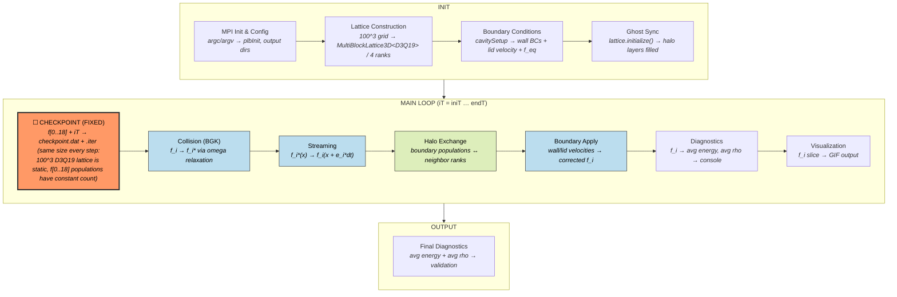
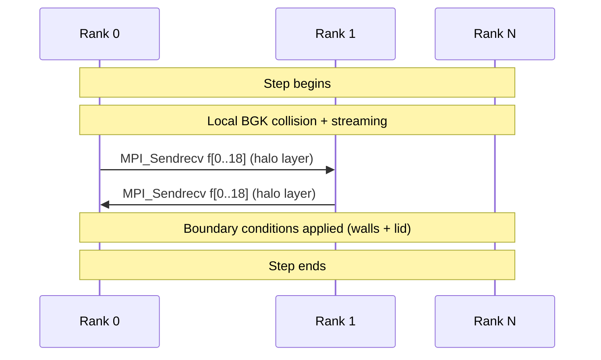
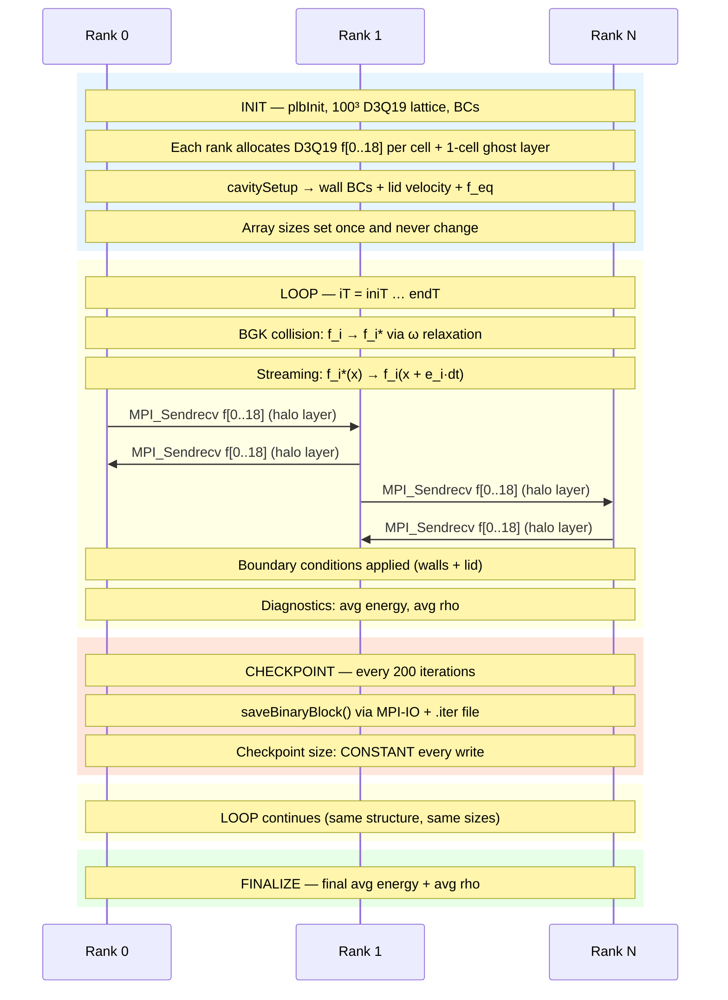

# Palabos — Parallel Lattice Boltzmann Solver

**Category:** Iterative / Fixed state  
**Language:** C++ (MPI)  
**Checkpoint library:** Native `saveBinaryBlock`/`loadBinaryBlock` (MPI-IO)

## Application Description

Palabos is a parallel Lattice Boltzmann Method (LBM) CFD solver. The benchmark solves **3D lid-driven cavity flow** using the D3Q19 BGK discretization at Re=100 on a 100^3 lattice. The domain is a unit cube with a moving top lid at constant velocity. Each MPI rank owns a rectangular sub-block of the 3D lattice.

## Computation Workflow


Data flow per step: D3Q19 populations are checkpointed (pre-collision), then relaxed, streamed, exchanged across ranks, and corrected at boundaries.

### Start

1. **MPI initialization** (`plbInit`), output directory setup.
2. **Lattice construction** — `MultiBlockLattice3D<double, D3Q19Descriptor>` distributed across 4 ranks.
3. **Boundary conditions** — `cavitySetup()` applies velocity conditions on all six walls, initializes interior cells to equilibrium `f_eq(rho=1, u=0)`, top lid to `f_eq(rho=1, u=(u_max/sqrt(2), 0, u_max/sqrt(2)))`.
4. **Ghost synchronization** — `lattice.initialize()` synchronizes halo layers.
5. **Restart detection** — attempt to open `checkpoint.dat.iter`; if valid iteration found in range, load checkpoint and adjust starting iteration.

### Main Loop (`iT` from `iniT` to `endT`)

1. **Checkpoint write** — if `iT % checkPointIter == 0` and `iT > iniT`: write checkpoint.
2. **Collision and streaming** — `lattice.collideAndStream()`, the core LBM operation:
   - **Collision:** for each cell, compute local density `rho` and velocity `u` from populations `f[0..18]`, relax toward equilibrium with rate `omega`.
   - **Streaming:** propagate post-collision populations to neighbor cells along lattice velocity directions.
   - **Halo exchange:** embedded `MPI_Sendrecv` for populations at the 1-cell boundary layer between sub-domains.
   - **Boundary conditions:** applied at domain walls.
3. **Diagnostics** — periodic print of `step iT; t=...; av energy=...; av rho=...`.
4. **Visualization** — periodic GIF slice output.

### End

- Loop exits at `iT == endT`.
- **Validation output:** diagnostic lines with average energy and density.

## Critical State

The lattice is **fixed size** throughout the simulation — no AMR, no migration.

| Field | Type | Evolution |
|-------|------|-----------|
| `f[0..18]` per cell | 19 doubles (D3Q19 populations) | Updated every step by BGK collision + streaming |
| Ghost layer (1-cell halo) | 19 doubles per boundary cell | Regenerated every step via MPI exchange |
| Iteration counter `iT` | 64-bit int | Incremented each step |

**Derived quantities:** Macroscopic density `rho` and velocity `u` are computed on the fly from `f` and are not stored separately. The halo layer is transient — always regenerated by `collideAndStream` before being read.

## MPI Task Lifetime

**Per-rank state:** Each rank owns a fixed rectangular sub-block of the 100^3 3D lattice. The local data is 19 distribution functions `f[0..18]` per cell (D3Q19 populations) plus a one-cell ghost layer from neighboring ranks. Array sizes are constant.

**How state changes:** Per-rank data stays fixed in size for the entire simulation. The `f` values evolve every step via BGK collision and streaming, but the lattice decomposition is static — no AMR, no cell migration.

**Communication pattern:** Each `collideAndStream` call includes embedded `MPI_Sendrecv` to exchange boundary-layer populations between adjacent sub-domains. No global reductions are used in the main loop.



### Application Lifetime View



**Key observations:**

- **State size is constant throughout execution.** The 100^3 D3Q19 lattice is partitioned once across ranks during INIT. No AMR, no cell migration — every rank holds the same number of cells (each with 19 doubles) from first step to last.
- **Communication is strictly nearest-neighbor via MPI_Sendrecv.** Each `collideAndStream` call exchanges the 1-cell halo layer between adjacent sub-domains. No global reductions are used in the main loop.
- **Checkpoint size is deterministic.** The parallel MPI-IO write (`saveBinaryBlock`) always writes the same total bytes — 19 doubles times the full 100^3 cell count — regardless of flow state or simulation time.

## Checkpoint Protection

### Write trigger

Every `checkPointIter = 200` iterations when `iT > iniT`.

### What is saved

Two files:
- **`checkpoint.dat`** — binary file containing all `f[0..18]` populations for every cell, written in parallel via `saveBinaryBlock`. Each rank writes its sub-domain using MPI-IO.
- **`checkpoint.dat.iter`** — ASCII text file containing just the current iteration number.

### Write sequence

```cpp
saveBinaryBlock(lattice, "checkpoint.dat");
std::ofstream iterFile("checkpoint.dat.iter");
iterFile << iT;
```

### Restart detection and recovery

```cpp
std::ifstream iterFile("checkpoint.dat.iter");
if (iterFile.good()) {
    plint savedIter;
    iterFile >> savedIter;
    if (savedIter > iniT && savedIter < endT) {
        loadBinaryBlock(lattice, "checkpoint.dat");
        iniT = savedIter + 1;
    }
}
```

`loadBinaryBlock` restores all `f[0..18]` values for every cell in the same spatial layout. Ghost cells are not stored — they are regenerated on the first `collideAndStream()` call.

### Consistency

The checkpoint is written **before** `collideAndStream()` at iteration `iT`, capturing the pre-collision state. On restart, the loop resumes at `savedIter + 1`, which is correct because `savedIter` was fully completed before the write. The `.iter` file acts as a commit record: if `saveBinaryBlock` crashes mid-write, the `.iter` file is not updated and the restart falls through to the previous valid checkpoint or starts fresh.
