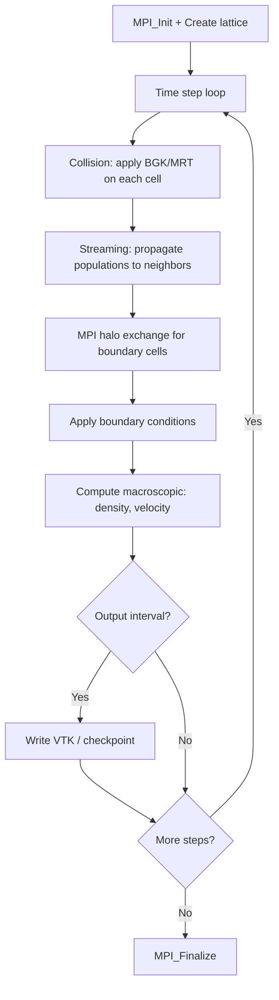

# Palabos Computation Flow

## Overview
Palabos solves fluid dynamics using the Lattice Boltzmann Method (LBM). Each timestep is a pipeline of collision, streaming, and boundary condition stages on a fixed Cartesian lattice distributed across MPI ranks.

## Main Loop

## MPI Communication
- **Halo exchange**: populations at subdomain boundaries exchanged via `MPI_Sendrecv`
- **Decomposition**: 3D block decomposition of the lattice
- **Collective**: `MPI_Reduce` for global statistics

## I/O Points
- VTK output for visualization
- Checkpoint: binary lattice state via `saveBinaryBlock`/`loadBinaryBlock`

## Output Format
VTK files for visualization. Checkpoint is a binary block containing all population values per cell. Stdout prints step number and macroscopic quantities.
**How to compare**: compare checkpoint binary files byte-for-byte (hash), or extract density/velocity fields and compare with numeric tolerance ~1e-10.
