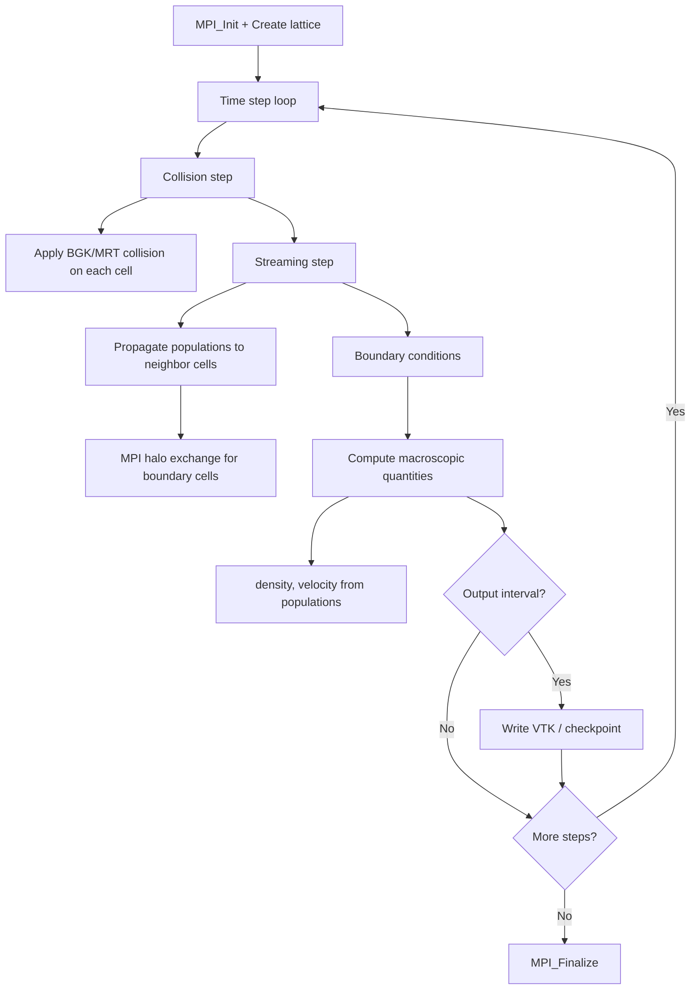

# Palabos Computation Flow

## Overview
Palabos solves fluid dynamics using the Lattice Boltzmann Method (LBM). Each timestep is a pipeline of collision, streaming, and boundary condition stages on a fixed Cartesian lattice distributed across MPI ranks.

## Main Loop

## MPI Communication
- **Halo exchange**: populations at subdomain boundaries exchanged via MPI_Sendrecv
- **Decomposition**: 3D block decomposition of the lattice
- **Collective**: MPI_Reduce for global statistics (average velocity, etc.)

## I/O Points
- VTK output for visualization
- Checkpoint: binary lattice state via saveBinaryBlock/loadBinaryBlock
