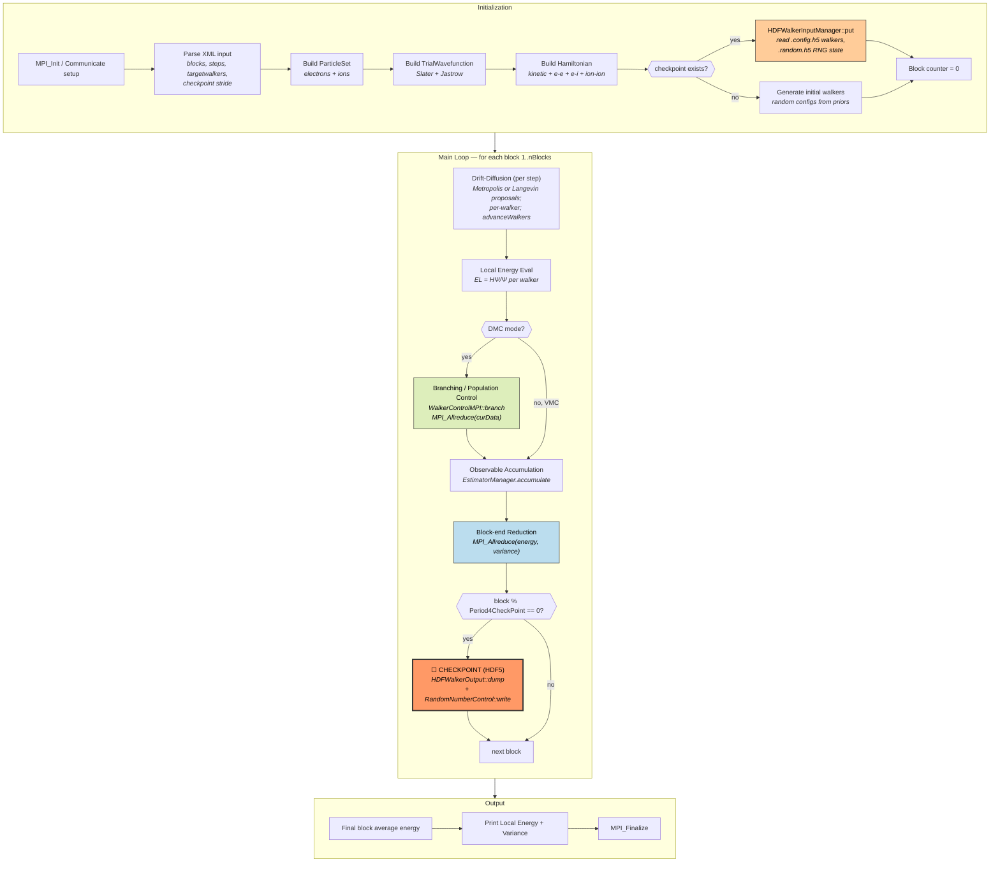
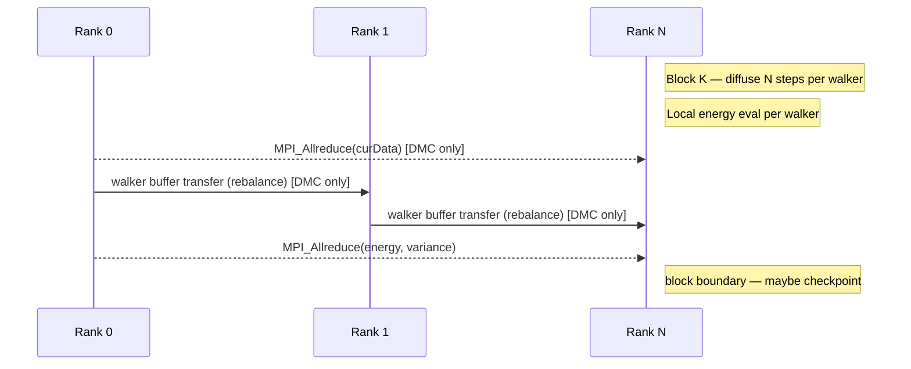
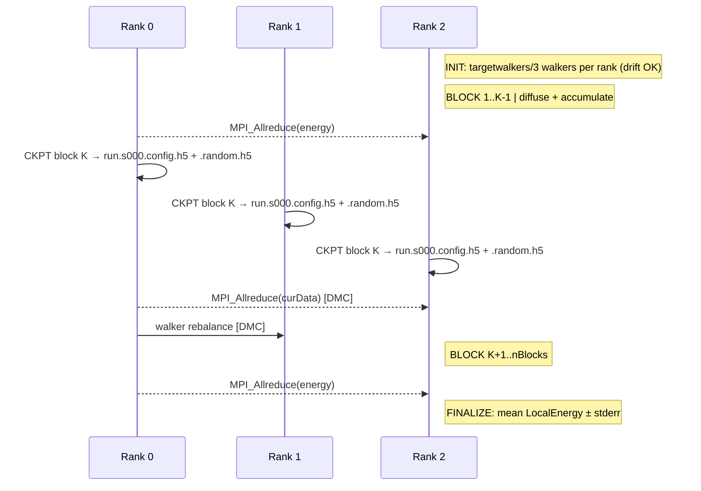

# QMCPACK — Quantum Monte Carlo Walker Ensemble

**Class:** (1) iterative_fixed
**Language:** C++ (with OpenMP threads, optional CUDA)
**Checkpoint library:** HDF5 (native `hdf_archive` API, walker `.config.h5` + RNG `.random.h5`)

## Application Description

QMCPACK is a continuum quantum Monte Carlo electronic-structure code from ORNL/UIUC. It computes ground-state expectation values for many-body wavefunctions by sampling electron configurations with stochastic walkers — VMC for variational sampling, DMC for projector-based diffusion. Each MPI rank owns a subset of an ensemble of walkers; the walkers diffuse, are weighted, and (in DMC) are branched/reconfigured between blocks. The checkpointed reference uses QMCPACK's built-in `mcwalkerset` HDF5 protocol.

## Computation Workflow



**Data flow per block:** `walkers(R, w, age, RNG)` →(N steps × diffuse)→ `walkers'` →(local energy)→ `EL` →(DMC: branch + reconfigure)→ `walkers'' (rebalanced)` →(estimator reduce)→ `<E>, σ²` →(checkpoint optional)→ `.config.h5`.

### Start

1. **MPI / Communicate initialization**, set rank and node binding.
2. **XML parse** — `qmcsystem`, `qmcdriver` (VMC/DMC), `mcwalkerset` (checkpoint reload), `parameter blocks`, `parameter steps`, `parameter targetwalkers`, optional `checkpoint="N"` stride.
3. **ParticleSet** — electrons + ions; sets up coordinate arrays and simulation cell.
4. **TrialWavefunction** — typically a Slater determinant times a Jastrow factor; precompute orbital evaluators.
5. **Hamiltonian** — kinetic, e–e Coulomb, e–i pseudopotentials, ion–ion contributions.
6. **Walker initialization** — either random initial configurations from a prior, or `HDFWalkerInputManager::put` to deserialize a `.config.h5` from a previous run; `RandomNumberControl::read` restores per-thread RNG state from `.random.h5` if present.

### Main Loop (block iterations)

A *block* is a measurement epoch composed of `steps` per-walker QMC moves. For each block:

1. **Drift–diffusion** — `QMCDriver::advanceWalkers` proposes new electron configurations per walker. VMC uses Metropolis with the trial wavefunction; DMC adds a drift term from `∇Ψ/Ψ` and an importance-weighted diffusion.
2. **Local energy** — evaluate `H Ψ / Ψ` for each walker; accumulate observables in the per-rank estimator buffers.
3. **(DMC only) Branching / population control** — `WalkerControlMPI::branch` uses an `MPI_Allreduce` on the per-rank walker counts (`curData`), then `swapWalkersSimple` rebalances by point-to-point transfer of walker buffers.
4. **Observable reduction** — block-level `MPI_Allreduce` of energy mean, variance, and other accumulators.
5. **Checkpoint** when `block % Period4CheckPoint == 0` (default: `nBlocks`, configurable via `<qmc checkpoint="N">`).

### End

- After the final block, write the closing checkpoint and the run summary.
- Print per-block averages of `LocalEnergy` and `Variance` to stdout — the validator's `keep_patterns` matches the `LocalEnergy` line.
- `MPI_Finalize`.

## Critical State

For a deterministic restart, every rank must reproduce both the live walker ensemble and the RNG sequence that drove it.

| Field | Type | Evolution |
|-------|------|-----------|
| Walker positions `R[nwalkers][nparticles][3]` | `double` | Updated every step by `advanceWalkers` |
| Walker weights `w[nwalkers]` | `FullPrecRealType` | Updated by branching factor in DMC; constant 1.0 in VMC |
| Walker age `age[nwalkers]` | `int` | Tracks how long a walker has lived; informs DMC reconfiguration |
| Walker multiplicity `m[nwalkers]` | `FullPrecRealType` | Decided per branching round |
| Per-thread RNG state | CLCG/Mersenne seed vectors | Advanced with every random draw |
| Block counter | `int` | Used to determine where the next block starts |
| Walker partition | `int[]` per-rank offsets | Lets a restart reconstitute per-rank walker counts |
| Estimator accumulators | `double[]` | Recomputable after restart by re-running the block; not persisted in walker file |

## MPI Task Lifetime

**Per-rank state shape:** each rank owns a slice of the global walker ensemble. The walker count per rank is *nominally fixed* but can drift:

- **VMC**: walker counts are stable; no migration.
- **DMC**: per-rank counts can fluctuate every block as branching multiplies / kills walkers, and population control rebalances counts back toward the per-rank target via point-to-point walker transfers.

That is why the cell is `dynamic_fixed`: the **structure** of per-rank state is stable (one walker container, one RNG buffer), but the **contents** evolve dynamically; redistribution happens at infrequent, well-defined block boundaries rather than continuously.

**Communication pattern:**

- Block-end `MPI_Allreduce` for energy and variance scalars.
- DMC branching `MPI_Allreduce` on a small per-rank counter array (`curData`).
- Walker rebalancing uses non-blocking point-to-point `MPI_Isend` / `MPI_Irecv` of walker payload buffers between donor and recipient ranks.



### Application Lifetime View



**Key observations:**
- Walker counts can drift ±10 % per block in DMC; VMC keeps them constant.
- The dominant network cost is **scalar reductions** (energy/variance), not bulk data movement, because walker payloads are small.
- The checkpoint cadence is **per-block**, never sub-block — every snapshot corresponds to a clean block boundary.

## Checkpoint Protection

### Write trigger

Inside `QMCDriver::recordBlock` (around `QMCDriver.cpp:299`):

```c++
if (DumpConfig && block % Period4CheckPoint == 0) {
    HDFWalkerOutput::dump(...);
    RandomNumberControl::write(...);
}
```

`Period4CheckPoint` defaults to `nBlocks` (one checkpoint at end of run); set `<qmc checkpoint="N"/>` in the input XML to checkpoint every `N` blocks.

### What is saved

Two files per QMC section:

- `<root>.s000.config.h5` — walker payload, written by `HDFWalkerOutput::write_configuration`. Datasets:
  - `state_0/block` — current block index (`int`).
  - `state_0/number_of_walkers` — total walker count across all ranks (`int`).
  - `state_0/walker_partition` — per-rank walker offsets (`int[]`).
  - `state_0/walkers` — particle positions, shape `[nwalkers][nparticles][3]`.
  - `state_0/walker_weights` — `[nwalkers]` of importance weights.
- `<root>.random.h5` — per-thread RNG seed vectors, written by `RandomNumberControl::write_parallel` (or `write_rank_0` in single-rank mode).

The wavefunction parameters and Hamiltonian definition are *not* in the checkpoint; they come from the input XML on restart.

### Write protocol (`HDFWalkerOutput.cpp`)

1. `hdf_archive::create()` opens the HDF5 file with the parallel-I/O flag when MPI-HDF5 is available.
2. Each rank writes its slice of `walkers` and `walker_weights` via hyperslab calls — collective if MPI-HDF5, otherwise serialized through rank 0.
3. `RandomNumberControl::write` produces the companion `.random.h5`.
4. `dump_file.close()` — no double-buffering or atomic rename; the file is in its final name throughout the write.

### Restart protocol

1. The XML input includes `<mcwalkerset fileroot="run.s000"/>` so `QMCDriver::setStatus` knows which `.config.h5` to load.
2. `QMCDriver::putWalkers` calls `HDFWalkerInputManager::put`, which reads back `walkers`, `walker_weights`, and `walker_partition` and reconstitutes per-rank walker containers.
3. `RandomNumberControl::read` restores per-thread RNG state from the `.random.h5`.
4. `QMCDriver::CurrentStep` is set to the saved block + 1; the loop resumes from there.

### Consistency

- **Single file per QMC section, single writer** — there is no atomic rename or shadow file. A crash mid-write leaves the file truncated.
- **Block-boundary semantics** — checkpoints only fire at block boundaries, so a successful checkpoint corresponds to a globally consistent state (all ranks have completed the same number of blocks).
- **Per-rank walker payloads** are written collectively when HDF5 is MPI-aware. Loss of one rank's slice (or a partial write) breaks restart for the entire ensemble.
