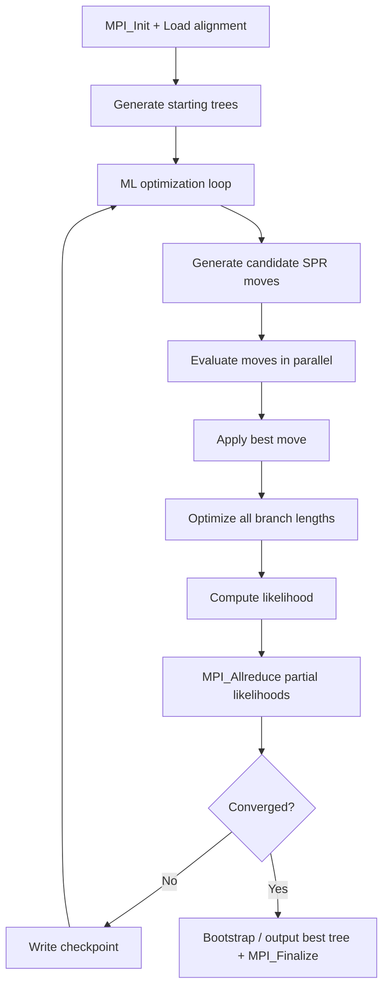

# RAxML-NG Computation Flow

## Overview
RAxML-NG performs maximum-likelihood phylogenetic inference using SPR-based tree search with fine-grained MPI+pthreads parallelism. Supports partitioned models, bootstrapping, and automatic checkpointing.

## Main Loop



## MPI Communication
- **Coarse-grained**: independent tree searches on different MPI ranks
- **Fine-grained**: alignment sites distributed across threads within a rank
- **Collective**: `MPI_Allreduce` for likelihood aggregation

## I/O Points
- Checkpoint: `.ckp` file with full search state (written each iteration)
- Output: `.raxml.bestTree`, `.raxml.log`, `.raxml.bestModel`

## Output Format
```
Final LogLikelihood: -12345.678901
Optimized model parameters written to: test.raxml.bestModel
Best ML tree written to: test.raxml.bestTree
```
**How to compare**: extract `Final LogLikelihood`; numeric comparison with tolerance ~1e-2 (ML scores have inherent numerical noise). Or compare best tree topologies using Robinson-Foulds distance.
