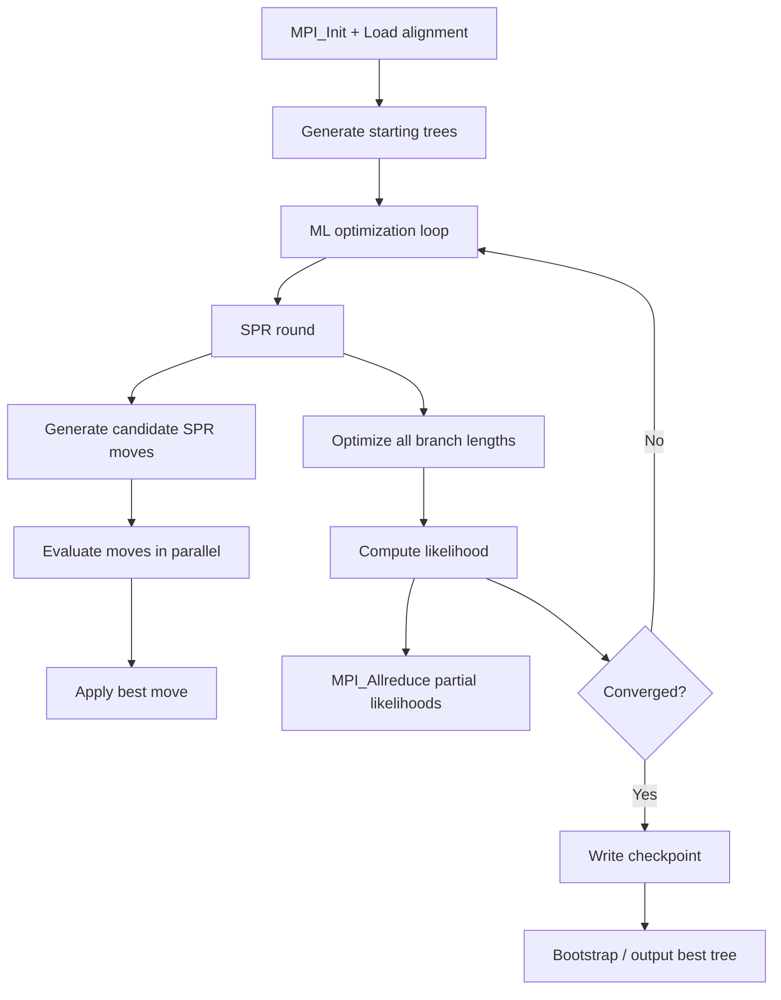

# RAxML-NG Computation Flow

## Overview
RAxML-NG performs maximum-likelihood phylogenetic inference using SPR-based tree search with fine-grained MPI+pthreads parallelism. Supports partitioned models, bootstrapping, and automatic checkpointing.

## Main Loop

## MPI Communication
- **Coarse-grained**: independent tree searches on different MPI ranks
- **Fine-grained**: alignment sites distributed across threads within a rank
- **Collective**: `MPI_Allreduce` for likelihood aggregation across ranks

## I/O Points
- Checkpoint: `.ckp` file with full search state (written automatically)
- Output: `.raxml.bestTree`, `.raxml.log`, `.raxml.bestModel`
