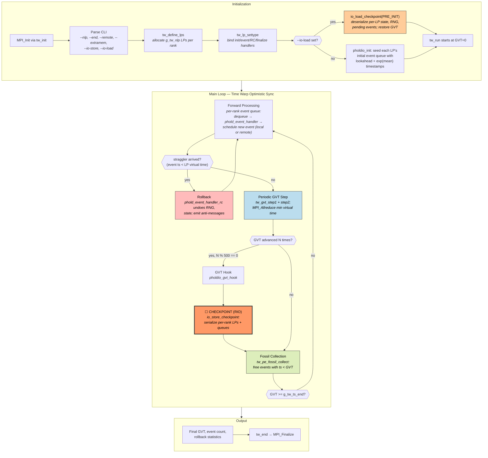
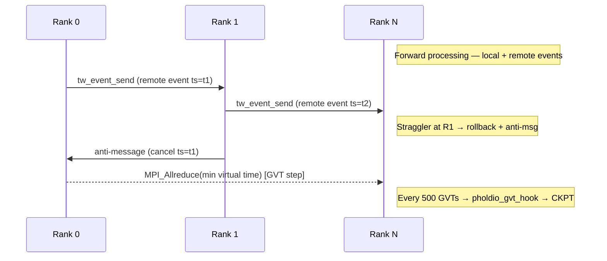
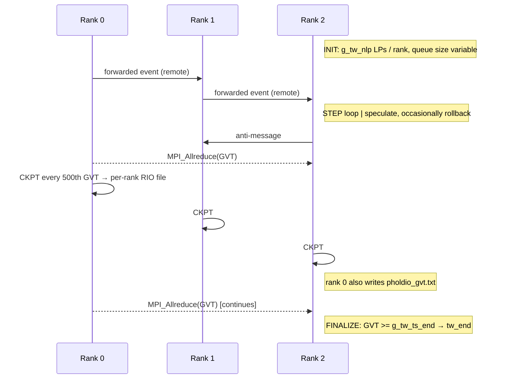

# ROSS / PHOLD — Optimistic Parallel Discrete-Event Simulation

**Class:** (4) asynchronous
**Language:** C (MPI)
**Checkpoint library:** RIO — ROSS's native I/O layer (POSIX file per rank, triggered from a GVT hook)

## Application Description

ROSS (Rensselaer's Optimistic Simulation System) is a Time Warp parallel discrete-event simulator. Each MPI rank runs a set of Logical Processes (LPs) that exchange timestamped events; LPs speculate forward optimistically and roll back when an event with a stale timestamp arrives. PHOLD is the canonical Hold-model microbenchmark distributed with ROSS — every LP holds a single integer counter and forwards events to a randomly chosen LP with exponentially distributed inter-arrival times. The reference checkpoint hooks into ROSS's GVT (Global Virtual Time) machinery so a snapshot is always taken at a globally consistent virtual-time boundary.

## Computation Workflow



**Data flow per event:** `event(ts, src LP, dst LP, payload)` →(forward handler advances LP)→ `LP state' + new event(s)` →(local/remote dispatch)→ `dst LP queue` →(GVT)→ `min ts across ranks` →(fossil collect)→ free `ts < GVT` events.

### Start

1. **`tw_init`** wraps `MPI_Init`, sets up the Time Warp kernel, registers the GVT algorithm.
2. **CLI** — number of LPs per rank (`--nlp`), end virtual time (`--end`), remote-event probability (`--remote`), checkpoint stride (`--extramem`), and either `--io-store=1` (write mode) or `--io-load=1` (restore mode).
3. **`tw_define_lps`** allocates `g_tw_nlp` LPs per rank, returning per-LP context structures.
4. **`tw_lp_settype`** binds the model handlers: `phold_init`, `phold_event_handler`, `phold_event_handler_rc` (the reverse handler used during rollback), and `phold_finalize`.
5. **Initial events** — `phold_init` (or `pholdio_init` in checkpointed mode) seeds each LP with one initial event at `lookahead + exponential(mean)`, kicking off the simulation.
6. **(restore path)** If `--io-load` is set, `io_load_checkpoint(..., PRE_INIT)` runs *before* event seeding; it reads the per-rank checkpoint file, restores LP state, RNG seeds, and the pending event queue, and aligns the local virtual time with the saved GVT.

### Main Loop (`tw_run` — optimistic Time Warp)

ROSS does not have an explicit per-step loop in user code; `tw_run` drives everything:

1. **Forward processing** — pop the lowest-timestamp event from the per-rank queue, dispatch it to its destination LP's handler. The handler can mutate LP state and schedule zero or more new events; each new event is sent locally or to a remote rank with probability `--remote`.
2. **Straggler detection** — if an event arrives whose timestamp is older than the LP's current virtual time, the LP rolls back: ROSS calls `phold_event_handler_rc` to undo each affected forward step (restoring RNG draws via `tw_rand_reverse_unif`) and emits anti-messages to cancel any speculative events that were sent.
3. **GVT computation** — periodically ROSS invokes `tw_gvt_step1` / `tw_gvt_step2`. These run an `MPI_Allreduce` on the minimum virtual time across all ranks. Once GVT advances, no event with `ts < GVT` can ever arrive, so events older than GVT can be permanently committed.
4. **GVT hook (PHOLD's checkpoint trigger)** — every 500 GVT steps (`tw_trigger_gvt_hook_every(500)`), `pholdio_gvt_hook` runs. In write mode it calls `io_store_checkpoint`; in load mode it is a no-op.
5. **Fossil collection** — `tw_pe_fossil_collect` walks each KP queue and frees events with `ts < GVT`.
6. **Termination** — the loop exits when GVT crosses `g_tw_ts_end` or all event budgets are exhausted.

### End

- ROSS's `tw_end` prints final statistics: total events processed, rollback count, anti-message count, GVT progression, walltime breakdown.
- Per-rank cleanup: free LP arrays, RNG state, event memory.
- `MPI_Finalize`.
- **Validation output:** the harness matches the line containing the final event count and PHOLD's "GVT" prints.

## Critical State

For a globally consistent restart, every rank must restore exactly the per-LP state, the RNG sequence, and the in-flight event set as of the checkpoint GVT.

| Field | Type | Source |
|-------|------|--------|
| Per-LP state (`phold_state.dummy_state`) | `long int` | One counter per LP — model-specific user data |
| Per-LP RNG state | `int[12]` (CLCG4 seeds: `Ig[4]`, `Lg[4]`, `Cg[4]`) | Restored byte-for-byte; lets forward replay produce the same random decisions |
| Pending event queue | linked list of `tw_event{ts, dst LP GID, src PE, bitfield}` | Serialized per rank, includes anti-messages still in flight |
| GVT | `tw_stime` | Side file `pholdio_gvt.txt` written by rank 0 |
| LP triggered-GVT hook flag | `unsigned int` | Preserves whether each LP has triggered its hook |
| Walker rebalance state | n/a | PHOLD does not rebalance LPs across ranks |

PHOLD does **not** persist the anti-message buffer separately because optimistic restart re-runs forward from the GVT snapshot and re-derives anti-messages naturally.

## MPI Task Lifetime

**Per-rank state shape:** each rank owns `g_tw_nlp` LPs (typically `nlp_per_pe = 2000`). The LP count is fixed at startup, but the **event queue size** is unbounded and varies wildly with workload — quiet periods leave a queue of tens of events, contended periods can balloon to tens of thousands. There is no automatic LP rebalancing in standard PHOLD, so per-rank queue depth is the dominant variable footprint.

**Why "task + variable":**

- **Task**: ROSS dispatches discrete events to handlers. The unit of work is a single event applied to a single LP; the order of events across LPs is decided by the optimistic synchronization protocol, not a fixed loop schedule.
- **Variable**: pending event count per rank changes continuously and unpredictably; speculation can deepen or unwind quickly under load imbalance.

**Communication pattern:**

- Per remote event: `tw_event_send` enqueues into a network buffer; ROSS flushes batches via non-blocking `MPI_Isend` / `MPI_Irecv` (the actual MPI calls live in `network-mpi.c`).
- Per GVT step: `MPI_Allreduce` on the per-rank minimum virtual time.
- Anti-messages travel the same path as ordinary events.



### Application Lifetime View



**Key observations:**
- Per-rank **event queue depth** is the dominant variable cost; checkpoint size scales with current pending events.
- Forward-only re-execution from a GVT snapshot is the consistency mechanism — no need to checkpoint anti-messages in flight.
- PHOLD is intentionally cheap per event so the framework overhead (queue management, GVT, rollback) dominates — it stresses the synchronization machinery, not the workload.

## Checkpoint Protection

### Write trigger

In `pholdio.c`:

```c
tw_trigger_gvt_hook_every(500);   // schedule pholdio_gvt_hook every 500 GVTs
```

`pholdio_gvt_hook` checks two flags before writing:

```c
if (!past_end_time && io_store == 1)
    io_store_checkpoint("pholdio_checkpoint");
```

So checkpoints fire only when the simulation is still active (`past_end_time == 0`) and write mode is on. Rank 0 additionally writes `pholdio_gvt.txt` containing the current GVT scalar so the restart script can sanity-check it.

### What is saved

Per rank, RIO writes a binary file (e.g. `pholdio_checkpoint.<rank>.dat`) containing:

- LP metadata (global IDs, mapping to local indices).
- Per-LP user state (`pholdio_state` — PHOLD's single `dummy_state` counter).
- Per-LP RNG state (CLCG4 seeds via `io_lp_serialize`).
- Pending event queue serialized via `io_event_serialize` — one record per event with the event bitfield, destination LP GID, source PE, and receive timestamp.

Plus the side file `pholdio_gvt.txt` (rank 0 only): a single floating-point GVT value.

### Write protocol (`io_store_checkpoint`)

1. RIO computes the partition layout (events + LPs per rank) and writes a header section.
2. Each rank serializes its LPs and event queue into its own file (RIO can also use MPI collective I/O when configured).
3. Rank 0 writes the side `pholdio_gvt.txt` with the current GVT.
4. Files close on the GVT boundary — by construction every rank has reached the same GVT, so all snapshots correspond to the same global virtual time.

### Restart protocol

1. User passes `--io-load=1` and a restart filename on the command line.
2. `io_load_checkpoint("pholdio_checkpoint", PRE_INIT)` runs *before* normal LP initialization:
   - Reads the partition map.
   - Per rank: deserializes LP array, rebuilds RNG state via `io_lp_deserialize`, restores `pholdio_state`.
   - Reconstructs the pending event queue: each saved event is mapped back to a local `tw_lp *` via `g_tw_custom_lp_global_to_local_map` and inserted into the appropriate KP queue.
3. `tw_run` continues from the restored GVT; events with `ts < GVT` are not re-dispatched (they have been committed).

### Consistency

- **Globally consistent by construction**: the GVT hook only fires after a successful global `MPI_Allreduce` for GVT, so all per-rank snapshots correspond to the same virtual time.
- **No mid-write atomicity**: each rank writes its own file; a crash during the write loses that snapshot, and the next restart attempt must use the previous one.
- **RNG determinism**: CLCG4 seeds are saved/restored exactly, so forward re-execution from a snapshot produces the same random decisions as the original run — that is what allows reverse computation rather than full state-saving.
