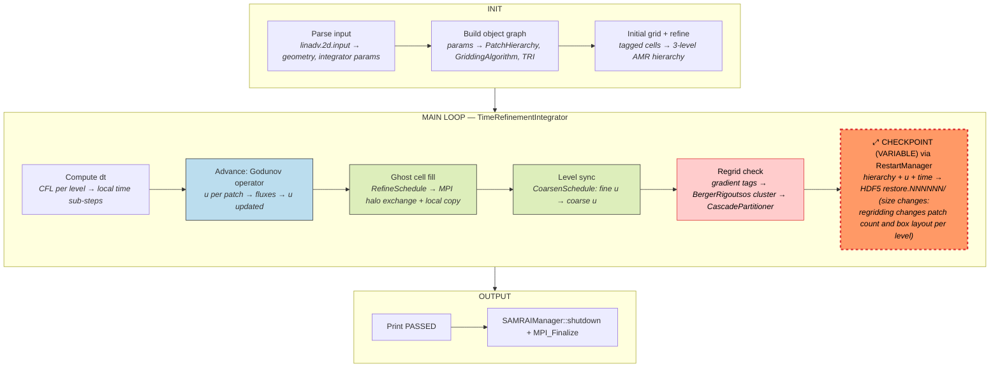
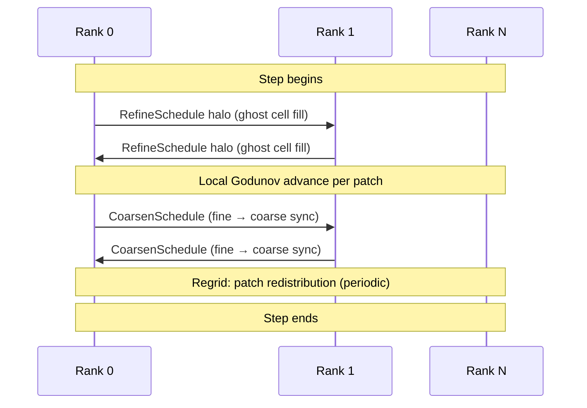
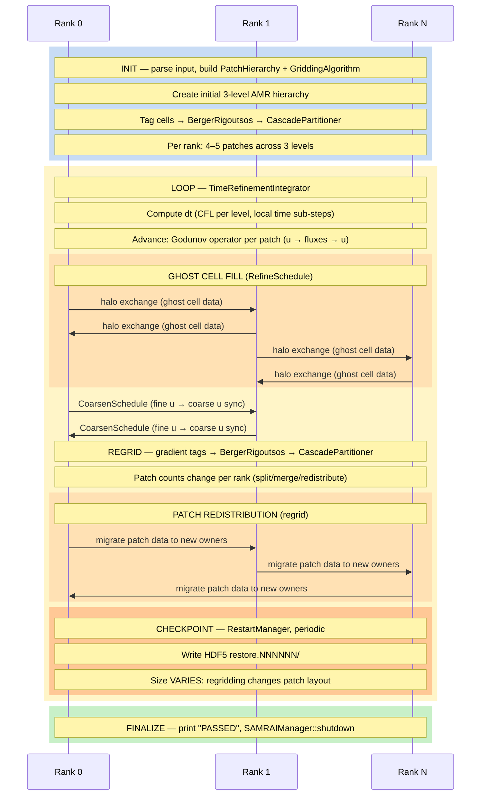

# SAMRAI — Structured Adaptive Mesh Refinement Application Infrastructure

**Category:** Dynamic / Fixed state  
**Language:** C++ (MPI)  
**Checkpoint library:** Native RestartManager (HDF5-based)

## Application Description

SAMRAI is an LLNL framework providing AMR infrastructure for structured-grid PDE solvers. The benchmark application is **LinAdv** (linear advection): it solves `du/dt + div(a*u) = 0` where `a` is a constant velocity vector, on a 2D Cartesian domain with a 3-level AMR hierarchy using a 4th-order Godunov scheme. SAMRAI handles all AMR bookkeeping (patch hierarchy, load balancing, ghost cell filling, fine-coarse synchronization); LinAdv provides only the per-patch physics operators.

## Computation Workflow

Data flow per step: cell-centered `u` is advanced by the Godunov operator per patch, ghost cells are filled via MPI, fine-to-coarse synchronization maintains consistency, and periodic regridding reshapes the AMR hierarchy before HDF5 checkpoint.

### Start

1. **MPI initialization**, `SAMRAIManager::initialize()`, parse input file (`linadv.2d.input`).
2. **Object graph construction** — `CartesianGridGeometry`, `PatchHierarchy`, `HyperbolicLevelIntegrator`, `GriddingAlgorithm` (with `BergerRigoutsos` clustering + `CascadePartitioner` + `StandardTagAndInitialize`), and `TimeRefinementIntegrator`.
3. **Initial grid generation** — coarse-level mesh created; initial refinement based on tagged cells.
4. If restarting: `RestartManager::openRestartFile(restart_dir, restore_num)` before constructing objects; objects reconstruct themselves from the restart database via `getFromRestart()`.

### Main Loop (driven by `TimeRefinementIntegrator`)

1. **Compute dt** — CFL condition accounting for local time refinement (finer levels use smaller sub-steps).
2. **Advance data** — for each patch on each level, apply LinAdv's Godunov operator to compute fluxes and update `u`.
3. **Ghost cell fill** — `RefineSchedule::fillData()` performs MPI halo exchange across rank boundaries plus local copies for same-rank patches.
4. **Level synchronization** — coarsen fine-level data back to coarse via `CoarsenSchedule` after each coarse step.
5. **Regrid check** — every N coarse steps: `GriddingAlgorithm` tags cells with large gradients, `BergerRigoutsos` clusters tagged cells into new boxes, `CascadePartitioner` reassigns patches to ranks, hierarchy is rebuilt.
6. **Checkpoint** — if `step % restart_interval == 0`: `RestartManager::writeRestartFile(restart_write_dirname, step)`.

### End

- After `max_integrator_steps` or `end_time` is reached.
- Print `PASSED` to stdout (autotesting result).
- `SAMRAIManager::shutdown()`, `MPI_Finalize`.
- **Validation output:** the `PASSED` line.

## Critical State

| Field | Type | Evolution |
|-------|------|-----------|
| `PatchHierarchy` | Hierarchy of `PatchLevel`s with `Patch` objects | Rebuilt during regridding; patch count and box layout change |
| `CellData<double>` per patch | Cell-centered `u` field | Updated every sub-step by LinAdv operator |
| Ghost cell data | Transient halo data | Filled fresh before each integration step |
| `CartesianGridGeometry` | Domain geometry | Static (fixed mesh domain) |
| Simulation time/step | `double`/`int` in `TimeRefinementIntegrator` | Advanced each step |
| Level-to-rank mapping | In `CascadePartitioner` | Updated on regrid |

**Key complexity:** Dynamic AMR means the patch layout — which boxes exist at which level, assigned to which rank — changes at regrid intervals. Ghost cell data is transient and regenerated after restart.

## MPI Task Lifetime

**Per-rank state:** Each rank owns a set of patches across AMR levels. Each patch holds cell-centered `u` data (the advected field) plus transient ghost cell buffers. The number and size of locally owned patches depend on the current AMR hierarchy and load-balance mapping.

**How state changes:** Per-rank data changes at regrid intervals when `BergerRigoutsos` clustering and `CascadePartitioner` reassign patches. Between regrids, patch data is fixed in size and updated in place by the Godunov operator.

**Communication pattern:** Each step uses `RefineSchedule` for MPI halo exchange to fill ghost cells, and `CoarsenSchedule` for fine-to-coarse data transfer. Regridding triggers bulk patch redistribution across ranks.

### Application Lifetime View

**Key observations:**
- **Variable state size:** Per-rank data changes at regrid intervals when BergerRigoutsos clustering creates new patch boxes and CascadePartitioner reassigns them. Between regrids, patch data is fixed in size and updated in place. The checkpoint size varies because the number and layout of patches per rank is dynamic.
- **Communication pattern:** Two regular exchanges per step -- RefineSchedule for ghost cell fills (MPI halo exchange) and CoarsenSchedule for fine-to-coarse synchronization. Regridding triggers a third, bulk communication phase where entire patches are redistributed across ranks.
- **Checkpoint coordination:** RestartManager writes an HDF5 directory per checkpoint step. Every SAMRAI object implementing `Serializable` writes its state via `putToRestart()`. Ghost cell data is NOT checkpointed -- it is regenerated after restart by `RefineSchedule::fillData()`.

## Checkpoint Protection

### Mechanism

SAMRAI uses its built-in **`RestartManager`** (HDF5-based). Every SAMRAI class holding persistent state implements the `Serializable` interface with `putToRestart(database)` / `getFromRestart(database)` methods.

### What is saved

In `restart_write_dirname/restore.NNNNNN/`:
- `PatchHierarchy` — full level/box/mapping structure
- `HyperbolicLevelIntegrator` — step counters, registered variables
- `TimeRefinementIntegrator` — current time, dt, step number
- `LinAdv` — application-specific state
- All `PatchData` arrays (cell data `u`) for locally owned patches per level

### Write sequence

1. `RestartManager::writeRestartFile(dirname, step)` creates directory `restore.NNNNNN/`.
2. Opens parallel HDF5 file (one per MPI rank or collective).
3. Calls `putToRestart()` on all registered `Serializable` objects.
4. Each `PatchLevel` writes all `PatchData` for its local patches.

### Restart sequence

1. `run_with_restart.sh` detects latest `restart_linadv/restore.*` directory.
2. Extracts step number from directory name.
3. Invokes: `./linadv input_file restart_dir restore_num`.
4. `RestartManager::openRestartFile()` opens HDF5 files.
5. Object constructors call `getFromRestart()` to reconstruct state.
6. `PatchHierarchy` rebuilds its complete level/patch/box structure.
7. Time stepping resumes from restored step.

Ghost cell data is **not** checkpointed — after restart, `RefineSchedule::fillData()` regenerates ghost cells before the first integration step.
