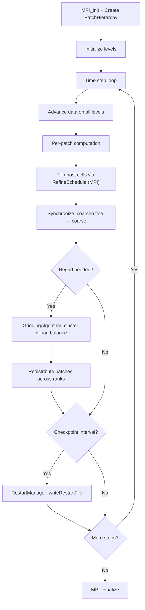

# SAMRAI Computation Flow

## Overview
SAMRAI provides structured AMR infrastructure. Applications define physics operators; SAMRAI handles the AMR hierarchy, communication, and load balancing.

## Main Loop



## MPI Communication
- **RefineSchedule**: fill ghost cells (MPI + local copy)
- **CoarsenSchedule**: synchronize fine → coarse
- **Load balancing**: redistribute patches across ranks during regrid

## I/O Points
- Restart files: HDF5-based via RestartManager
- Visualization: VisIt data files

## Output Format
Restart is HDF5-based (patch hierarchy + all patch data). Stdout prints:
```
Timestep 100: time=0.50  dt=0.005  regrid=yes  patches=1200
```
**How to compare**: compare HDF5 restart files using `h5diff`; or extract timestep/time values from stdout with numeric tolerance.
