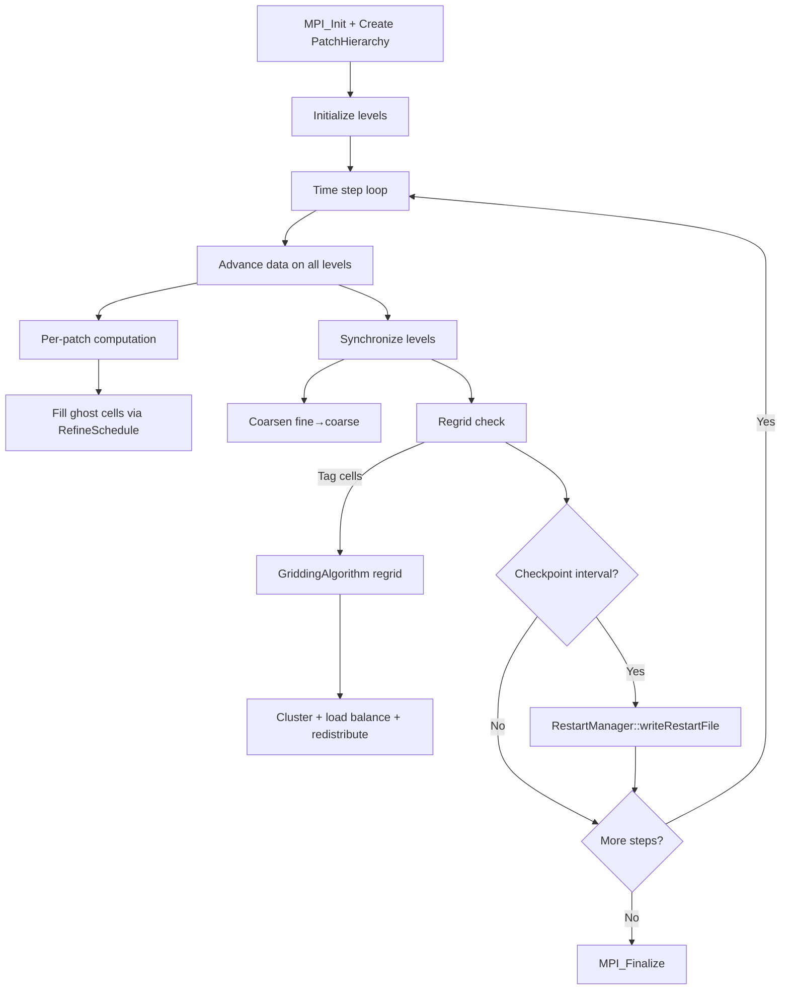

# SAMRAI Computation Flow

## Overview
SAMRAI provides structured AMR infrastructure. Applications define physics operators; SAMRAI handles the AMR hierarchy, communication, and load balancing.

## Main Loop

## MPI Communication
- **RefineSchedule**: fill ghost cells (MPI + local copy)
- **CoarsenSchedule**: synchronize fine→coarse
- **Load balancing**: redistribute patches across ranks during regrid

## I/O Points
- Restart files: HDF5-based via RestartManager
- Visualization: VisIt data files
