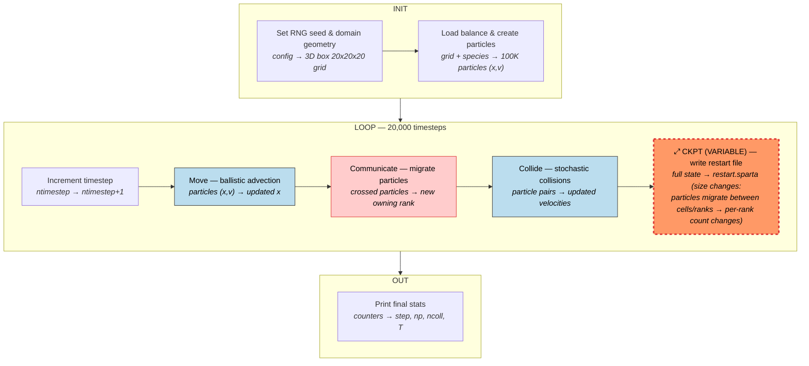
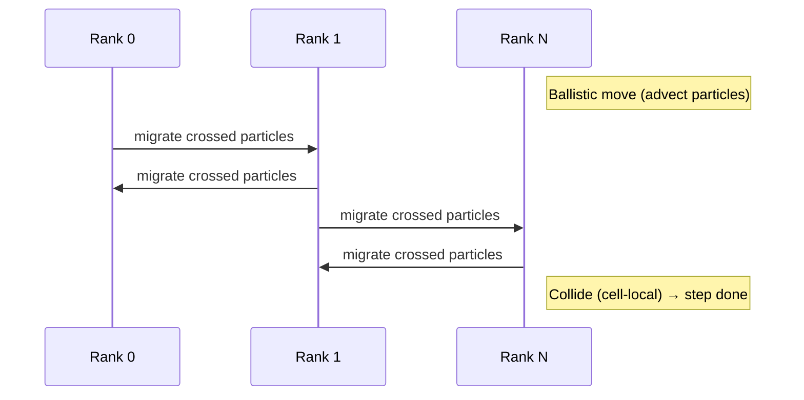
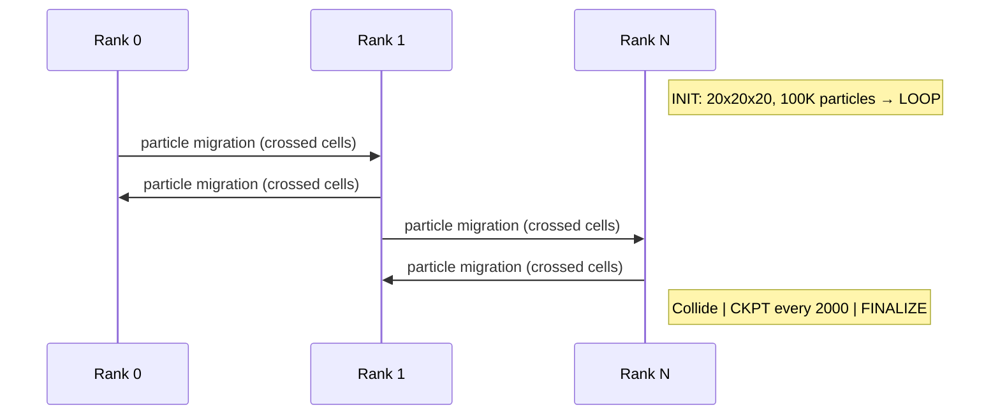

# SPARTA — Stochastic PArallel Rarefied-gas Time-accurate Analyzer

**Class:** (2) iterative_variable  
**Language:** C++ (MPI)  
**Checkpoint library:** Native binary restart files

## Application Description

SPARTA is a Direct Simulation Monte Carlo (DSMC) code for simulating rarefied gas dynamics — dilute gas flows where the mean free path is comparable to or larger than the physical domain size. The simulation domain is a 3D Cartesian box subdivided into a structured grid of cells. Individual gas particles are tracked as they stream ballistically, reflect off boundaries, and undergo stochastic intermolecular collisions. The benchmark simulates 100,000 argon particles in a 100 um x 100 um x 100 um periodic box with reflective boundaries, run for 20,000 timesteps.

## Computation Workflow

Data flow per step: particles (x,v) are advected, migrated across ranks, collided stochastically, and periodically serialized to a binary restart file.

### Start

1. **RNG seed** fixed (`seed 12345`).
2. **Domain geometry** — 3D box `0 0.0001 0 0.0001 0 0.0001`, subdivided into a 20x20x20 grid of cells.
3. **Load balance** — recursive coordinate bisection (`balance_grid rcb part`).
4. **Species/mixture** — argon, `nrho = 7.07e22`, temperature 273.15 K.
5. **Particle creation** — `create_particles air n 100000 twopass` stochastically places particles.
6. **Diagnostics and output** configured; restart schedule set (`restart 2000 restart.sparta`).

### Main Loop (20,000 timesteps, `dt = 7e-9 s`)

Each timestep in `Update::run()`:

1. **Increment** `ntimestep`.
2. **Move** — ballistic particle advection through the grid; particles reflecting off boundaries.
3. **Communicate** — particles that crossed cell boundaries migrated to the owning MPI rank.
4. **Collide** — stochastic intermolecular collision processing (if enabled).
5. **Output** — check if stats/dump/restart is due; write if triggered.

### End

- Stats at step 20000 printed (step, cpu, np, nattempt, ncoll, temperature).
- **Validation output:** the step-20000 stats line, compared numerically with tolerance 0.1.

## Critical State

| Field | Type | Evolution |
|-------|------|-----------|
| Particle array (x, y, z, vx, vy, vz, species, cell_id) per particle | Mixed double/int | Positions advance ballistically each step; velocity changed by collisions and boundary reflections |
| Grid cell decomposition | Cell boundaries, neighbor connectivity | Fixed after initial balance (but saved for portability across process counts) |
| `ntimestep` | Step counter (int) | Incremented each step |
| `np` | Particle count | Constant in this benchmark (no creation/destruction) |
| `nattempt`, `ncoll` | Collision statistics | Accumulated counters |
| RNG state | Internal state of SPARTA's RNG | Evolves with each random decision; fixed seed ensures reproducibility only from checkpoint |

**Task-parallel nature:** Each cell's collision processing is independent — particles within a cell are paired and tested stochastically without cross-cell dependencies. The streaming step is the only phase requiring inter-rank communication.

## MPI Task Lifetime

**Per-rank state:** Each rank owns a subset of the 3D grid cells (assigned by recursive coordinate bisection) and holds all particles currently within those cells. Each particle carries position `(x,y,z)`, velocity `(vx,vy,vz)`, species, and owning cell ID.

**How state changes:** The per-rank particle count changes every timestep as particles stream ballistically across cell boundaries into cells owned by other ranks. The grid cell assignment itself is fixed after initial load balancing.

**Communication pattern:** Each step performs point-to-point migration of particles that crossed into cells owned by neighbor ranks. Collisions are purely cell-local (no inter-rank communication). There are no global reductions during the timestep loop.

### Application Lifetime View

**Key observations:**
- **Variable state size:** Per-rank particle count changes every timestep as particles stream across cell boundaries. The total count is conserved, but distribution across ranks fluctuates continuously.
- **Communication pattern:** Only point-to-point particle migration between neighbor ranks; collisions are entirely cell-local with zero inter-rank communication. No global reductions during the timestep loop.
- **Checkpoint coordination:** All ranks write to a single binary restart file via MPI ping-pong protocol every 2000 steps. The file size varies because each rank's particle buffer size depends on current local particle count.

## Checkpoint Protection

### Mechanism

The `restart 2000 restart.sparta` command invokes `WriteRestart` every 2000 steps through the `Output` class. The restart file is binary (little-endian).

### What is saved

Binary file `restart.sparta` containing:
- **Magic string** `"SpartA RestartT"` and endianness marker.
- **Header:** `NTIMESTEP`, `DT`, `TIME`, global simulation parameters (nrho, fnum, vstream, temperature), global counts (`NPARTICLE`, `NUNSPLIT`, `NSPLIT`).
- **Box parameters:** domain extents, boundary condition flags.
- **Species and mixture definitions.**
- **Grid data:** per-rank child cell data (extents, parent pointers, neighbor connectivity, split-cell metadata) via `grid->pack_restart()`.
- **Particle data:** per-particle position, velocity, species, owning cell via `particle->pack_restart()`. Each rank packs local particles; the file writer receives buffers via MPI ping-pong.
- **Surface data** (if any explicit surfaces).

### Write protocol

Single file `restart.sparta` is overwritten each interval (every 2000 steps), keeping only the most recent checkpoint.

### Restart protocol

The restart input `in.restart`:
1. `read_restart restart.sparta.*` — reads the binary file, reconstructs box, species, grid, and particles (redistributing across possibly different MPI rank count).
2. `reset_timestep 0` — resets the step counter.
3. Re-registers diagnostics, re-enables restart writes.
4. `run 20000` — runs 20,000 more steps from the restored state.

The `run_with_restart.sh` script detects the restart file and chooses between `in.validation` (fresh) or `in.restart` (recovery).
