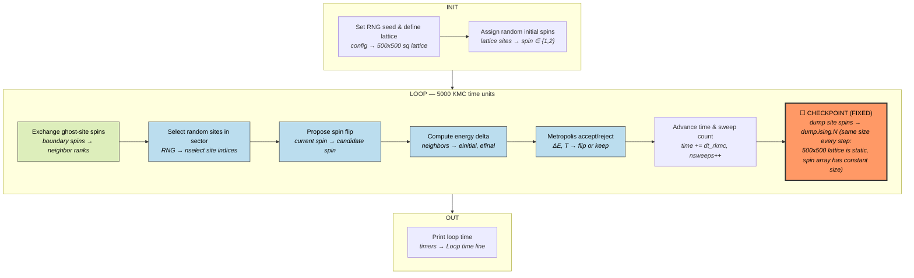
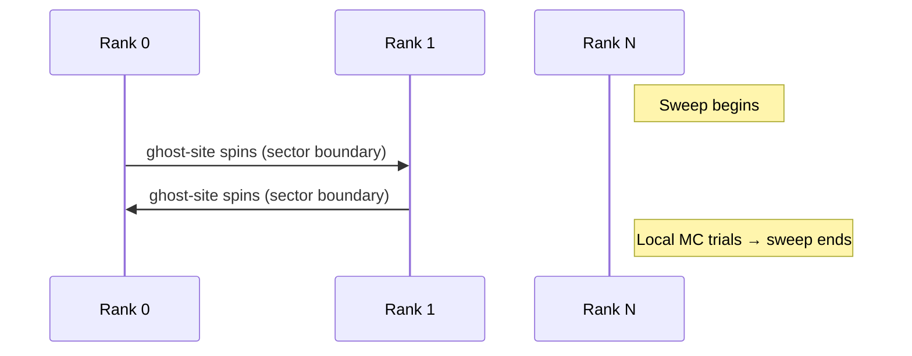
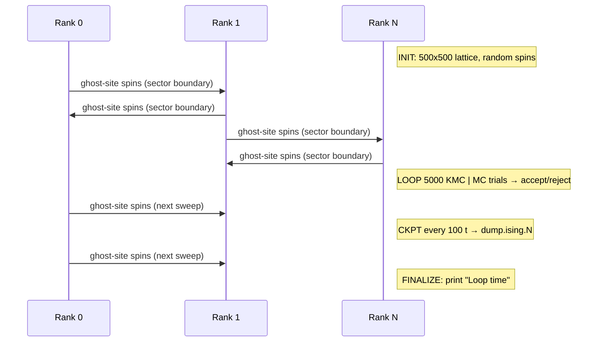

# SPPARKS — Stochastic Parallel PARticle Kinetic Simulator

**Class:** (1) iterative_fixed  
**Language:** C++ (MPI)  
**Checkpoint library:** Native `dump sites` output (text format, repurposed as checkpoint)

## Application Description

SPPARKS is a kinetic Monte Carlo (KMC) code for lattice-based stochastic simulations. The benchmark runs the **2D Ising model**: a 500x500 square lattice with periodic boundary conditions, where each site carries a binary spin (1 or 2). Events are individual spin flips accepted or rejected by the Metropolis criterion at temperature T=1.0. The simulation uses rejection KMC with sectored domain decomposition for parallelism, running for 5000 KMC time units (sweeps) with output every 100 time units.

## Computation Workflow

Data flow per step: ghost spins are exchanged, random sites are selected and tested by Metropolis criterion, accepted flips update the lattice, and spins are periodically dumped to text files.

### Start

1. **RNG seed** fixed (`seed 56789`).
2. **Model** — `app_style ising` loads `AppIsing` (inherits `AppLattice`). One integer per site (spin), no doubles.
3. **Domain** — 2D square lattice (`sq/4n` = 4-neighbor), 500x500 sites.
4. **Initial spins** — randomly assigned uniform in {1, 2} (`set site range 1 2`).
5. **Sweep algorithm** — `random` with `sector yes` (domain divided into non-overlapping sectors).
6. **Diagnostics** — `diag_style energy` computes total Ising energy (unlike-neighbor pair count).
7. **Output** — stats every 100.0 time units; dump sites every 100.0 time units to `dump.ising.*`.

### Main Loop (KMC sweeps, `time` from 0 to 5000.0)

Driven by `AppLattice::iterate_rejection()`:

For each sweep:

1. **For each sector:**
   - Communicate ghost-site values from neighbors (`comm->sector(iset)`).
   - Randomly select `nselect` sites from the sector.
   - For each selected site, call `site_event_rejection()`:
     - Propose random new spin.
     - Compute `einitial` (unlike neighbors before) and `efinal` (unlike neighbors after).
     - Accept by Metropolis criterion: `exp((einitial - efinal) / T)`.
2. **Increment** `nsweeps`, advance `time += dt_rkmc`.
3. **Check termination** — if `time >= stoptime`.
4. **Output** — call `output->compute()` to emit stats and dump files at scheduled intervals.

### End

- Loop exits when `time >= 5000.0`.
- `"Loop time"` line printed.
- **Validation output:** the loop time line, compared numerically with tolerance 1.0 (accommodating stochastic divergence).

## Critical State

| Field | Type | Evolution |
|-------|------|-----------|
| `spin[i]` (`iarray[0]`) | Integer {1, 2} per lattice site | Flipped stochastically by Metropolis criterion; Ising energy decreases from disordered toward ferromagnetic ground state |
| Ghost sites | Copies of boundary-neighbor spins | Refreshed via `comm->sector()` before each sector sweep |
| `time` | KMC time (double) | Accumulated by `dt_rkmc` per sweep |
| `nsweeps` | Sweep counter | Incremented each sweep |
| `naccept`, `nattempt` | Acceptance statistics | Diagnostic counters |
| `ranapp` | RNG state (`RandomPark`) | Evolves with each random decision; determines stochastic trajectory |

**Variable state nature:** While the lattice size is fixed, the spin configuration is the full state — and the RNG state determines the trajectory. Since the RNG state is not saved in the dump files, the post-restart trajectory diverges stochastically from an uninterrupted run (same long-time averages, different individual configurations).

## MPI Task Lifetime

**Per-rank state:** Each rank owns a fixed rectangular sector of the 500x500 lattice. The local data is `spin[i]` (one integer per owned site), the `ranapp` RNG state, and ghost copies of boundary-neighbor spins. The per-rank array sizes are constant throughout execution — the lattice never changes topology.

**How state changes:** Spin values flip stochastically but the array dimensions stay fixed. The RNG state evolves with every random decision. Total data per rank is constant.

**Communication pattern:** Ranks exchange ghost-site spins at sector boundaries before each sweep, then proceed with independent local Monte Carlo trials.

### Application Lifetime View

**Key observations:**
- **Fixed state size:** The 500x500 lattice is static -- no sites are created, destroyed, or migrated. Each rank owns a constant rectangular sector with a fixed number of sites throughout the entire simulation. Checkpoint file size is identical every dump.
- **Communication pattern:** Only ghost-site spin exchange at sector boundaries before each sweep. All Monte Carlo trials are purely local with no inter-rank communication or global reductions during the sweep.
- **Checkpoint coordination:** Each dump writes a global text file with all site IDs and spin values. The RNG state is NOT saved, so post-restart trajectories diverge stochastically (same thermodynamic averages, different configurations).

## Checkpoint Protection

### Mechanism

SPPARKS uses its existing `dump sites` mechanism as the checkpoint. Every 100 KMC time units, a text file `dump.ising.N` is written containing all site IDs and spin values. This file format is readable back via the `read_sites` command.

### What is saved

Plain-text `dump.ising.N` file (where N is the dump index) containing:
- For every site: `id` (global site ID) and `site` (spin value).

### Write trigger

Every 100 KMC time units via `dump 1 sites 100.0 dump.ising.* id site`.

### Restart protocol (`run_with_restart.sh`)

1. Find the most recent `dump.ising.*` file by modification time.
2. Extract dump index (e.g., `45` from `dump.ising.45`).
3. Compute completed time: `45 * 100 = 4500` KMC time units.
4. Compute remaining time: `5000 - 4500 = 500`.
5. Generate a restart input file in `/tmp/spparks_restart.in` that:
   - Defines the same lattice geometry.
   - Reads spins from the dump file: `read_sites $DUMP`.
   - Re-registers sweep algorithm, temperature, diagnostics.
   - Schedules continued dumps.
   - Runs for remaining time: `run 500.0`.
6. Feed the restart input to `spk_mpi`.

### Limitation

Only spin state is recovered — the RNG state of `ranapp` is not saved. The post-restart stochastic trajectory differs from an uninterrupted run, but long-time thermodynamic averages (energy, acceptance rate) remain statistically correct. The output comparison uses tolerance 1.0 to accommodate this.
