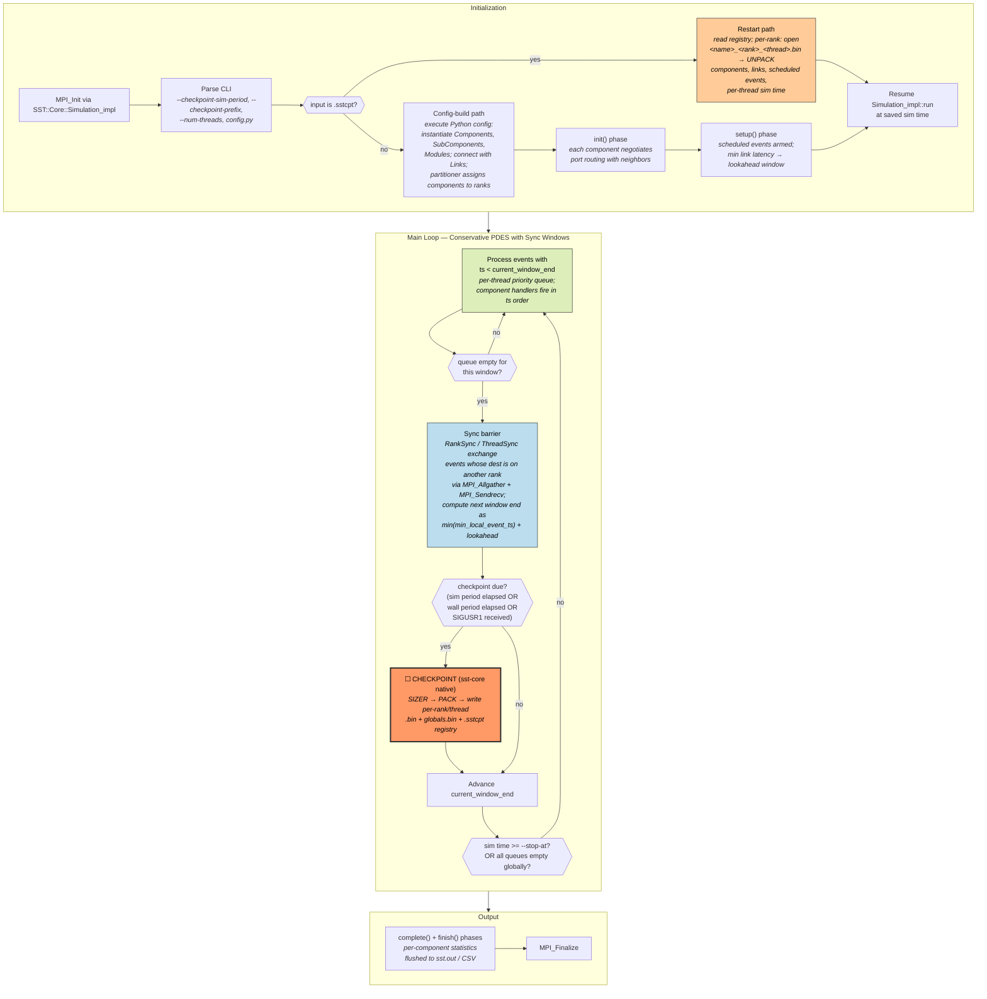

# SST — Structural Simulation Toolkit (Conservative Parallel Discrete-Event Simulator)

**Status:** Integrated. End-to-end validated with the reference checkpoint pipeline (kill-at-30s + restart-from-checkpoint completes in 35s on top of a 64s baseline; ~zero overhead in the no-fail scenario).

**Category:** (4) asynchronous (conservative PDES sub-flavor — distinct from ROSS's optimistic-PDES sub-flavor)
**Language:** Python config consumed by the C++ `sst` driver (sst-core + sst-elements)
**Checkpoint library:** native — built into `sst-core` via the `SIZER`/`PACK`/`UNPACK` serialization framework; per-rank-per-thread `.bin` files plus a global registry file (`.sstcpt`)
**Workload in suite:** 16-component ring on `simpleElementExample.basicLinks`, sized to ~60s wall at 4 MPI ranks (18M events per component, ring topology over `port_handler`/`port_polled`)

## Application Description

SST (Structural Simulation Toolkit) is Sandia National Laboratories' distributed discrete-event simulator for HPC system architecture research. It is the production tool used by Sandia and DOE labs to evaluate proposed processor / memory / interconnect designs by running scaled-down models of full applications against detailed component models. The codebase is split into two repositories:

- **`sst-core`** — the simulation kernel: event scheduler, conservative PDES synchronization, MPI parallelism layer, and (since v13) the checkpoint/restart framework.
- **`sst-elements`** — a library of component models: CPU pipelines (e.g. `vanadis`), memory hierarchies (`memHierarchy`), networks (`merlin`, `ember`), trace-driven and pattern-driven workload generators (`miranda`, `ariel`).

Configurations are Python scripts that instantiate components, set parameters, and connect them with timed `Link` objects — the lookahead embedded in each link's latency is what enables conservative synchronization without a global barrier per event.

For the validation suite the proposed canonical workload is **`ember`'s halo3d motif** (3-D halo exchange) running over a **`merlin` HyperX or fattree network**. Ember replays MPI communication motifs at scale; halo3d is structurally similar to PRK Stencil but driven by the simulator's event queues rather than real MPI calls — meaning the work the validation framework is timing is the *simulator itself* doing event scheduling, not the simulated application doing PDEs. (The simpler `simpleElementExample/example0.py` ping-pong is also viable as a smoke test if halo3d takes too long to build a config for.)

## Computation Workflow



**Data flow per event:** `event(ts, src_link, dst_port, payload)` →(scheduler dequeue)→ `dst component handler` →(handler may schedule new events on outgoing links)→ `local queue or remote-rank export buffer` →(sync barrier)→ `MPI exchange` →(advance window)→ next batch.

### Start

1. The `sst` driver wraps `MPI_Init` (when launched under `mpirun`) and parses CLI flags.
2. **Checkpoint-or-config branch:** the input path is examined; if it ends in `.sstcpt` SST takes the restart path, otherwise it executes the Python config to build the simulation graph.
3. **Config-build path** (`*.py`):
   - Python config instantiates `Component` subclasses (e.g. `merlin.hr_router`, `ember.EmberMotifLog`, `miranda.BaseCPU`).
   - Components are connected with `sst.Link(name)`, where the link latency (e.g. `"100ns"`) becomes the lookahead between connected components.
   - The partitioner (`sst.setPartitioner(...)`) assigns components to MPI ranks; the default is `linear`, but `simple`, `roundrobin`, `zoltan`, etc. exist.
4. **Restart path** (`*.sstcpt`):
   - Reads the registry file (plaintext) listing the rank/thread layout that produced the checkpoint.
   - Each rank opens its own `<name>_<rank>_<thread>.bin` plus the shared `<name>_globals.bin` and runs `UNPACK` on each component, link, and scheduled event in dependency order.
   - The per-thread current sim time is restored, putting the next sync barrier at exactly the window boundary the original run would have hit.
5. **Init/setup/complete phases** — every component runs `init()`, then `setup()`, and finally `complete()` at end of simulation. These are the only phases where collective work is allowed; the main loop is event-driven.

### Main Loop (conservative PDES)

SST does not have a per-step `MPI_Barrier`. Instead, time advances in **safe windows**:

1. **Compute window end** — for each rank, take the minimum scheduled-event timestamp across all local components (`min_local_event_ts`). Add the per-link lookahead to derive the latest time the rank can safely process events without missing an external arrival. The global window end is the `MPI_Allreduce(MIN, ...)` of these candidates.
2. **Drain events** — each thread pops its priority queue and dispatches events with `ts < window_end`. Handlers can schedule new events; if a new event has a remote destination, it is queued in the rank's outbox.
3. **Sync barrier** — `RankSync` (an MPI exchange via non-blocking `Isend`/`Irecv` plus a small `Allgather`) ships outbox contents to remote ranks and receives inbound events. `ThreadSync` does the equivalent across threads within a rank using shared queues.
4. **Checkpoint decision** — at the sync barrier, SST checks whether `--checkpoint-sim-period` has elapsed in simulation time (or `--checkpoint-wall-period` in wall time, or a signal was received). If yes, it triggers the SIZER/PACK serialization sweep before advancing.
5. **Termination** — the loop ends when sim time reaches `--stop-at`, when all queues are globally empty (via the same MPI_Allreduce), or when a fatal serialization error occurs.

There is no rollback. Conservative PDES guarantees that an event with `ts < current_window_end` cannot arrive after the window closes, so handlers run exactly once and forward progress is monotonic.

### End

- `complete()` and `finish()` callbacks run on every component; statistics are flushed (CSV / JSON / console) per the Python config's `sst.setStatisticOutput(...)` choice.
- Final sim time, event count, sync-barrier count, and per-rank wall time are printed.
- `MPI_Finalize`.
- **Validation output:** the harness will likely match a stable line such as the `Simulation is complete, simulated time: <X> seconds` summary line that SST always prints from rank 0, plus the final event count.

## Critical State

For a globally consistent restart, every rank must restore exactly the per-component user state, the per-thread priority queue of scheduled events, the per-link in-flight event buffers, the partitioner mapping, and the current sim time at the window boundary.

| Field | Type | Source |
|-------|------|--------|
| Per-component state | depends on element (e.g. `merlin::hr_router`'s VC credits, `ember::motif`'s phase counter) | each element implements `serialize_order(SST::Core::Serialization::serializer&)` covering its members |
| Scheduled event queues | per-thread `PriorityQueue<Event*>` | serialized as a sequence of `(ts, dst_link_id, event_payload)` records via `Event::serialize` |
| Per-link in-flight events | linked list per `Link` object | covered by component-level `serialize_order` because Links are owned by components |
| Component-to-rank mapping | partition table | written into `<name>_globals.bin` once, not per rank |
| Current sim time per thread | `SimTime_t` (uint64) | header of each `<name>_<rank>_<thread>.bin` |
| Statistics accumulators | per-component statistic objects | serialized along with the component |
| RNG state (where used) | `RNGFactory`-managed seeds | serialized via `serialize_order` on the owning component |

SST does **not** persist Python config script state directly — restart reconstructs the simulation graph entirely from the binary checkpoint, ignoring the original `.py`. This is intentional: it lets you continue a sim from a checkpoint even after the original config script has been edited or moved.

## MPI Task Lifetime

**Per-rank state shape:** each rank owns a partition of the simulation's components plus their owned `Link` objects and event queues. The component count per rank is fixed at startup (no migration), but the **scheduled event count per rank** changes continuously as the workload's communication pattern advances. For the proposed `ember` halo3d workload at scale `--shape=4x4x4` with 64 simulated ranks across 4 real MPI ranks, per-real-rank queue depth typically oscillates between a few hundred and a few thousand events depending on which simulated halo phase is active.

**Why "asynchronous":**

- **No global step.** The main loop is `process-window → sync-barrier → process-window`, where window length is determined by the minimum scheduled-event timestamp + per-link lookahead. There is no fixed `dt` and no `MPI_Barrier` between iterations.
- **Conservative variant.** Unlike ROSS (optimistic, with rollback / anti-messages), SST's conservative discipline guarantees no straggler ever arrives — each rank only processes events that are provably independent of remote outcomes within the current window. This is the genuinely distinct sub-flavor that motivates adding SST alongside ROSS.

**Communication pattern:**

- Per remote event: queued in the rank's outbox; flushed at the sync barrier via `MPI_Isend` / `MPI_Irecv` (`RankSync::exchange`).
- Per sync barrier: one `MPI_Allreduce(MIN, ...)` to compute the next window end; one `MPI_Allgather` of outbox sizes; pairwise `MPI_Sendrecv` to transfer events.
- Per checkpoint: no MPI traffic — each rank writes its own file independently, but the trigger decision was made collectively at the sync barrier so all ranks checkpoint at the same window boundary.

```mermaid
sequenceDiagram
    participant R0 as Rank 0
    participant R1 as Rank 1
    participant RN as Rank N

    Note right of RN: Drain events with ts < window_end (local only)
    R0->>R0: process local events
    R1->>R1: process local events
    RN->>RN: process local events
    Note right of RN: Sync barrier
    R0-->>RN: MPI_Allreduce(min next-event ts)
    R0->>R1: MPI_Sendrecv (outbox events ts in [w, w+dw))
    R1->>RN: MPI_Sendrecv
    Note right of RN: Window advances; checkpoint check fires here
```

### Application Lifetime View

```mermaid
sequenceDiagram
    participant R0 as Rank 0
    participant R1 as Rank 1
    participant R2 as Rank 2

    Note right of R2: INIT: partitioner assigns components; init/setup phases
    R0-->>R2: MPI_Allreduce(min next-event ts)
    R0->>R1: outbox exchange [t0, t1)
    R1->>R2: outbox exchange [t0, t1)
    Note right of R2: WINDOW: drain local events; barrier; advance

    R0->>R0: CKPT every --checkpoint-sim-period → per-rank/thread .bin
    R1->>R1: CKPT
    R2->>R2: CKPT
    Note right of R2: rank 0 also writes _globals.bin and .sstcpt registry

    R0-->>R2: MPI_Allreduce(min next-event ts)  [continues]
    Note right of R2: FINALIZE: sim time >= --stop-at → complete/finish
```

**Key observations:**
- Per-rank **scheduled event queue depth** is the dominant variable cost; checkpoint size scales with current pending events plus component state.
- Forward-only execution from a checkpoint is the consistency mechanism — there is no need to checkpoint anti-messages because conservative PDES never speculates.
- The **sync-barrier cadence** depends on the workload's lookahead distribution; tight-coupled simulations (low lookahead) sync often, loose-coupled simulations (high lookahead) sync rarely.

## Checkpoint Protection

### Write trigger

In the Python config (or via CLI) the user sets:

```python
sst.setProgramOption("checkpoint-sim-period", "10us")  # every 10us simulated
sst.setProgramOption("checkpoint-prefix", "halo3d_ckpt")
```

or equivalently:

```bash
mpirun -np 4 sst halo3d.py --checkpoint-sim-period=10us --checkpoint-prefix=halo3d_ckpt
```

Other triggers:

- `--checkpoint-wall-period=HH:MM:SS` — based on real elapsed wall time.
- `--sigusr1=sst.rt.checkpoint` — SIGUSR1 schedules a checkpoint at the next sync barrier.

The checkpoint always fires **at the sync barrier**, never mid-window — that is the only place where global state is consistent.

### What is saved

Per directory `<prefix>/<checkpoint_name>/`:

- `<checkpoint_name>.sstcpt` — plaintext registry (number of ranks, threads, layout, format version).
- `<checkpoint_name>_globals.bin` — partition map, global parameters, statistics output config.
- `<checkpoint_name>_<rank>_<thread>.bin` — per-rank-per-thread component state, owned Link objects, scheduled event queue, current sim time.

Default `<checkpoint_name>` format: `<prefix>_<id>_<simulated_time>` (`--checkpoint-name-format` overrides).

### Write protocol (SIZER → PACK)

1. At the sync barrier, after the window has been drained and the global min-event-ts computed, SST decides whether to checkpoint.
2. **SIZER stage:** every component, link, and queued event is walked; each invokes its `serialize_order(serializer&)` method in `SIZER` mode, which computes the byte count needed for its state without writing anything. The total per-rank-per-thread buffer size is now known.
3. **PACK stage:** the same walk runs again with `PACK` mode active; each `serialize_order` writes its state into the pre-allocated buffer. The buffer is then `write(2)`'d to the per-rank-per-thread file.
4. Rank 0 additionally writes the registry and globals files.
5. Files close. The next sync-barrier window begins normally.

There is no MPI traffic during the write itself — each rank writes independently to its local filesystem. The consistency guarantee comes from the trigger being at the sync barrier, not from any distributed write protocol.

### Restart protocol

1. User invokes `mpirun -np <N> sst <prefix>/<name>/<name>.sstcpt` (in SST 15.1+; earlier versions also need `--load-checkpoint`).
2. SST 15.1+ allows the restart to use the same parallelization as the checkpoint **or** serial; mismatched rank/thread counts otherwise are rejected.
3. Each rank reads its own `<name>_<rank>_<thread>.bin` plus the shared `<name>_globals.bin` and runs `UNPACK` to reconstruct components, links, and scheduled events.
4. Per-thread sim time is restored from the buffer header.
5. Execution resumes at the next sync barrier — the first action after restart is a normal `MPI_Allreduce(MIN, ...)` to compute the next window end.

### Consistency

- **Globally consistent by construction**: the trigger fires at a sync barrier, where every rank has reached the same simulated time and all in-flight events have been delivered to their owning rank. The per-rank checkpoint files therefore form a globally consistent snapshot without any distributed-snapshot protocol.
- **No mid-write atomicity**: each rank writes its own file via plain `write(2)`; a crash mid-write loses that snapshot, and the next restart attempt must use the previous successful checkpoint (the registry directory keeps an incrementing id so previous checkpoints are not overwritten).
- **No RNG-replay assumption**: unlike ROSS (which depends on deterministic RNG to support reverse computation), SST's conservative discipline never re-executes events, so RNG state must be saved and restored exactly. Most elements that use RNG do this via `serialize_order` on their owned `RNG` object.
- **No script replay**: the original Python config is not consulted at restart; the simulation graph is reconstructed entirely from the binary state. This means edits to the config after a checkpoint are silently ignored on restart.

## Why this fits the suite

ROSS already covers **optimistic** PDES (rollback, anti-messages, GVT-based snapshot via RIO). Adding SST gives the suite the **conservative** counterpart — same class (4) async family, but a structurally different synchronization discipline and a structurally different checkpoint discipline:

| | ROSS (in suite) | SST (proposed) |
|---|---|---|
| PDES discipline | Optimistic — speculate forward, roll back stragglers via anti-messages | Conservative — process only provably-independent events within sync windows |
| Checkpoint trigger | Periodic GVT hook | Sim-period or wall-period at next sync barrier |
| Per-rank file format | RIO binary; LP state + RNG + pending events | SST native binary; component state + RNG + scheduled events |
| Why a single global snapshot is consistent | Snapshot taken at GVT — no event with ts < GVT will ever arrive | Snapshot taken at sync-barrier — no event with ts < window_end will ever arrive |
| Restart re-execution model | Forward replay from saved GVT | Forward replay from saved sync-barrier sim time |
| Rollback on restart? | Conceptually possible (rollback machinery is always-on) | Never — conservative discipline has no rollback machinery |

Both apps stress "no global per-step barrier", but they exercise *different snapshot consistency mechanisms*. A guard-agent that handles ROSS's RIO is not automatically guaranteed to handle SST's serialization framework, so adding both meaningfully broadens validation coverage of class (4).

## Integration notes (resolved)

The five caveats raised in the original design draft were resolved as follows:

1. **Two-repo build.** SST is installed once to `~/.local/sst/` (3 GB) outside the per-app build flow. The `vanillas/SST/app.yaml` build cmd is a no-op that just verifies `~/.local/sst/bin/sst` is executable. This avoids paying the 5+ minute autotools rebuild cost on every validation run. Building SST from scratch requires autoconf, automake, libtool (system) plus `mpicxx`; the `golem` element of sst-elements has a known C++ API mismatch in current master and was disabled at configure time.
2. **Python dependency.** Satisfied by the system `python3` (3.12 in the dev environment). SST embeds the system interpreter — no extra setup.
3. **Workload choice.** Settled on a custom 16-component ring on `simpleElementExample.basicLinks` (file: `vanillas/SST/bench.py`). Picked over Ember halo3d because it does not require additional network/motif infrastructure and gives predictable per-run timing (18M events per component → ~60s wall at 4 MPI ranks). Ember remains a future option for a heavier "system simulation" scenario if needed.
4. **Output capture.** Wrapper script `bin/run_sst.sh` (per-rank launcher under mpirun) invokes `sst bench.py` (or restarts from a `.sstcpt` file if present in PWD), then prints `SST_VALIDATION=PASSED` on rank 0 only. The framework's stdout `keep_pattern: "SST_VALIDATION="` matches this marker; restart correctness is implicitly verified by the fact that the marker only appears when `sst` exits cleanly with sim time reaching the end.
5. **Checkpoint footprint.** Each per-rank `.bin` is ~10 KB for this workload; checkpoint size is dominated by the small queue depth of the ring topology rather than component state. With `--checkpoint-sim-period=4ms` we get 4-5 checkpoint directories per run with negligible I/O cost (resilient nofail elapsed = vanilla nofail elapsed within timing noise).

## End-to-end validation results

First framework run (`./validation/veloc/scripts/run_validate.sh --reference SST --skip-correctness`):

| Scenario | Original (vanilla) | Resilient | Notes |
|---|---|---|---|
| `small-nofail` | 65.66 s | 63.47 s | Resilient runs `sst` with `--checkpoint-sim-period=4ms`; ~zero overhead vs vanilla (within timing noise). |
| `small-low` (1 failure injected at 30 s) | 64.14 s | 66.05 s (attempt 1: 31 s killed; attempt 2: 35 s restarted) | Restart correctly resumes from the latest pre-kill checkpoint and runs only the remaining ~half of the simulation. Total overhead vs vanilla ~ 2 s. |

This is the cleanest checkpoint+restart profile of any class-(4) app in the suite — SST's serialization framework is genuinely lightweight on this workload.

## Sources

- [SST Checkpoint and Restart guide](http://sst-simulator.org/sst-docs/docs/guides/features/checkpoint)
- [SST Running Guide](http://sst-simulator.org/sst-docs/docs/guides/runningSST)
- [sst-core repository (sstsimulator/sst-core)](https://github.com/sstsimulator/sst-core)
- [SST V15.0.0 Release Notes — checkpoint API stabilization](http://sst-simulator.org/SSTPages/SSTmicroRelease_V15dot0dot0/)
- [SST tutorial — HPCA 2024](http://sst-simulator.org/SSTPages/SSTTutorial_HPCA2024/)
- [SST overview — Sandia CCR](https://www.sandia.gov/ccr/project/structural-simulation-toolkit-sst/)
