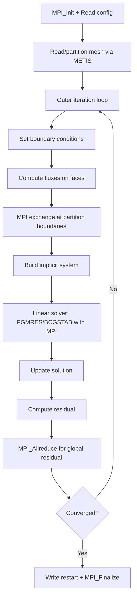

# SU2 Computation Flow

## Overview
SU2 solves CFD and shape optimization problems using finite volume methods on unstructured meshes. Iterative solver pipeline on a fixed mesh with implicit time stepping.

## Main Loop



## MPI Communication
- **Halo exchange**: `MPI_Sendrecv` for solution values at partition boundaries
- **Collective**: `MPI_Allreduce` for global residuals, CFL computation
- **Mesh partitioning**: METIS/ParMETIS at startup

## I/O Points
- Restart files: solution state for all mesh nodes
- Surface output: forces, pressure coefficients

## Output Format
```
+---------------------------------------------------+
|  Inner_Iter|      rms[Rho]|      rms[RhoE]|   CL  |
+---------------------------------------------------+
|         100|  -8.234567e+0|  -7.123456e+0| 0.3245|
```
**How to compare**: extract final `rms[Rho]` residual; numeric comparison with tolerance ~1e-4. Or compare restart files by re-running 1 iteration from each and diffing the residuals.
