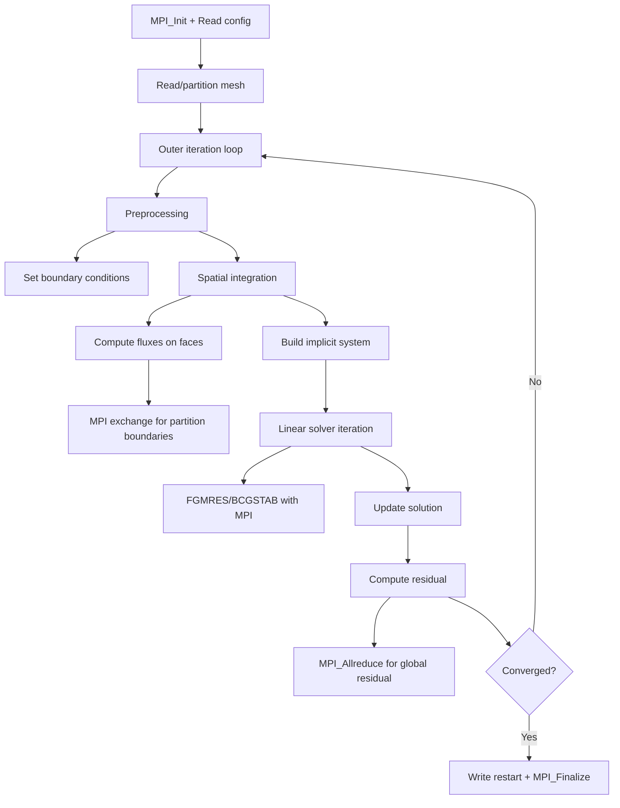

# SU2 Computation Flow

## Overview
SU2 solves CFD and shape optimization problems using finite volume / finite element methods on unstructured meshes. Iterative solver pipeline on a fixed mesh with implicit time stepping.

## Main Loop

## MPI Communication
- **Halo exchange**: MPI_Sendrecv for solution values at partition boundaries
- **Collective**: MPI_Allreduce for global residuals, CFL computation
- **Mesh partitioning**: METIS/ParMETIS at startup

## I/O Points
- Restart files: solution state for all mesh nodes
- Surface output: forces, pressure coefficients
- Volume output: flow field visualization
