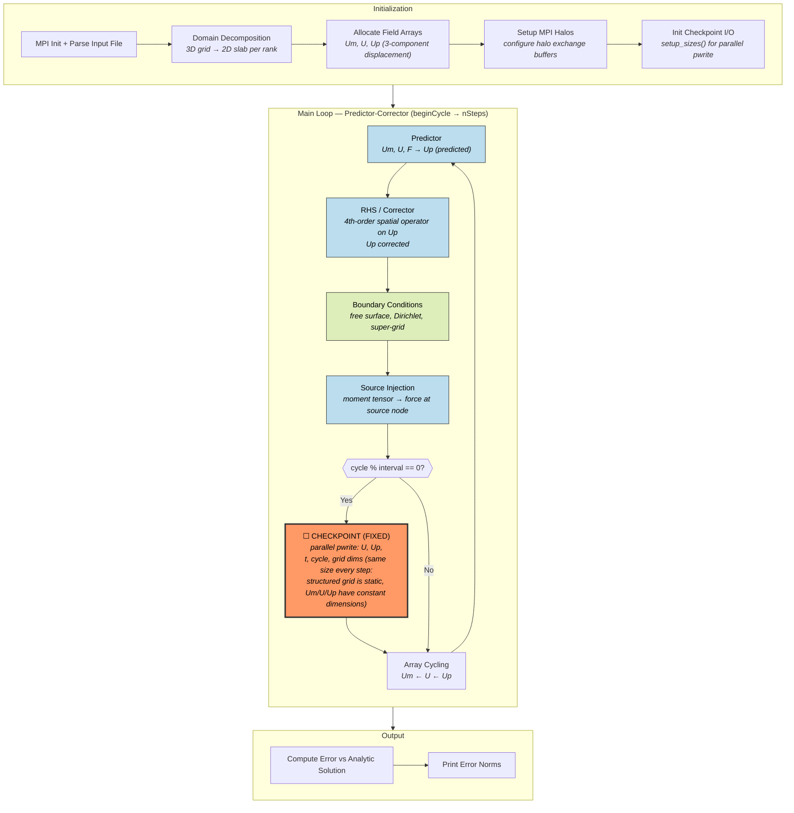
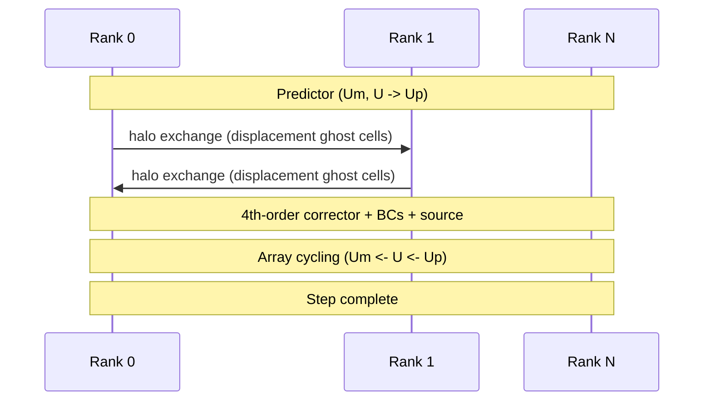
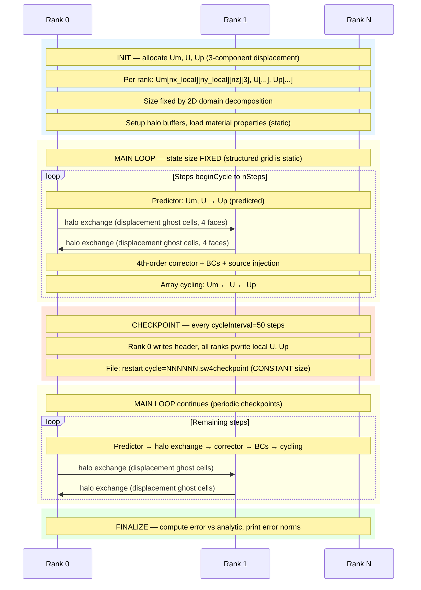

# SW4lite — Seismic Wave Propagation (4th order)

**Category:** Iterative / Fixed state  
**Language:** C++ (MPI)  
**Checkpoint library:** POSIX parallel I/O (`Parallel_IO` class with `pwrite`)

## Application Description

SW4lite is an LLNL mini-app (simplified version of the full SW4 code) that simulates seismic wave propagation through a 3D heterogeneous elastic solid. It solves the elastic wave equations using a 4th-order finite-difference scheme on a structured Cartesian grid with a free-surface condition at the top boundary and sponge/super-grid absorbing layers at the other boundaries. The domain is partitioned across MPI ranks in 2D (x-y plane), each owning a slab of grid columns. The test case (`validation_test.in`) drives a point-source moment-tensor seismic event and measures the solution error against an analytic solution.

## Computation Workflow

**Data flow per step:** `Um,U` →(predict)→ `Up` →(correct)→ `Up'` →(BC)→ `Up''` →(source)→ `Up'''` →(cycle)→ `Um=U, U=Up'''`

### Start

1. **MPI initialization**, construct `EW` object with input file.
2. **Input parsing** (`parseInputFile`) — grid dimensions, time span, source definitions, checkpoint/restart parameters, material properties, super-grid settings.
3. **Domain setup** (`setupRun`) — decompose domain across MPI ranks, allocate field arrays, set up MPI halo communications.
4. **Checkpoint setup** — initialize `CheckPoint` objects for writing and `m_restart_check_point` for reading, call `setup_sizes()` to configure parallel I/O layout.
5. If restarting: `read_checkpoint()` restores displacement fields and cycle counter.

### Main Loop (predictor-corrector, `beginCycle` to `mNumberOfTimeSteps`)

Each iteration:

1. **Predictor** (`evalPredictor`) — compute predicted displacement `Up` from `U` (current) and `Um` (previous), plus body force `F`.
2. **RHS evaluation / Corrector** (`evalRHS`/`evalCorrector`) — evaluate the second-order spatial operator and correct `Up`.
3. **Boundary conditions** (`enforceBC`) — free surface, Dirichlet, super-grid absorbing.
4. **Source injection** (`Force`) — add seismic source contribution.
5. **Checkpoint write** — if due (every `cycleInterval` steps).
6. **Array cycling** (`cycleSolutionArrays`) — advance `Um <- U <- Up` for next step.

### End

- Compute and print solution errors against exact solution (`"Errors at time"` lines).
- **Validation output:** the error norm values.

## Critical State

The state is fully described by three 3D displacement arrays per grid level:

| Field | Type | Evolution |
|-------|------|-----------|
| `Um[g]` | Displacement at t_{n-1} (3-component `Sarray`) | Becomes previous `U` after array cycling |
| `U[g]` | Displacement at t_n (3-component `Sarray`) | Current field; updated from `Up` after cycling |
| `Up[g]` | Displacement at t_{n+1} (3-component `Sarray`) | Newly predicted/corrected each step |
| `t` | Physical time (double) | Advanced by `dt` each step |
| `currentTimeStep` | Cycle counter (int) | Incremented each step |

**Static arrays** (not checkpointed): material properties `mMu`, `mLambda`, `mRho` (elastic moduli and density) do not evolve.

**Key insight:** Given `Um` and `U` at any step, the solver can compute the next `Up` — the leapfrog-like stencil only needs two time levels to advance.

## MPI Task Lifetime

**Per-rank state:** Each rank owns a 2D slab of the 3D structured grid and holds three displacement arrays (`Um`, `U`, `Up`) with 3 vector components per grid point. The grid partition is fixed at initialization.

**How state changes:** Per-rank data is strictly fixed in size throughout execution. The structured grid never changes dimensions, and no data migrates between ranks.

**Communication pattern:** Each step requires a halo exchange of displacement values with neighboring ranks (2D decomposition, 4 face neighbors) before applying the 4th-order finite-difference stencil. A single `MPI_Allreduce` broadcasts the restored cycle counter on restart.

### Application Lifetime View

**Key observations:**
- **State size behavior:** Per-rank state is strictly fixed throughout execution. The structured 3D grid dimensions are set at initialization, and the displacement arrays `Um`, `U`, `Up` never change size. Checkpoint file size is constant across all writes.
- **Communication pattern:** Nearest-neighbor halo exchange with 4 face neighbors (2D decomposition of 3D grid) for ghost cell displacement values, required before the 4th-order finite-difference stencil. A single `MPI_Allreduce` occurs only on restart to broadcast the restored cycle counter.
- **Checkpoint coordination:** Coordinated parallel I/O using POSIX `pwrite` with absolute file offsets — each rank writes its local sub-array to a computed offset in a shared file. Rank 0 writes the header first, then all ranks write in parallel.

## Checkpoint Protection

### Write trigger

Every `cycleInterval=50` cycles, configured via `checkpoint cycleInterval=50 file=restart` in the input file.

### What is saved

Binary file `restart.cycle=NNNNNN.sw4checkpoint` containing:
- **Header** (rank 0): precision flag, number of grid levels, simulation time `t`, cycle number, global 3D dimensions per grid level.
- **Field data** (parallel): 3-component displacement data for `U` and `Up` for each grid level, written in parallel using the `Parallel_IO` class (coordinated `pwrite` with absolute file offsets).

### Write protocol

1. `CheckPoint::timeToWrite()` returns true at checkpoint intervals.
2. `write_checkpoint(t, currentTimeStep, U, Up)` is called.
3. Rank 0 writes the header.
4. All participating ranks write their local sub-array portions using `pwrite`-style absolute offsets to a shared POSIX file.

### Restart protocol

1. `run_with_restart.sh` finds the most recent `*.sw4checkpoint` file.
2. Appends `restart file=<ckpt_path>` to a temporary copy of the input file.
3. During `parseInputFile`, the `processRestart` command creates `m_restart_check_point`.
4. At the start of `timesteploop`, `read_checkpoint()` is called:
   - Rank 0 reads the header, verifies grid dimensions match.
   - Broadcasts recovered `t` and `beginCycle` via `MPI_Allreduce`.
   - All ranks read their local sub-arrays for `Um` and `U`.
5. Boundary conditions re-enforced on restored arrays.
6. Loop resumes at `beginCycle + 1`.
