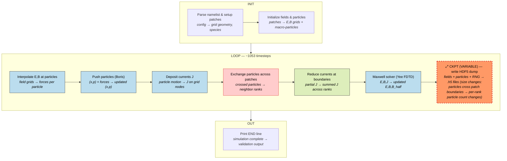
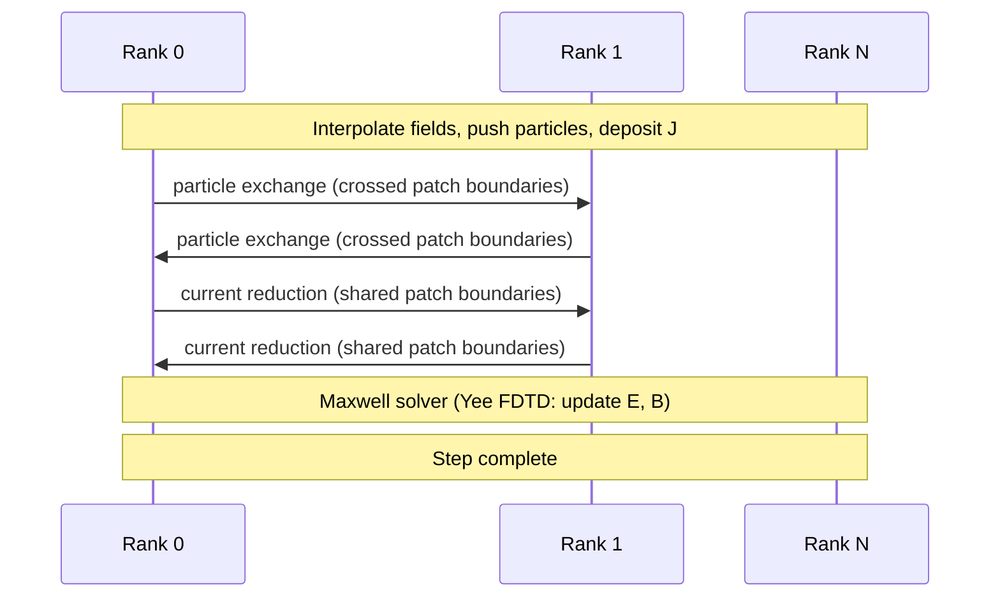
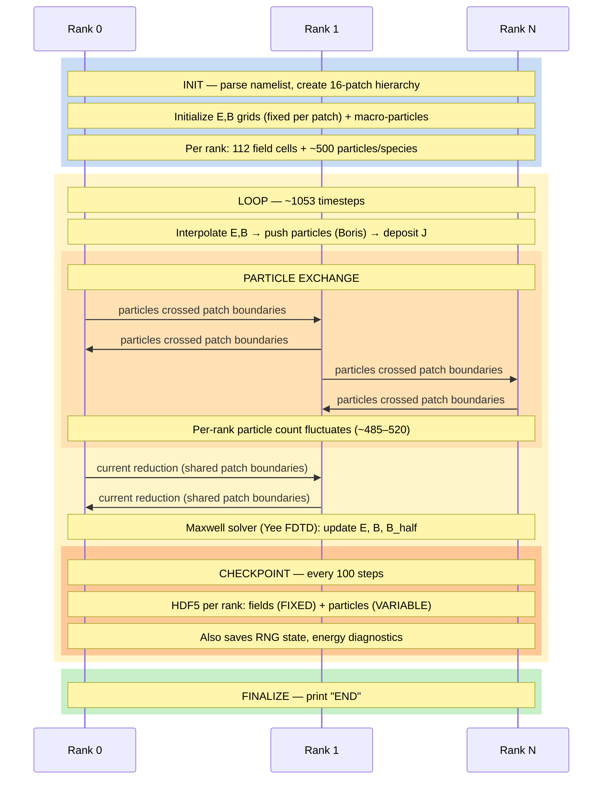

# Smilei — Particle-in-Cell Plasma Simulator

**Category:** Iterative / Fixed state  
**Language:** C++ (MPI + OpenMP)  
**Checkpoint library:** Native HDF5 checkpoint (`Checkpoint` class)

## Application Description

Smilei is a Particle-in-Cell (PIC) code for plasma physics simulations. It solves the coupled Vlasov-Maxwell system: charged particles move under electromagnetic forces, and their currents feed back into Maxwell's equations to update the fields. The domain is decomposed into hierarchical patches, each owning a region of the EM field grids and a subset of macro-particles. The benchmark runs a 1D Cartesian plasma with ions and electrons initialized in a slightly non-uniform density profile (cosine perturbation), periodic boundaries, over ~1053 timesteps. This exercises the plasma oscillation (Langmuir wave) regime.

## Computation Workflow

Data flow per step: fields are interpolated to push particles, currents deposited and reduced across ranks, then Maxwell's equations update E,B for the next cycle.

### Start

1. **MPI/OpenMP initialization.**
2. **Namelist parsing** (`Params`) — grid geometry (1D Cartesian, `cell_length=0.01`, `grid_length=1.12`), timestep (`dt=0.0095`), total time (`10.0`), patch decomposition (`number_of_patches=16`), species definitions.
3. **Checkpoint setup** — reads `dump_step=100`, `keep_n_dumps=2`, checks for `restart_dir`.
4. **If fresh start:** create patch hierarchy, initialize field grids (all zero), place macro-particles (ions at uniform density, electrons at cosine-perturbed density), initialize field solver.
5. **If restarting:** `readPatchDistribution()` determines patch ownership; `restartAll()` reads HDF5 files to populate field grids and particle arrays.

### Main Loop (`itime` from `this_run_start_step + 1` to `n_time`)

Each iteration:

1. **Time advance** — increment `time_prim` and `time_dual` by `dt`.
2. **Collision processes** (if any).
3. **Particle dynamics:**
   - Interpolate E, B fields at particle positions (2nd-order shape functions).
   - Push particles (Boris pusher).
   - Deposit currents J onto grid nodes.
4. **Particle exchange** — particles crossing patch boundaries communicated to neighbor patches/ranks.
5. **Current reduction** — sum current densities across shared patch boundaries (MPI).
6. **Maxwell solver** (Yee FDTD):
   - Update E from `curl(B)` and J.
   - Update B from `curl(E)`.
7. **Diagnostics** — field dumps, particle binning, scalar energy.
8. **Checkpoint check** — `checkpoint.dump()` if due.

### End

- Loop exits at `n_time` or when `exit_asap` is set.
- **Validation output:** the `"END"` line.

## Critical State

Two coupled components evolve together:

| Field | Type | Evolution |
|-------|------|-----------|
| `Ex_`, `Ey_`, `Ez_` | Electric field (1D arrays on Yee grid, per patch) | Updated each step by Maxwell solver from `curl(B) - J` |
| `Bx_`, `By_`, `Bz_` | Magnetic field (1D arrays on Yee grid, per patch) | Updated each step by Maxwell solver from `curl(E)` |
| `Bx_m`, `By_m`, `Bz_m` | Half-step magnetic field | Mandatory for leapfrog time-centering; without them, restart cannot correctly resume |
| Particle positions | `x` per particle per species | Advance under Lorentz force via Boris pusher |
| Particle momenta | `px`, `py`, `pz` per particle per species | Advance under Lorentz force via Boris pusher |
| Particle weights | `w` per particle | Static (no particle merging/splitting in this benchmark) |
| `xorshift32_state` | RNG state per patch | Drives stochastic processes; must be saved for reproducibility |
| Energy diagnostics | `Energy_time_zero`, `EnergyUsedForNorm`, Poynting flux | Running accumulators for energy balance tracking |

**Key requirement:** The half-step B fields (`Bx_m`, `By_m`, `Bz_m`) are essential — the leapfrog scheme is E at integer steps, B at half-steps. Omitting them would produce a first-order error on restart.

## MPI Task Lifetime

**Per-rank state:** Each rank owns a set of patches, each containing local EM field arrays (`Ex`, `Ey`, `Ez`, `Bx`, `By`, `Bz`, plus half-step `B_m` fields) on the Yee grid, and macro-particles (positions, momenta, weights) for each species within those patches.

**How state changes:** Per-rank particle count changes as macro-particles cross patch boundaries and migrate to the owning rank. Field arrays are fixed in size since the grid is static. The coupling between particles and fields means both must stay synchronized.

**Communication pattern:** Each step involves point-to-point particle exchange between neighbor patches/ranks, followed by a current-density reduction at shared patch boundaries. The Maxwell solver operates locally per patch after the current is synchronized.

### Application Lifetime View

**Key observations:**
- **Variable state size:** Field arrays are fixed (static grid), but per-rank particle count changes every step as macro-particles cross patch boundaries. The checkpoint file size per rank varies because particle data dominates the HDF5 dump.
- **Communication pattern:** Two distinct exchanges per step -- point-to-point particle migration between neighbor patches/ranks, then current-density reduction at shared patch boundaries. The Maxwell solver operates locally after synchronization.
- **Checkpoint coordination:** Each rank writes its own HDF5 file independently (no collective I/O). The cycling `keep_n_dumps=2` ensures crash safety -- the previous dump set is untouched while the new one is being written.

## Checkpoint Protection

### Write trigger

Every `dump_step = 100` iterations, checked in `Checkpoint::dump()`. Also triggered by `SIGUSR1`/`SIGUSR2` signals or wall-clock timeout.

### What is saved

HDF5 file per MPI rank: `checkpoints/dump-NNNNN-RRRRRRRRRR.h5` where `NNNNN` is the dump index modulo `keep_n_dumps` (cycling mod 2, so only the last 2 dump sets exist on disk).

Each HDF5 file contains:
- **Attributes:** `dump_step` (current iteration), `dump_number`, `patch_count`, scalar energy diagnostics, Poynting flux values.
- **Per-patch groups** (`patch-NNNNNN`):
  - All E and B field arrays (6 components + 3 half-step B components).
  - Per-species particle data: positions, momenta, weights, index arrays.
  - Species energy accounting attributes.
  - RNG state (`xorshift32_state`).
  - EM boundary condition state (Silver-Muller coefficients).

### Restart protocol

1. `run_with_restart.sh` detects `checkpoints/dump-*-0000000000.h5`.
2. Passes `Checkpoints.restart_dir='.'` on the command line.
3. `Checkpoint` constructor scans all dump files to find the one with the largest `dump_step`.
4. `restartAll()` reads each rank's HDF5 file, reconstructing fields and particles.
5. `itime` initialized to `this_run_start_step + 1`, continuing the PIC loop from the checkpoint timestep.

### Consistency

The cycling `keep_n_dumps=2` ensures at least one complete checkpoint exists even if a crash occurs mid-write — the previous dump set is untouched while the new one is being written.
