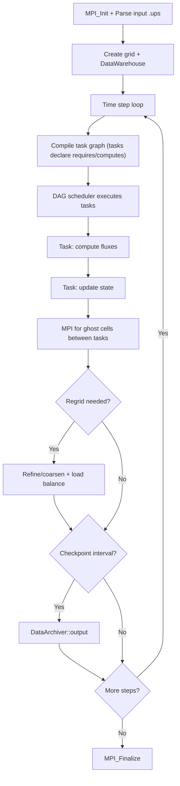

# Uintah Computation Flow

## Overview
Uintah is a task-based AMR framework using a DAG scheduler. Applications express computation as tasks with data dependencies; the runtime schedules execution and manages MPI communication.

## Main Loop



## MPI Communication
- **Implicit**: scheduler handles all MPI based on task dependencies
- **Ghost cells**: automatic based on task requirements
- **Load balancing**: dynamic redistribution of patches

## I/O Points
- Checkpoint: DataArchiver writes all DataWarehouse variables
- UDA (Uintah Data Archive) directory structure

## Output Format
UDA directories contain per-timestep checkpoint data. Stdout prints:
```
Timestep 100  Time=0.50  WallTime=120.5s  Patches=800
```
**How to compare**: use Uintah's `compare_uda` tool; or compare DataWarehouse variable dumps with numeric tolerance.
