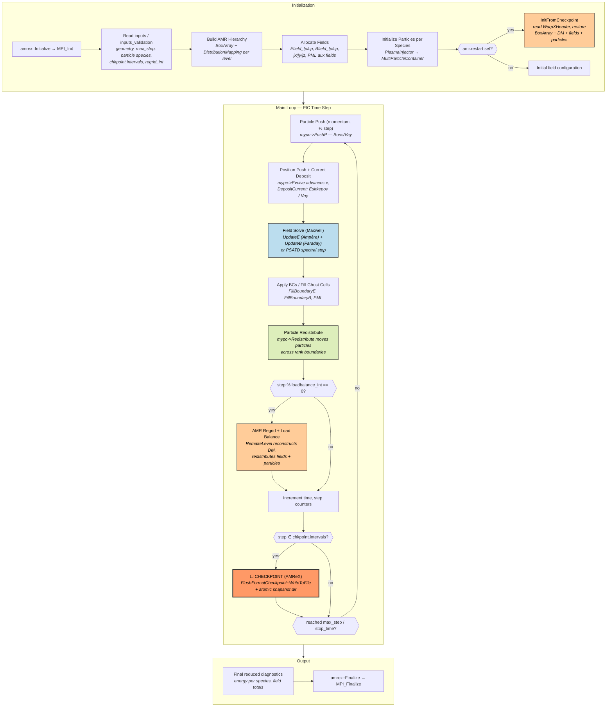
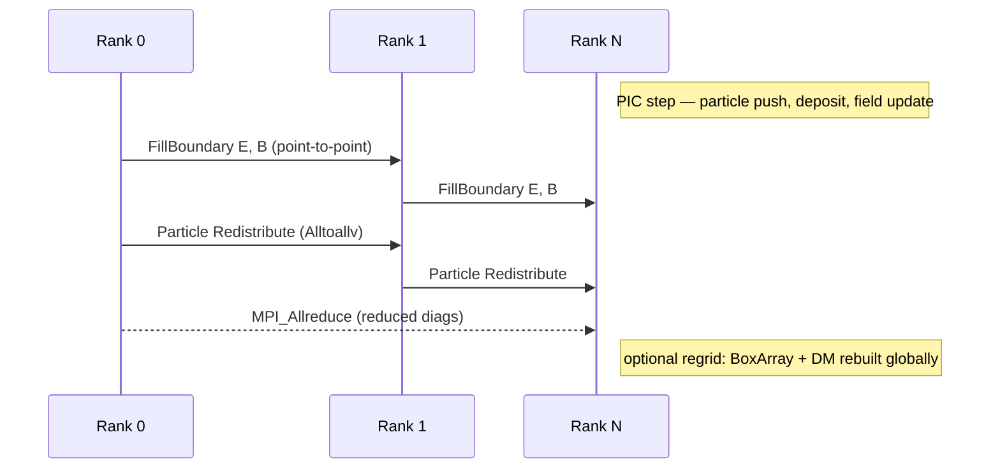
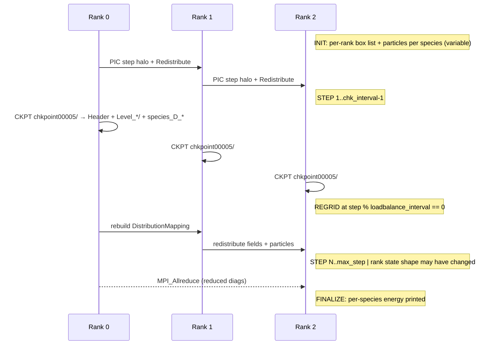

# WarpX — Electromagnetic Particle-In-Cell on AMReX

**Class:** (3) iterative_adaptive
**Language:** C++ (with optional CUDA, HIP, SYCL kernels)
**Checkpoint library:** AMReX native checkpoint format (per-snapshot directory: `WarpXHeader` + `Level_*/` MultiFabs + per-species particle files + `DM` distribution maps + `ReducedDiags`)

## Application Description

WarpX is an electromagnetic Particle-In-Cell (PIC) code from the ECP-WarpX project. It solves the relativistic Maxwell equations coupled to a population of charged particles using either a finite-difference (Yee/FDTD) or pseudo-spectral (PSATD) field solver and a Boris- or Vay-pusher for particles. It runs on top of AMReX, so the simulation is structured as a hierarchy of AMR levels with subcycling, mesh refinement, and load balancing. Geometries are 1D, 2D, 3D, or RZ cylindrical. The reference checkpoint reuses AMReX's directory-based snapshot format with WarpX-specific extensions for the synchronization flag, moving-window state, and reduced diagnostics buffers.

## Computation Workflow



**Data flow per step:** `particles(x, p) + E, B` →(PushP)→ `p_half` →(Evolve + DepositCurrent)→ `x' + j` →(Maxwell)→ `E', B'` →(Redistribute)→ migrated `particles'` →(optional regrid)→ new `BoxArray + DM` →(checkpoint optional)→ `chkpointXXXXX/`.

### Start

1. **AMReX initialization** — `amrex::Initialize` wraps `MPI_Init` and reads the input file via ParmParse.
2. **Domain and AMR setup** — `BoxArray` + `DistributionMapping` are constructed for each AMR level from `geometry`, `amr.n_cell`, and `amr.max_level`.
3. **Field allocation** — `Efield_fp`, `Bfield_fp`, plus coarse patches `Efield_cp` / `Bfield_cp` at refinement levels, current density `jx/jy/jz`, and PML auxiliary fields if PML boundaries are enabled. All registered through `ablastr::fields::MultiFabRegister`.
4. **Particle initialization** — for each species declared in the input, `PlasmaInjector` populates positions, momenta, and weights according to the chosen distribution.
5. **Boundary conditions** — periodic, PML, or PEC on the field side; species-specific reflect/absorb/transmit handlers on the particle side.
6. **Optional restart** — if `amr.restart=chkpointXXXXX` is provided, `InitFromCheckpoint` reads the snapshot back: header parse, `BoxArray` reconstruction, distribution map restore, MultiFab read, particle read.

### Main Loop (`OneStep` in `Source/Evolve/WarpXEvolve.cpp`)

For each step from `istep[0]` to `max_step` (or until `cur_time >= stop_time`):

1. **Particle momentum push (½ step)** — `mypc->PushP` advances `p` using the gathered fields; Boris or Vay pusher selected by `particle_pusher_algo`.
2. **Position push + current deposition** — `mypc->Evolve` moves `x → x + v·dt`, gathers `E,B` from grid to particles, and deposits `J` from particles to grid. Uses the algorithm chosen by `current_deposition_algo` (Esirkepov for charge conservation, Vay for relativistic).
3. **Maxwell field update** — depending on solver type, two half-step updates: `UpdateE` (Ampère's law with `J`) and `UpdateB` (Faraday's law). The PSATD path replaces these with a spectral step.
4. **Boundary application** — `FillBoundaryE` / `FillBoundaryB` synchronize ghost cells and apply PML / periodic / PEC boundary conditions.
5. **Particle redistribution** — `mypc->Redistribute` migrates particles whose new positions land in another rank's boxes. Uses an `MPI_Alltoallv`-style exchange under the hood.
6. **AMR regrid + load balance** (when `step % amr.loadbalance_interval == 0`) — `CheckLoadBalance` evaluates per-rank cost; if imbalance crosses a threshold, AMReX `RemakeLevel` rebuilds the grid hierarchy with a new `DistributionMapping` and redistributes both fields and particles.
7. **Time bookkeeping** — `istep[lev]++`, `t_new[lev] += dt[lev]`.
8. **Diagnostics + checkpoint** — `multi_diags->FilterComputePackFlush` writes plotfiles and, when the step matches a configured `chkpoint.intervals` value, drives `FlushFormatCheckpoint::WriteToFile` to take a snapshot.

### End

- Loop exits when `istep[0] >= max_step` or `cur_time >= stop_time`.
- A final reduced-diagnostics line is printed (per-species energy, field totals) — the validator's `keep_patterns` matches the energy line.
- `amrex::Finalize` calls `MPI_Finalize`.

## Critical State

WarpX checkpoints both the field state and the particle state at every AMR level, plus all the metadata needed to rebuild the AMR hierarchy on restart.

| Category | Components | How it is saved |
|----------|-----------|------------------|
| Particle positions | `Real[AMREX_SPACEDIM]` per particle | `mypc->Checkpoint` → `WriteBinaryParticles` (SoA per species) |
| Particle momenta | `Real[3]` `(px, py, pz)` per particle | Same SoA payload |
| Particle weights | `Real` per particle | Same SoA payload |
| Particle attributes | user-defined `Real[]` and `int[]` (e.g. tag, ionization state) | Selected by `write_real_comps` / `write_int_comps` masks |
| Electric field | `Efield_fp` / `Efield_cp` MultiFabs per level | `VisMF::Write` to `Level_*/Ex_fp` etc. |
| Magnetic field | `Bfield_fp` / `Bfield_cp` MultiFabs per level | `VisMF::Write` to `Level_*/Bx_fp` etc. |
| Current density | `jx_fp/cp`, `jy_fp/cp`, `jz_fp/cp` (only when synchronized) | `VisMF::Write`; written only if `m_is_synchronized == true` |
| PML auxiliary fields | per-PML MultiFabs (Exy, Exz, …) | `PML::CheckPoint` writes `Level_*/pml` |
| AMR mesh hierarchy | `BoxArray` + `DistributionMapping` per level | Mesh in `WarpXHeader`; per-level DM in `Level_*/DM` |
| Time metadata | `istep[lev]`, `t_new[lev]`, `t_old[lev]`, `dt[lev]` | `WarpXHeader` (text) |
| Synchronization flag | `bool m_is_synchronized` | `WarpXHeader` |
| Moving-window state | `Real moving_window_x` | `WarpXHeader` (when `do_moving_window=1`) |
| RNG state | per-particle / per-rank PRNG seeds | Embedded in particle binary if `random_seed` is tracked |
| Reduced diagnostics | scalar accumulators (energy, momentum, particle counts) | `MultiReducedDiags::WriteCheckpointData` |

## MPI Task Lifetime

**Per-rank state shape:** initially each rank owns a subset of grid boxes per AMR level and the particles inside them. Both change over the run:

- Field MultiFabs are sized by the rank's box list — that list is fixed between regrids and rebuilt on each regrid.
- Particle counts per rank drift continuously as particles cross box boundaries; AMReX `Redistribute` migrates them.
- AMR regrid + load balance can change box ownership across many ranks at once.

**Why "iterative + variable":**

- **Iterative**: every step is the same fixed sequence of phases (PushP → Evolve+Deposit → Maxwell → BCs → Redistribute → optional regrid → diagnostics).
- **Variable**: per-rank memory footprint and particle counts shift constantly, and AMR regrid can suddenly reshuffle box ownership. Checkpoints are taken across these reshuffles.

**Communication pattern:**

- Field halo fills via `FillBoundary` use non-blocking point-to-point per neighbor pair.
- Particle redistribution uses `MPI_Alltoallv`-style exchange.
- Maxwell solver halo fills are short-range; PSATD requires FFT collectives over the spectral domain.
- Reduced diagnostics scalars use `MPI_Allreduce`.



### Application Lifetime View



**Key observations:**
- Both **fields** (per-level MultiFabs) and **particles** (per-species) contribute to checkpoint size — particles dominate when species counts are large.
- AMR regrid resets the per-rank distribution map; checkpoints capture the post-regrid state, not a stale one.
- WarpX uses the same AMReX VisMF binary format as Nyx, so tooling that handles one tends to handle the other.

## Checkpoint Protection

### Write trigger

Configured in the input file with `diagnostics.chkpoint.intervals`:

```
diagnostics.chkpoint.intervals = 5000   # write checkpoint at step 5000, 10000, …
```

Inside the evolve loop, `multi_diags->FilterComputePackFlush` checks `m_intervals.contains(step+1)`; when true, `FlushFormatCheckpoint::WriteToFile` runs.

### What is saved

The on-disk layout for a single snapshot:

```
chkpoint00005000/
├─ WarpXHeader              # text: nlevs, istep[], nsubsteps[], t_new[],
│                           #   t_old[], dt[], m_is_synchronized,
│                           #   prob_lo[], prob_hi[], moving_window_x,
│                           #   per-level BoxArray, particle header,
│                           #   diagnostic metadata
├─ Level_0/
│  ├─ Ex_fp, Ey_fp, Ez_fp           # AMReX VisMF binary
│  ├─ Bx_fp, By_fp, Bz_fp
│  ├─ jx_fp, jy_fp, jz_fp           # only if m_is_synchronized
│  ├─ pml/                          # PML auxiliary fields if enabled
│  ├─ DM                            # text: nprocs + DistributionMapping
│  ├─ electrons_H                   # particle-species header
│  ├─ electrons_D_00000             # particle SoA binary (positions, weight, momenta, attrs)
│  ├─ ions_H, ions_D_*              # additional species
│  └─ CheckPointCarrier             # job metadata (code version, build flags)
├─ Level_1/                         # (and Level_2, … per AMR level)
│  ├─ Ex_fp / Ex_cp …               # full + coarse patches
│  └─ DM, particles, …
└─ ReducedDiags/                    # reduced-diagnostic scalar accumulators
```

### Write protocol (`Diagnostics/FlushFormats/FlushFormatCheckpoint.cpp`)

1. `PreBuildDirectorHierarchy` ensures the snapshot directory and `Level_*/` subdirectories exist on disk.
2. `WriteWarpXHeader` writes the metadata text file first; if a crash interrupts later writes, restart will see the header but missing data and refuse to load.
3. Per level: `VisMF::SetHeaderVersion(NoFabHeader_v1)` + `VisMF::Write` for each MultiFab (collective MPI binary).
4. Per level: `WriteDMaps` writes the `DM` text file so restart can decide whether to reuse the same rank-to-box mapping.
5. `CheckpointParticles` calls `pc->Checkpoint` per species; AMReX `WriteBinaryParticles` produces the SoA binary.
6. Reduced diagnostics state is appended via `MultiReducedDiags::WriteCheckpointData`.

### Restart protocol

1. User passes `amr.restart=chkpoint00005000` on the command line.
2. `InitFromCheckpoint` (`Source/Diagnostics/WarpXIO.cpp`) opens `WarpXHeader`, parses `nlevs`, `istep[]`, `t_new[]`, `dt[]`, `BoxArray[]` per level, `m_is_synchronized`, and `moving_window_x`.
3. `GetRestartDMap` reads each `Level_*/DM` and reuses the same distribution map when the rank count matches; otherwise a new map is computed and the data is redistributed on read.
4. Field MultiFabs are read back via `VisMF::Read` for each registered field.
5. `mypc->ReadParticles` loads each species' SoA binary back into the particle container.
6. Reduced-diagnostics buffers and counters are restored.
7. Main loop resumes at the saved `istep[0]`.

### Consistency

- **Snapshot directory is the unit of atomicity** — a partial write leaves the directory in a missing-files state and the restart will refuse it.
- **Header-first write** — `WarpXHeader` is written before any field/particle data, so an interrupted write cannot produce a header-only "ghost" snapshot that looks complete on the surface.
- **DistributionMapping preserved** — when the rank count is unchanged, `GetRestartDMap` reuses the saved mapping for bit-identical resumption; otherwise data is redistributed during the read.
- **Signal-driven graceful checkpoint** — `SignalHandling::CheckSignals` (`WarpXEvolve.cpp`) lets WarpX trap a signal and trigger a clean checkpoint before exiting, useful when a job runs out of allocation.
