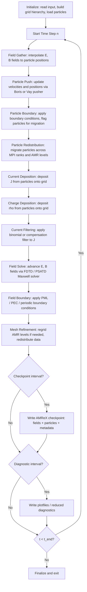

# WarpX Computation Flow

## Overview

WarpX is an advanced electromagnetic Particle-In-Cell (PIC) code built on the AMReX adaptive mesh refinement framework. It simulates plasma physics by evolving charged particles under self-consistent electromagnetic fields on a structured grid. The main time-stepping loop alternates between pushing particles under field forces, depositing particle charges and currents onto the grid, and solving Maxwell's equations to update the fields. WarpX supports multiple AMR levels, allowing dynamic refinement around regions of interest such as particle beams or laser pulses. Particle migration across MPI ranks occurs whenever particles cross subdomain boundaries during the push step.

## Main Loop Flowchart

## MPI Communication Pattern

- **Domain decomposition**: The computational domain is decomposed into rectangular boxes distributed across MPI ranks via AMReX's box distribution mapping. Each rank owns a set of boxes at each AMR level.
- **Guard/ghost cell exchange**: Before field gather and after field solve, neighboring ranks exchange ghost cell data for the electromagnetic fields (E, B) and current density (J). This uses AMReX's `FillBoundary` operation, which performs point-to-point MPI sends/receives.
- **Particle migration**: After the particle push, particles that have moved outside their owning box are collected and sent to the appropriate rank via AMReX's `Redistribute` call. This involves all-to-all-like communication patterns but is implemented as point-to-point messages between neighbors.
- **AMR regridding**: When the grid hierarchy is modified, box-level data must be redistributed. AMReX handles this with collective communication to establish the new distribution map, followed by point-to-point data transfers.
- **Reductions**: Global diagnostics (total energy, particle count) use MPI_Allreduce.

## I/O Points

- **Checkpoint writes**: Full simulation state (all field MultiFabs, all particle containers, AMR hierarchy metadata, and simulation parameters) written at user-specified intervals via AMReX's native checkpoint mechanism. Uses one directory per checkpoint with one file per MultiFab component per level.
- **Plotfile writes**: Visualization-oriented output at user-specified intervals. Contains field data and optionally particle data in AMReX plotfile format.
- **Reduced diagnostics**: Scalar quantities (field energy, particle energy, charge) written to text files every N steps.
- **Back-transformed diagnostics**: For boosted-frame simulations, data is transformed back to the lab frame and written at specified z-positions.
- **Particle output**: Optional per-species particle dumps in formats including AMReX native, openPMD-HDF5, or openPMD-ADIOS.
- **Input file read**: Simulation parameters read from an input file at initialization.
